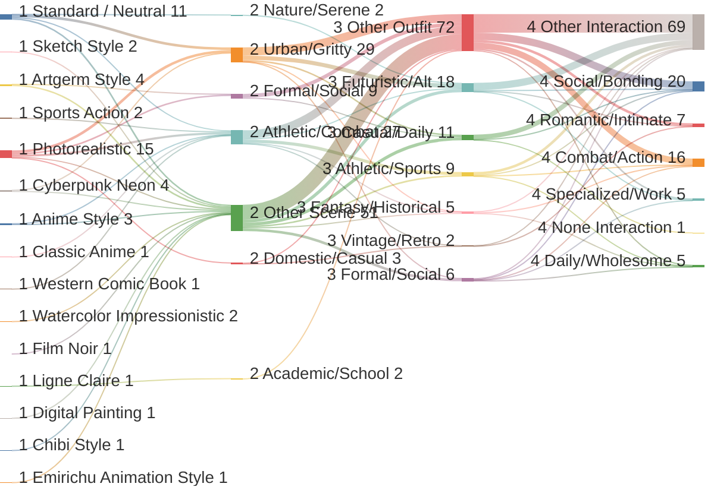

# PromptBuilder Comprehensive Audit Report
**Generated:** 2026-01-12 20:38:48

This document combines all individual audit modules into a single overview of system health, content quality, and generation logic performance.

---

<div style='page-break-before: always;'></div>

# 📑 Distribution Visualizations

## Prompt Distribution Flow




---

<div style='page-break-before: always;'></div>

# 📑 Style Distribution Census

## Style Representation Census

| Base Style | Count | Percentage |
| :--- | :--- | :--- |
| Photorealistic | 15 | 30.0% |
| Standard / Neutral | 11 | 22.0% |
| Artgerm Style | 4 | 8.0% |
| Cyberpunk Neon | 4 | 8.0% |
| Anime Style | 3 | 6.0% |
| Sketch Style | 2 | 4.0% |
| Sports Action | 2 | 4.0% |
| Watercolor Impressionistic | 2 | 4.0% |
| Ligne Claire | 1 | 2.0% |
| Film Noir | 1 | 2.0% |
| Classic Anime | 1 | 2.0% |
| Western Comic Book | 1 | 2.0% |
| Digital Painting | 1 | 2.0% |
| Chibi Style | 1 | 2.0% |
| Emirichu Animation Style | 1 | 2.0% |


---

<div style='page-break-before: always;'></div>

# 📑 Vibe Cohesion Analysis

## Vibe Cohesion & Diversity Report

### Top Vibe Mixes (Multi-faceted Prompts)
- **Academic + Wholesome/School**: 1 prompts

### Potential Thematic Mismatches
- ⚠️ Mismatch: Cozy Cable Knit Cardigan in Gritty City street at night, glowing neon signs, wet pavement reflecting lights, urban atmosphere, vibrant colors. (gen_only_1768268212_39.txt)
- ⚠️ Mismatch: Cozy Comfortable in Gritty City street at night, glowing neon signs, wet pavement reflecting lights, urban atmosphere, vibrant colors. (gen_only_1768268212_39.txt)


---

<div style='page-break-before: always;'></div>

# 📑 Prompt Scoring Analysis (Best & Worst)

## Best and Worst Generated Prompts

### 📊 Statistical Summary

- **Total Prompts Analyzed:** 50
- **Mean Score:** 208.20
- **Median Score:** 212.5
- **Mode Score:** 260
- **Standard Deviation:** 101.75
- **Score Range:** 20 - 445

### 🏆 Top 3 Best Prompts

#### 1. gen_only_1768268212_49.txt (Score: 445)
```text
Generate an image of: Rendering
High-speed sports photography aesthetic. Simulates a telephoto lens (200mm-400mm) with a wide aperture (f/2.8) and a rapid shutter speed (1/2000s) to freeze motion or slow-shutter panning to create directional blur streaks. High contrast "Stadium" lighting with sharp, harsh shadows or bright, overcast outdoor diffusion.

Character Accuracy
Expressions are candid and intense: grimaces of exertion, focus, and adrenaline. Facial muscles are taut. Skin glistens with realistic sweat (specular highlights) and flushing from physical exertion.

Body Types
Hyper-athletic and functional. Muscles are compressed and tensed in action. Anatomy is warped slightly by the physics of motion (jiggle physics on impact, compression of limbs). Veins are prominent (vascularity).

Hair & Clothing
Hair: Wet with sweat, messy, and reacting violently to momentum. Clothing: High-tech athletic fabrics (mesh, spandex) with visible moisture-wicking textures. Fabric ripples and stretches tightly across the body due to wind resistance and movement.

Details
Debris (turf clumps, chalk dust, water spray) suspended in mid-air. Background is a creamy, unrecognizable bokeh of stadium crowds or track lines. Motion blur ghosting on the edges of extremities.

---

**SCENE/SETTING:**
From behind the soccer net, looking out at the field, goalie in position, tension of an incoming attack.
---

**CHARACTER: Leilani Te'o**
**Appearance:**
* **Body:** Dramatic Natural; massive, heavily muscled frame with broad powerful shoulders and a deep chest; 45-35-50 proportions; tall height at 6'0"; EXTREME muscle density with visible definition in her "capped" delts, thick biceps, and powerful quads; heavy but athletic presence.
* **Face:** Rugged-soft structure; square-oval face with a strong, well-defined jawline and high prominent cheekbones; large dark brown eyes with a steady, direct gaze; full expressive mouth; neutral resting expression is calm but intense, radiating a sense of quiet authority.
* **Hair:** Type 3A–3B curls; high density; long length past her shoulders; naturally thick dark hair often worn half-up to keep it out of her face during training; healthy natural sheen.
* **Skin:** Deep warm tan with rich golden-brown undertones (Polynesian coloring); smooth surface with visible muscle separation creating deep shadows; elaborate traditional 'tatau' patterns visible on one shoulder and upper arm.
**Outfit:**
- **Top:** Rhinestone-embellished western shirt.
  - **Fit:** Fitted silhouette.
  - **Material:** Cotton with crystal embellishments.
  - **Pattern:** Ornate yoke with crystals.
  - **Neckline:** Collared with pearl snaps.
  - **Sleeve:** Long sleeves.
- **Bottom:** Bootcut jeans.
  - **Fit:** Tight thigh with flared hem.
  - **Material:** Dark wash denim.
  - **Pattern:** Decorative back pockets.
  - **Waist:** Natural with bedazzled silver belt.
  - **Length:** Full length.
- **Footwear:** Tall cowboy boots with metallic accents.
- **Accessories:** White felt cowboy hat; rodeo queen sash; hoop earrings.
**Pose/Action:**
wide shot with the character framed within the environment, One foot on the skateboard, the other pushing off the ground, mid-motion, forward momentum.
---

**CHARACTER 2: Talia Levi**
**Appearance:**
* **Body:** Soft Dramatic frame; wave-lush flesh quality; voluptuous hourglass proportions with pronounced bust (full D-DD), defined waist, and rounded hips; moderate-to-tall vertical (5'7"); soft density with feminine curves, visible décolletage, rounded shoulders, and shapely legs; magnetizing sensual presence.

* **Face:** Balanced-sultry facial structure; oval-to-diamond shape; high pronounced cheekbones with sculpted planes; large almond-shaped wide-set eyes in deep amber-brown with naturally seductive heavy-lidded quality and penetrating direct gaze; full shapely lips; defined angular jawline; neutral resting expression is knowing and self-assured with slight sultry smile and unwavering confident eye contact that holds just a beat too long.

* **Hair:** Type 2B-2C waves; very high density; voluminous cascading silhouette; long length past mid-back; natural loose center part; healthy high-sheen finish; commonly worn loose and wild with tousled volume, half-up with face-framing tendrils, or low messy bun showing neck; rich dark chocolate brown with warm caramel highlights.

* **Skin:** Medium-tan with warm golden-olive undertones and luminous sun-kissed finish; beauty mark above upper lip on left side; smooth healthy Mediterranean glow.
**Outfit:**
- **Top:** Rhinestone-embellished western shirt.
  - **Fit:** Fitted silhouette.
  - **Material:** Cotton with crystal embellishments.
  - **Pattern:** Ornate yoke with crystals.
  - **Neckline:** Collared with pearl snaps.
  - **Sleeve:** Long sleeves.
- **Bottom:** Bootcut jeans.
  - **Fit:** Tight thigh with flared hem.
  - **Material:** Dark wash denim.
  - **Pattern:** Decorative back pockets.
  - **Waist:** Natural with bedazzled silver belt.
  - **Length:** Full length.
- **Footwear:** Tall cowboy boots with metallic accents.
- **Accessories:** White felt cowboy hat; rodeo queen sash; hoop earrings.
**Pose/Action:**
wide shot with the character framed within the environment, Arching backward with hands and feet on the ground, creating a graceful bridge, impressive flexibility.
---

**Additional Notes:**
A split-second moment of confrontation in the penalty box. Leilani Te'o (striker) is mid-strike, leg swept back, body leaning over the ball for power. Talia Levi (goalie) is launching into a sprawling dive, arms outstretched, fingers spread wide to make the save. Grass divots and dirt fly up from Leilani Te'o's planting foot. Stadium lights create a halo effect around the players. The focus is razor-sharp on the ball and the players' expressions of sheer determination. Background stadium seating is blurred to emphasize the duel.
```

#### 2. gen_only_1768268212_29.txt (Score: 420)
```text
Generate an image of: Rendering
High-resolution vector-style illustration. Sharp, non-aliased distinct line art. Coloring uses "hard shading" (clear separation between light and dark) with minimal gradients. Colors are highly saturated and distinct.

Character Accuracy
Stylized facial proportions: large eyes, simplified noses/mouths. Chin and jawlines are sharp and angular. Expressions are clearly readable and slightly exaggerated for emotional clarity.

Body Types
Idealized anime anatomy. Elongated limbs and exaggerated posture. Anatomy is simplified into aesthetically pleasing shapes rather than biological realism.

Hair & Clothing
Hair: Gravity-defying clumps with distinct "shiny" highlight bands. Clothing: Folds are sharp, triangular, and dramatic. Fabric behaves dynamically to emphasize motion lines.

Details
"Screen tone" dots for shading texture. Speed lines or radial focus lines in the background. Lens flare is stylized (starbursts). Pop-art color palettes.

---

**SCENE/SETTING:**
Dedicated wrestling practice room, padded mats, minimal decor, bright overhead lights, serious training space.
---

**CHARACTER: Zahara El-Amin**
**Appearance:**
* **Body:** Dramatic; tall vertical (5'9"); lean and angular frame with long limbs; graceful, measured density; poised and commanding presence.
* **Face:** Sharp-balanced structure; diamond face shape with high, prominent cheekbones; large, intelligent dark brown eyes; straight, high-bridged nose; well-defined, narrow jawline; neutral expression is focused and contemplative.
* **Hair:** (Covered) Long dark hair typically styled in a low, secure bun beneath her hijab.
* **Skin:** Rich mahogany depth with warm, luminous undertones (Sub-Saharan/North African transition); smooth matte finish; clear, even complexion that catches the light on high points of the face. signature thick-rimmed designer glasses in deep amber tortoise-shell
**Outfit:**
- **Hijab:** Tight-fitting sports hijab in **#4B0082**.
- **Top:** High-neck long-sleeve leotard.
  - **Fit:** Skin-tight modest.
  - **Material:** Performance Lycra.
  - **Neckline:** High-neck.
  - **Sleeve:** Long sleeves.
- **Bottom:** Full-length matching athletic leggings.
  - **Fit:** Tight.
  - **Material:** Lycra.
  - **Waist:** High-waist.
  - **Length:** Full length.
- **Footwear:** Barefoot or toe-wraps.
- **Accessories:** Decorative hijab pin.
**Pose/Action:**
full body shot showing the character from head to toe, Balanced combat stance, fists up guarding face, focused intense expression, weight on balls of feet.
---

**CHARACTER 2: Kaito Sato**
**Appearance:**
* **Body:** Flamboyant Gamine frame; wiry and compact; defined, sinewy muscle (climber/skater build); shorter vertical (5'6"-5'7"); extremely agile and fast-twitch; straight lines with sharp edges; projects nervous, electric energy.
* **Face:** Angular, diamond-shaped face; sharp, pointed chin; narrow eyes that are often squinting in focus or widening in adrenaline; mischievous grin that shows teeth; features are delicate but sharp.
* **Hair:** Type 1B straight; medium density; undercut with a long, choppy top; bleached platinum blonde (almost white) with roots showing; often messy or swept forward.
* **Skin:** Fair with cool undertones; prone to flushing when active; usually has a band-aid or small scrape on the cheek or knuckles.
**Outfit:**
- **Top:** Long-sleeve compression shirt.
  - **Fit:** Ultra-fitted muscle definition.
  - **Material:** Nylon-spandex blend.
  - **Pattern:** Solid charcoal.
  - **Neckline:** High-neck.
  - **Sleeve:** Long sleeves.
- **Bottom:** Matching compression leggings.
  - **Fit:** Compression.
  - **Material:** Moisture-wicking fabric.
  - **Waist:** Elasticated.
  - **Length:** Full length.
- **Footwear:** Sneakers (Implied).
- **Accessories:** Black fitness tracker; wireless earbuds.
**Pose/Action:**
full body shot showing the character from head to toe, Standing in profile, one leg bent with calf flexed, torso twisted toward the camera, hands gripped together to pop the chest and bicep.
---

**CHARACTER 3: Oliver St. James**
**Appearance:**
* **Body:** Soft Natural frame; average height (5'9"-5'10"); "Otter" build—slim but not skinny, with a soft, natural muscularity and a bit of fuzz; rounded shoulders; comfortable and lived-in physicality.
* **Face:** Oval face with soft features; warm, crinkling blue eyes; nose is slightly button-like; jawline is softened by a scruffy, well-maintained short beard (strawberry blonde/ginger tone).
* **Hair:** Type 2C curls; medium density; messy "mop top" style that looks better when tousled; light brown/dark blonde; often falling into his eyes.
* **Skin:** Fair to light; pinkish warm undertones; prone to blushing; smooth complexion. round gold wire-frame glasses
**Outfit:**
- **Top:** Shirtless with shoulder pauldron and vambrace.
  - **Fit:** Bare midriff.
  - **Material:** Brown leather.
  - **Pattern:** Solid.
  - **Neckline:** Open.
  - **Sleeve:** Sleeveless.
- **Bottom:** Warrior's kilt above knee.
  - **Fit:** Relaxed kilt.
  - **Material:** Brown and White linen.
  - **Pattern:** White loincloth panel.
  - **Waist:** Wide leather belt with crystal buckle.
  - **Length:** Mid-thigh.
- **Footwear:** Crisscrossing leather leg wraps.
- **Accessories:** Crystal pendant; leather armor pieces .
**Pose/Action:**
full body shot showing the character from head to toe, Hands held apart in front of the chest, fingers curved as if holding a sphere of light, face illuminated by a glow from between the palms.
---

**Additional Notes:**
Zahara El-Amin playfully pushing Kaito Sato, light contact showing friendly interaction
```

#### 3. gen_only_1768268212_18.txt (Score: 410)
```text
Generate an image of: Rendering
High-speed sports photography aesthetic. Simulates a telephoto lens (200mm-400mm) with a wide aperture (f/2.8) and a rapid shutter speed (1/2000s) to freeze motion or slow-shutter panning to create directional blur streaks. High contrast "Stadium" lighting with sharp, harsh shadows or bright, overcast outdoor diffusion.

Character Accuracy
Expressions are candid and intense: grimaces of exertion, focus, and adrenaline. Facial muscles are taut. Skin glistens with realistic sweat (specular highlights) and flushing from physical exertion.

Body Types
Hyper-athletic and functional. Muscles are compressed and tensed in action. Anatomy is warped slightly by the physics of motion (jiggle physics on impact, compression of limbs). Veins are prominent (vascularity).

Hair & Clothing
Hair: Wet with sweat, messy, and reacting violently to momentum. Clothing: High-tech athletic fabrics (mesh, spandex) with visible moisture-wicking textures. Fabric ripples and stretches tightly across the body due to wind resistance and movement.

Details
Debris (turf clumps, chalk dust, water spray) suspended in mid-air. Background is a creamy, unrecognizable bokeh of stadium crowds or track lines. Motion blur ghosting on the edges of extremities.

---

**SCENE/SETTING:**
Professional baseball field, perfectly manicured grass, dirt infield, white foul lines, outfield fence, bright sunny day.
---

**CHARACTER: Sitara Saanvi**
**Appearance:**
* **Body:** Romantic frame; soft lush flesh quality; hourglass proportions with defined waist; moderate height (5'4"); soft rounded density with lush bust and hips, delicate wrists and ankles; alluring captivating presence.
* **Face:** Soft rounded structure; heart shape; large expressive dark brown almond eyes with dazzled flirtatious quality; softly curved jawline; neutral resting expression is slightly pouting and sensual.
* **Hair:** Type 2C waves; medium-high density; dark glossy black with high sheen; long voluminous hair that takes styling well; commonly worn in glamorous, vintage-inspired styles.
* **Skin:** Medium tan with warm golden-olive undertones and luminous smooth surface finish; small delicate beauty mark near lip.
**Outfit:**
- **Top:** Cropped athletic tank or sports bra under zip-up hoodie.
  - **Fit:** Tight top; Oversized hoodie.
  - **Material:** Stretchy technical fabric; Cotton fleece.
  - **Pattern:** Solid.
  - **Neckline:** Scoop/Hooded.
  - **Sleeve:** Sleeveless (top) under Long (hoodie).
- **Bottom:** High-waist yoga leggings.
  - **Fit:** Stretchy compression.
  - **Material:** Technical fabric.
  - **Pattern:** Solid or subtle pattern.
  - **Waist:** High-waist.
  - **Length:** Ankle-length.
- **Footwear:** Slip-on sneakers.
- **Accessories:** Yoga mat bag, water bottle.
**Pose/Action:**
full body shot showing the character from head to toe,
---

**CHARACTER 2: Jena Marlowe**
**Appearance:**
* **Body:** Soft Dramatic–Romantic blend; elongated but light vertical; gentle hourglass with soft waist emphasis; overall delicacy rather than dramatic weight.
* **Face:** Soft oval face with balanced proportions; medium-large bright eyes; refined nose; gentle jawline; warm, approachable expression with an easy smile.
* **Hair:** Light honey-blonde; Type 2A–2B loose waves; fine-to-medium density; long hair with soft volume; luminous natural-looking highlights; healthy glossy finish.
* **Skin:** Fair to light neutral-warm tone with a natural satin glow; fresh and luminous in daylight.
**Outfit:**
- **Top:** Cropped athletic tank or sports bra under zip-up hoodie.
  - **Fit:** Tight top; Oversized hoodie.
  - **Material:** Stretchy technical fabric; Cotton fleece.
  - **Pattern:** Solid.
  - **Neckline:** Scoop/Hooded.
  - **Sleeve:** Sleeveless (top) under Long (hoodie).
- **Bottom:** High-waist yoga leggings.
  - **Fit:** Stretchy compression.
  - **Material:** Technical fabric.
  - **Pattern:** Solid or subtle pattern.
  - **Waist:** High-waist.
  - **Length:** Ankle-length.
- **Footwear:** Slip-on sneakers.
- **Accessories:** Yoga mat bag, water bottle.
**Pose/Action:**
full body shot showing the character from head to toe,
---

**Additional Notes:**
Sitara Saanvi and Jena Marlowe in mirrored poses, matching each other's stance and gestures
```


### 📉 Bottom 3 Worst Prompts

#### 1. gen_only_1768268212_2.txt (Score: 20)
```text
Generate an image of: Rendering
"Clear Line" style (reminiscent of Hergé/Tintin or Moebius). Uniform, continuous black outlines of consistent width. No hatching or cross-hatching. Colors are flat, vivid, and unmodulated (no gradients).

Character Accuracy
Faces are highly simplified and iconic (dots for eyes), while the environment remains realistically proportioned. Expressions are readable and graphic.

Body Types
Realistic human proportions but rendered with flat graphic shapes. Posture is distinct and theatrical to ensure silhouette readability without shadow support.

Hair & Clothing
Hair: Defined by a single bounding outline and a flat color fill. Clothing: Realistic fashion rendered with minimal fold lines. Patterns (plaid, stripes) are drawn flat, ignoring the volume of the cloth.

Details
Backgrounds are hyper-detailed and architectural, contrasting with the simple characters. Everything is in sharp focus (deep depth of field). Shadows are cast as solid black shapes detached from the object.

---

**SCENE/SETTING:**
A classic classroom setting with a view of the sky from a window seat. Sunlight streams in, illuminating dust motes. A notebook and pen sit on the desk.
---

**CHARACTER: Kendra Mitchell**
**Appearance:**
* **Body:** Flamboyant Natural frame; straight athletic flesh; broad inverted triangle proportions with wide shoulders, long limbs, and subtle waist definition; tall (5'9"); strong defined muscle with visible shoulder caps, toned arms, and powerful legs; commanding physical presence.
* **Face:** Strong angular structure; oblong-square face; prominent bone structure with high broad cheekbones; almond-shaped wide-set hazel-green eyes; strong defined jawline; neutral resting expression is confident and direct with penetrating gaze; smile is wide, genuine, and slightly asymmetric with infectious energy.
* **Hair:** Type 3B curls; high density; shoulder-length layered cut; side part; voluminous natural texture; matte-satin finish; commonly worn loose and free or in high messy bun; warm chestnut brown with golden highlights.
* **Skin:** Medium tan with warm golden undertones and healthy athletic glow; faint freckles across nose and shoulders.
**Outfit:**
- **Top:** Oversized asymmetric shirt under cropped distressed vest.
  - **Fit:** Asymmetrical; Layered.
  - **Material:** Distressed knit; Pinstripe wool.
  - **Pattern:** Mismatched buttons.
  - **Neckline:** Asymmetric collar.
  - **Sleeve:** Extra long sleeves (raw hem).
- **Bottom:** Skirt-over-pants combo.
  - **Fit:** Layered; Split-hem skirt.
  - **Material:** Cotton drill; Pinstripe wool.
  - **Waist:** Mid-rise.
  - **Length:** Midi/Maxi combo.
- **Footwear:** Tabi boots.
- **Accessories:** Safety pin jewelry; silver rings; frayed canvas bag.
**Pose/Action:**
Leaning forward with hands together in front of the waist, all muscles in the arms, chest, and shoulders tensed to the limit.
---

**CHARACTER 2: Diesel Murphy**
**Appearance:**
* **Body:** Natural frame; straight athletic flesh with functional density; balanced proportions with broadened shoulders from upper body work, minimal waist definition, and straight hip line; moderate-to-tall vertical (5'7"-5'8"); working-class athletic build with developed forearms and shoulders from mechanical work, strong hands, visible core strength, practical muscle without aesthetic focus; distinctly female frame with masculine presentation and movement patterns; grounded capable presence.

* **Face:** Balanced-angular structure; square-to-rectangular face shape with broad forehead and strong defined jawline; minimal midface projection with subtle cheekbones; medium-to-small eyes with moderate-close spacing, hazel-brown color, minimal lid exposure, direct no-nonsense gaze; straight broad nose with flat bridge and squared tip; strong angular jawline with masculine definition; neutral resting expression shows calm confidence with closed-mouth straight line and steady assessing gaze; rare smile is crooked and genuine.

* **Hair:** Type 2A; medium density; very short length (pixie-to-undercut style); no defined part, textured and pushed back; matte finish; commonly worn tousled and practical, sometimes with small amount of pomade for control; dark brown with sun-lightened tips from outdoor work.

* **Skin:** Light-medium tone with neutral-warm undertones and natural matte finish; scattered scars on hands and forearms from mechanical work; permanent grease staining under short fingernails and in hand creases; sun exposure on forearms and face; textured from outdoor work.
**Outfit:**
- **Top:** Structural neoprene bodice .
  - **Fit:** Oversized architectural; Severe boxy shoulders.
  - **Material:** Neoprene; ; Rigid vinyl.
  - **Pattern:** Solid.
  - **Neckline:** High standing neck.
  - **Sleeve:** Elongated sleeves with angular padding.
- **Bottom:** Asymmetric skirt with voluminous pleats.
  - **Fit:** Rigid draping; Asymmetric.
  - **Material:** matching.
  - **Waist:** Structural Obscured.
  - **Length:** Knee-length.
- **Footwear:** Split-toe sculptural boots.
- **Accessories:** Geometric chrome face jewelry (nose bridge); sleek leather clutch.
**Pose/Action:**
Both arms raised overhead in triumph after strike, wide smile, celebratory energy, standing near foul line or approach area.
---

**Additional Notes:**
Kendra Mitchell and Diesel Murphy standing before a massive aquarium wall, their silhouettes sharp against the deep blue water and swirling marine life, enchanted and serene atmosphere.
```

#### 2. gen_only_1768268212_46.txt (Score: 20)
```text
Generate an image of: Rendering
Clean digital vector illustration with flat cel-shading. Smooth, anti-aliased line art with consistent medium-weight outlines. Minimal shading using one to two tones per area for subtle depth while maintaining a 2D animation aesthetic. Soft gradients only where needed. Even, friendly lighting creating a warm, inviting atmosphere. Bright, cheerful color palette with pastel undertones and well-balanced saturated hues that pop without overwhelming. Colors are vibrant but harmonious, never harsh.
Character Accuracy
Large, expressive doe eyes that dominate the face and convey strong emotions (joy, surprise, concern). Eyes feature simple but effective highlights and reflections. Small simplified noses (often just dots or tiny curved lines). Expressive eyebrows that enhance comedic timing and emotional readability. Round, cherubic faces with soft jawlines. Mouths are simple but convey clear emotions. Features are consistently cute and approachable, optimized for relatability and storytelling.
Body Types
Chibi-influenced proportions with slightly shortened limbs. Soft, rounded body shapes using gentle curves throughout. Simplified anatomy with minimal angular details. Bodies are "squishy" and non-threatening. Hand shapes are simplified (often mitten-like or stubby fingers). Overall silhouette is compact and endearing. Proportions favor expressiveness over realism.
Hair & Clothing
Hair: Large, chunky shapes with simplified strand detail. Soft, flowing forms that move as unified masses. Gentle curves define the hair volume with minimal individual strands. Shading uses one or two tones maximum. Clothing: Clean, simplified designs that read clearly at any size. Folds are minimal and stylized using soft curved lines. Fabric drapes naturally but with simplified physics. Details like buttons or patterns are oversized and graphic for readability.
Details
Simplified backgrounds that complement rather than compete with characters. Occasional floating iconography (hearts, sparkles, sweat drops, exclamation marks) for emotional emphasis. Soft drop shadows beneath characters. Clean composition optimized for animation and screen-based viewing. Overall aesthetic balances cuteness with relatability, perfect for YouTube storytime animation and comedic scenarios. Style is distinctly modern digital creator aesthetic—polished yet personal, professional yet approachable.

---

**SCENE/SETTING:**
A flat concrete rooftop surrounded by a chain-link fence. The blue sky stretches endlessly above. A quiet, private place for lunch or secrets.
---

**CHARACTER: Luna Vex**
**Appearance:**
* **Body:** Soft Gamine; firm yet smooth flesh quality; 35-25-35 balanced hourglass proportions; petite height at 5’2”; athletic density with a defined waist and toned anatomical markers; compact and magnetic presence.
* **Face:** Classic heart-shaped silhouette with a broad, smooth forehead and high, soft cheekbones that become prominent when she smiles; delicate, pointed chin creating a sharp taper from the mid-face; soft but clean and well-defined jawline; focal wide-set almond-shaped eyes in captivating light grey-blue; framed by naturally high-arched, manicured dark brown eyebrows sitting well above the orbital bone; signature sharp black winged eyeliner that accentuates the upward curve of her eyes; petite, straight nose bridge with a soft rounded tip and characteristic "scrunch" when laughing; wide, expressive mouth with a prominent philtrum and a broad, radiant smile revealing straight white teeth; deep endearing smile lines (nasolabial folds) and pronounced "crow's feet" signal genuine warmth and joy.
* **Hair:** Type 2A (wavy); medium density; soft, voluminous layered silhouette; shoulder-length; varying part pattern (side or center); glossy sheen with styled "wet-look" roots; common styling includes loose, face-framing waves. Split-dye neon magenta pink and electric blue/amethyst purple.
* **Skin:** Fair/Light depth; neutral-cool undertones; smooth, luminous surface finish; natural "crow's feet" laugh lines around the eyes.
**Outfit:**
- **Top:** Fitted long-sleeve velvet turtleneck with a **subtle floral embossed texture**.
  - **Fit:** Fitted; Skintight.
  - **Material:** Velvet.
  - **Pattern:** Embossed or Solid with a **subtle floral embossed texture**.
  - **Neckline:** High turtleneck.
  - **Sleeve:** Long sleeves.
- **Bottom:** High-waisted wide-leg wool trousers or plaid midi skirt.
  - **Fit:** wide-leg or flared.
  - **Material:** Wool or Plaid fabric.
  - **Waist:** High-waisted with leather belt.
  - **Length:** Ankle-length or Mid-calf.
- **Footwear:** Pointed-toe ankle boots.
- **Accessories:** Gold pendant necklace (over turtleneck); leather belt.
**Pose/Action:**
full body shot showing the character from head to toe, Standing over a stove, holding a wooden spoon, stirring a large pot with one hand while the other steadying the handle, savory steam rising.
---

**CHARACTER 2: Valentina "Tina" Kovač**
**Appearance:**
* **Body:** Dramatic frame; straight thin flesh with minimal softness; narrow angular proportions with long limbs, prominent joints (elbows, wrists, knees), flat planes, minimal bust (A cup), straight hips, long fingers and toes; tall-moderate vertical (5'8"-5'9"); very low body density—visible bone structure, delicate appearance but wiry strength, lean muscle definition without bulk; bird-like presence that seems too delicate yet surprisingly resilient.
* **Face:** Sharp angular structure; long oval-to-diamond face; high prominent cheekbones creating dramatic shadows; deep-set eyes, almond-shaped, close-set, Intense dark brown to black with penetrating gaze; strong straight nose with high bridge; defined angular jawline; hollow cheeks even at healthy weight; neutral resting expression is intense and assessing with slight suspicious edge—reads as guarded or challenging.
* **Hair:** Type 2C-3A waves/curls; medium-high density but fine texture; long length past shoulders; no defined part, tousled and wild; matte-to-low sheen finish; deliberately unkempt aesthetic; commonly worn loose and chaotic, half-up with tendrils escaping, or messy bun with pieces falling; deep black-brown with occasional henna-red undertones or temporary colored streaks (artistic expression).
* **Skin:** Light-olive with warm golden undertones (Roma coloring); smooth but slightly weathered from outdoor living/art-making; paint stains semi-permanent on hands and forearms; small scattered tattoos (DIY stick-and-poke aesthetic); natural bohemian finish.
**Outfit:**
- **Top:** Red and black buffalo plaid flannel shirt.
  - **Fit:** Boxy; Buttoned or Open over white tank.
  - **Material:** Thick cotton flannel.
  - **Pattern:** Buffalo plaid (red/black).
  - **Neckline:** Pointed collar.
  - **Sleeve:** Long sleeves.
- **Bottom:** Distressed blue jeans.
  - **Fit:** straight leg; Rugged.
  - **Material:** Distressed denim.
  - **Waist:** Natural with leather belt and large buckle.
  - **Length:** Full leg.
- **Footwear:** Brown leather work boots.
- **Accessories:** Small axe prop (optional); wool beanie.
**Pose/Action:**
full body shot showing the character from head to toe, Pulling leather jacket onto shoulders, mid-motion, confident smirk, cool effortless vibe.
---

**Additional Notes:**
Luna Vex handing a small, glowing data-shard to Valentina "Tina" Kovač, their fingers brushing briefly, a sense of high-stakes cooperation and secrecy.
```

#### 3. gen_only_1768268212_36.txt (Score: 45)
```text
Generate an image of: Rendering
Ray-traced digital rendering with high-contrast chiaroscuro. Dominant cyan and magenta rim lighting against deep matte blacks. Heavy volumetric fog, bloom effects on light sources, and chromatic aberration at the edges. Wet-surface reflections and a distinct digital noise overlay.

Character Accuracy
Sharp, angular facial geometry with high-contrast shading. Expressions are rendered with dramatic under-lighting or silhouette emphasis. Focus on hard-surface modeling for features, giving skin a synthetic or plasticky sheen.

Body Types
Anatomy defined by harsh lighting highlights rather than soft gradients. Musculature or body shape is accentuated by reflective contours. Silhouettes are cut sharp against the background with glowing edge detection.

Hair & Clothing
Hair: Rendered as synthetic fiber with high specularity (shine). Clothing: Materials appear as latex, matte carbon fiber, or translucent plastic. integrated light strips and glowing tech-wear accents are baked into the texture maps.

Details
Glitch art artifacts, holographic UI overlays in the foreground, and lens flare streaks. Backgrounds feature out-of-focus bokeh of city lights. The overall atmosphere is oppressive, high-tech, and gritty.

---

**SCENE/SETTING:**
Futuristic command center, holographic displays, captain's chair, viewport showing stars, sleek high-tech atmosphere.
---

**CHARACTER: Siofra Quinn**
**Appearance:**
* **Body:** Dramatic Gamine frame; straight athletic flesh with lean definition; narrow agile proportions with long limbs and compact torso; moderate-tall vertical (5'7"-5'8"); lean sinewy muscle built for speed, agility, and upper body precision—visible shoulder definition, strong forearms, powerful back muscles from draw weight; warrior-scholar presence combining lethal capability with thoughtful discipline.
* **Face:** Angular compact structure; diamond-leaning oval face; intense eyes; focused warrior expression.
* **Hair:** Type 2A waves; high density; long hair with copper-red tones; versatile styling options, often favoring practical braids that keep hair secure.
* **Skin:** Fair neutral skin with weathered undertone.
**Outfit:**
- **Top:** Form-fitting neoprene diving suit.
  - **Fit:** Skin-tight; High-tech.
  - **Material:** Black neoprene; Integrated lighting cables.
  - **Pattern:** Rhythmic amber glow along spine and limbs.
  - **Neckline:** High-neck scuba collar.
  - **Sleeve:** Long sleeves.
- **Bottom:** Integrated neoprene diving leggings.
  - **Fit:** Form-fitting; Reinforced knee panels.
  - **Material:** matching neoprene.
  - **Waist:** Integrated amber-light sensors.
  - **Length:** Ankle-length.
- **Footwear:** High-grip rubber diving boots with glowing amber accents.
- **Accessories:** Amber-lit tactical oxygen tank; black diving gloves with fiber-optic sensors.
**Pose/Action:**
wide shot with the character framed within the environment,
---

**CHARACTER 2: Priya Sharma**
**Appearance:**
* **Body:** Flamboyant Gamine frame; straight athletic flesh; compact powerful proportions; petite vertical.
* **Face:** Soft oval face with gentle rounded features; warm expressive dark brown eyes; friendly approachable expression; fuller cheeks; soft jawline; warm genuine smile.
* **Hair:** Type 2B-2C waves; medium-high density; long dark brown hair (almost black at roots) with warm caramel-brown highlights throughout mid-lengths and ends; natural body and volume; beachy waves.
* **Skin:** Deep warm brown skin with rich golden undertones; natural healthy glow. tiny sparkling silver nose stud
**Outfit:**
- **Top:** Form-fitting neoprene diving suit.
  - **Fit:** Skin-tight; High-tech.
  - **Material:** Black neoprene; Integrated lighting cables.
  - **Pattern:** Rhythmic amber glow along spine and limbs.
  - **Neckline:** High-neck scuba collar.
  - **Sleeve:** Long sleeves.
- **Bottom:** Integrated neoprene diving leggings.
  - **Fit:** Form-fitting; Reinforced knee panels.
  - **Material:** matching neoprene.
  - **Waist:** Integrated amber-light sensors.
  - **Length:** Ankle-length.
- **Footwear:** High-grip rubber diving boots with glowing amber accents.
- **Accessories:** Amber-lit tactical oxygen tank; black diving gloves with fiber-optic sensors.
**Pose/Action:**
wide shot with the character framed within the environment,
---

**CHARACTER 3: Theo Okonkwo**
**Appearance:**
* **Body:** Natural frame; natural-to-soft flesh; balanced proportions; moderate-to-tall vertical; relaxed athletic build with natural ease.
* **Face:** Balanced-warm facial structure; square-leaning oval face; warm expressive eyes; full lips; easy genuine smile; open welcoming expression.
* **Hair:** Type 4C coils; high density; short fade with textured top styled in mini twists; clean lineup; matte finish.
* **Skin:** Deep rich brown skin with warm undertones and healthy glow.
**Outfit:**
- **Top:** Heavy-duty technical diving vest over neoprene base.
  - **Fit:** Bulky; Technical.
  - **Material:** Neoprene; Amber fiber-optic lighting.
  - **Neckline:** High collar.
  - **Sleeve:** Sleeveless (vest).
- **Bottom:** Articulated neoprene diving trousers.
  - **Fit:** Articulated; Reinforced seams.
  - **Material:** Neoprene; Integrated storage pockets.
  - **Waist:** Natural with amber markers.
  - **Length:** Full.
- **Footwear:** Rugged industrial diving boots with amber lighting.
- **Accessories:** Tactical diving backpack; diving gloves with glowing fingertips.
**Pose/Action:**
wide shot with the character framed within the environment,
---

**Additional Notes:**
Siofra Quinn and Priya Sharma standing side by side comparing heights, one measuring against the other
```


---

<div style='page-break-before: always;'></div>

# 📑 Quality & Integrity Audit

## Content Quality & Integrity Audit

### 👥 Character Detail Audit
| Character | Score | Density | Sections | Photo | Status |
|---|---|---|---|---|---|
| aaliyah_chen.md | 100 | 186 | ✅ | ✅ | 🌟 Elite |
| aiyana_blackfeather.md | 100 | 220 | ✅ | ✅ | 🌟 Elite |
| amina_benali.md | 100 | 334 | ✅ | ✅ | 🌟 Elite |
| amira_khalil.md | 100 | 158 | ✅ | ✅ | 🌟 Elite |
| aryan_kapoor.md | 100 | 144 | ✅ | ✅ | 🌟 Elite |
| astrid_nielsen.md | 100 | 219 | ✅ | ✅ | 🌟 Elite |
| audrey_thorne.md | 100 | 239 | ✅ | ✅ | 🌟 Elite |
| avery_glam.md | 100 | 254 | ✅ | ✅ | 🌟 Elite |
| callum_doherty.md | 100 | 185 | ✅ | ✅ | 🌟 Elite |
| camila_vargas.md | 100 | 272 | ✅ | ✅ | 🌟 Elite |
| celine_voss.md | 100 | 129 | ✅ | ✅ | 🌟 Elite |
| chayton_red_elk.md | 100 | 141 | ✅ | ✅ | 🌟 Elite |
| chiara_lombardi.md | 100 | 138 | ✅ | ✅ | 🌟 Elite |
| Diego_Morales.md | 100 | 308 | ✅ | ✅ | 🌟 Elite |
| diesel_murphy.md | 100 | 506 | ✅ | ✅ | 🌟 Elite |
| efe_kouadio.md | 100 | 389 | ✅ | ✅ | 🌟 Elite |
| elara_soledad.md | 100 | 165 | ✅ | ✅ | 🌟 Elite |
| elena_rosales.md | 100 | 144 | ✅ | ✅ | 🌟 Elite |
| elias_thorne.md | 100 | 132 | ✅ | ✅ | 🌟 Elite |
| Enzo_Rossi.md | 100 | 275 | ✅ | ✅ | 🌟 Elite |
| Esme_Dubois.md | 100 | 284 | ✅ | ✅ | 🌟 Elite |
| Fiona_OSullivan.md | 100 | 220 | ✅ | ✅ | 🌟 Elite |
| freydis_holm.md | 100 | 263 | ✅ | ✅ | 🌟 Elite |
| hallie_bennett.md | 100 | 300 | ✅ | ✅ | 🌟 Elite |
| hana_park.md | 100 | 136 | ✅ | ✅ | 🌟 Elite |
| harald_bjornson.md | 100 | 230 | ✅ | ✅ | 🌟 Elite |
| harper_mae.md | 100 | 222 | ✅ | ✅ | 🌟 Elite |
| ines_santos.md | 100 | 226 | ✅ | ✅ | 🌟 Elite |
| isla_macleod.md | 100 | 228 | ✅ | ✅ | 🌟 Elite |
| jamal_rivers.md | 100 | 139 | ✅ | ✅ | 🌟 Elite |
| Jax_Chen.md | 100 | 257 | ✅ | ✅ | 🌟 Elite |
| jena_marlowe.md | 100 | 248 | ✅ | ✅ | 🌟 Elite |
| jin_park.md | 100 | 260 | ✅ | ✅ | 🌟 Elite |
| jordan_vance.md | 100 | 208 | ✅ | ✅ | 🌟 Elite |
| julian_blackwood.md | 100 | 121 | ✅ | ✅ | 🌟 Elite |
| Kaia_Vaitupu.md | 100 | 276 | ✅ | ✅ | 🌟 Elite |
| kaito_sato.md | 100 | 134 | ✅ | ✅ | 🌟 Elite |
| kassandra_lykaios.md | 100 | 246 | ✅ | ✅ | 🌟 Elite |
| keiko_yamamoto.md | 100 | 201 | ✅ | ✅ | 🌟 Elite |
| kendra_mitchell.md | 100 | 151 | ✅ | ✅ | 🌟 Elite |
| leilani_teo.md | 100 | 201 | ✅ | ✅ | 🌟 Elite |
| leonidas_stratos.md | 100 | 204 | ✅ | ✅ | 🌟 Elite |
| lila_reyes.md | 100 | 285 | ✅ | ✅ | 🌟 Elite |
| lucia_reyes.md | 100 | 125 | ✅ | ✅ | 🌟 Elite |
| luna_vex.md | 100 | 261 | ✅ | ✅ | 🌟 Elite |
| maki_cruz.md | 100 | 242 | ✅ | ✅ | 🌟 Elite |
| Malik_Farrah.md | 100 | 275 | ✅ | ✅ | 🌟 Elite |
| marcus_thompson.md | 100 | 128 | ✅ | ✅ | 🌟 Elite |
| marisol_rivera.md | 100 | 414 | ✅ | ✅ | 🌟 Elite |
| marley_thompson.md | 100 | 296 | ✅ | ✅ | 🌟 Elite |
| maya_rose.md | 100 | 162 | ✅ | ✅ | 🌟 Elite |
| mei_chen.md | 100 | 366 | ✅ | ✅ | 🌟 Elite |
| mela_hart.md | 100 | 158 | ✅ | ✅ | 🌟 Elite |
| natsumi_maki.md | 100 | 240 | ✅ | ✅ | 🌟 Elite |
| nora_alvarez.md | 100 | 261 | ✅ | ✅ | 🌟 Elite |
| oliver_st_james.md | 100 | 123 | ✅ | ✅ | 🌟 Elite |
| priya_sharma.md | 100 | 152 | ✅ | ✅ | 🌟 Elite |
| rafael_costa.md | 100 | 163 | ✅ | ✅ | 🌟 Elite |
| rosa_torres.md | 100 | 178 | ✅ | ✅ | 🌟 Elite |
| roxanna_perez.md | 100 | 239 | ✅ | ✅ | 🌟 Elite |
| samira_mansour.md | 100 | 154 | ✅ | ✅ | 🌟 Elite |
| silas_burnside.md | 100 | 209 | ✅ | ✅ | 🌟 Elite |
| sina_tuilagi.md | 100 | 476 | ✅ | ✅ | 🌟 Elite |
| siofra_quinn.md | 100 | 286 | ✅ | ✅ | 🌟 Elite |
| sitara_saanvi.md | 100 | 279 | ✅ | ✅ | 🌟 Elite |
| suki_nakamura.md | 100 | 139 | ✅ | ✅ | 🌟 Elite |
| talia_levi.md | 100 | 321 | ✅ | ✅ | 🌟 Elite |
| theo_okonkwo.md | 100 | 151 | ✅ | ✅ | 🌟 Elite |
| valentina_kovac.md | 100 | 348 | ✅ | ✅ | 🌟 Elite |
| Yuki_Tanaka.md | 100 | 319 | ✅ | ✅ | 🌟 Elite |
| zahara_el_amin.md | 100 | 152 | ✅ | ✅ | 🌟 Elite |
| zara_washington.md | 100 | 156 | ✅ | ✅ | 🌟 Elite |


---

<div style='page-break-before: always;'></div>

# 📑 Asset Descriptiveness

## Asset Descriptiveness Audit

### 🧥 Outfit Detail Depth
| Outfit | Total Words | [F] | [M] | [H] | Status |
|---|---|---|---|---|---|
| Team Sports\Beach Volleyball.txt | 185 | 58 | 57 | 70 | ✅ Detailed |
| International\Japanese Harajuku Streetwear.txt | 173 | 73 | 44 | 56 | ✅ Detailed |
| Character  Costume\Costume - Gypsy Fortune Teller Pirate.txt | 166 | 75 | 42 | 49 | ✅ Detailed |
| Team Sports\American Football.txt | 164 | 68 | 41 | 55 | ✅ Detailed |
| Team Sports\Boxing.txt | 162 | 55 | 49 | 58 | ✅ Detailed |
| Performance  Entertainment\Matador.txt | 160 | 63 | 48 | 49 | ✅ Detailed |
| Specialty\Modern Alchemist.txt | 160 | 59 | 49 | 52 | ✅ Detailed |
| Vintage  Period\1900s Coastal New England.txt | 156 | 53 | 57 | 46 | ✅ Detailed |
| Mythological  Cultural\Hindu.txt | 153 | 53 | 41 | 59 | ✅ Detailed |
| Specialty\Bioluminescent Diver.txt | 152 | 55 | 48 | 49 | ✅ Detailed |
| Professional  Office\Office.txt | 151 | 61 | 45 | 45 | ✅ Detailed |
| Casual Wear\Retro Tracksuit.txt | 150 | 54 | 49 | 47 | ✅ Detailed |
| Historical\Samurai.txt | 150 | 64 | 37 | 49 | ✅ Detailed |
| International\African Print Contemporary.txt | 150 | 58 | 45 | 47 | ✅ Detailed |
| Team Sports\MMA.txt | 150 | 48 | 50 | 52 | ✅ Detailed |
| Team Sports\Tennis.txt | 150 | 54 | 38 | 58 | ✅ Detailed |
| Team Sports\Volleyball.txt | 150 | 54 | 44 | 52 | ✅ Detailed |
| Vintage  Period\Newsboy.txt | 150 | 48 | 45 | 57 | ✅ Detailed |
| Character  Costume\Costume - Dark Pirate.txt | 149 | 56 | 44 | 49 | ✅ Detailed |
| Fantasy\Spirit Priestess Warrior.txt | 149 | 49 | 43 | 57 | ✅ Detailed |
| Traditions  Ceremonies\K-Pop Idol Performance.txt | 149 | 49 | 51 | 49 | ✅ Detailed |
| Vintage  Period\Victorian Detective.txt | 149 | 57 | 48 | 44 | ✅ Detailed |
| Western  Rugged\Pinup Cowgirl.txt | 149 | 54 | 43 | 52 | ✅ Detailed |
| Character  Costume\Supervillain.txt | 147 | 56 | 41 | 50 | ✅ Detailed |
| Traditions  Ceremonies\Steampunk Aviator.txt | 147 | 67 | 37 | 43 | ✅ Detailed |
| Professional  Office\Modern Power Suit.txt | 146 | 53 | 43 | 50 | ✅ Detailed |
| Alternative  Edgy\Dark Academia.txt | 145 | 54 | 42 | 49 | ✅ Detailed |
| Fantasy\Bard.txt | 145 | 61 | 40 | 44 | ✅ Detailed |
| Mythological  Cultural\Indian Formal.txt | 145 | 61 | 42 | 42 | ✅ Detailed |
| Casual Wear\Smart Casual.txt | 144 | 56 | 45 | 43 | ✅ Detailed |
| Character  Costume\Soft Aesthetic.txt | 143 | 50 | 43 | 50 | ✅ Detailed |
| Futuristic\Neo-Tokyo Street.txt | 143 | 50 | 50 | 43 | ✅ Detailed |
| Historical\Renaissance Noble.txt | 143 | 51 | 50 | 42 | ✅ Detailed |
| Fantasy\Druid.txt | 142 | 57 | 47 | 38 | ✅ Detailed |
| Team Sports\Swimming.txt | 142 | 47 | 50 | 45 | ✅ Detailed |
| Fantasy\Sorceress.txt | 141 | 65 | 33 | 43 | ✅ Detailed |
| Vintage  Period\1970s Disco.txt | 141 | 47 | 52 | 42 | ✅ Detailed |
| Fantasy\Beastmaster.txt | 140 | 58 | 36 | 46 | ✅ Detailed |
| Formal  Evening\Symphony Gown.txt | 140 | 49 | 45 | 46 | ✅ Detailed |
| Character  Costume\Casino Dealer.txt | 139 | 42 | 41 | 56 | ✅ Detailed |
| Mythological  Cultural\Greek.txt | 139 | 46 | 38 | 55 | ✅ Detailed |
| Stage Performance\Pop Icon Corset.txt | 139 | 57 | 34 | 48 | ✅ Detailed |
| Casual Wear\Bohemian.txt | 138 | 48 | 42 | 48 | ✅ Detailed |
| Historical\Steampunk.txt | 138 | 55 | 38 | 45 | ✅ Detailed |
| Mythological  Cultural\African Royalty.txt | 138 | 52 | 43 | 43 | ✅ Detailed |
| Mythological  Cultural\Celtic.txt | 138 | 48 | 45 | 45 | ✅ Detailed |
| Alternative  Edgy\Light Academia.txt | 137 | 52 | 41 | 44 | ✅ Detailed |
| Vintage  Period\Pinup.txt | 137 | 42 | 37 | 58 | ✅ Detailed |
| Western  Rugged\Cowboy.txt | 137 | 49 | 42 | 46 | ✅ Detailed |
| Futuristic\Neo-Tokyo Street Style.txt | 136 | 44 | 47 | 45 | ✅ Detailed |
| Performance  Entertainment\Oktoberfest.txt | 136 | 54 | 37 | 45 | ✅ Detailed |
| Performance  Entertainment\Vintage Tap.txt | 136 | 46 | 42 | 48 | ✅ Detailed |
| Traditions  Ceremonies\Ranch Hand.txt | 136 | 56 | 39 | 41 | ✅ Detailed |
| Fantasy\Battle Priest.txt | 135 | 51 | 39 | 45 | ✅ Detailed |
| Formal  Evening\Cocktail Party.txt | 135 | 51 | 44 | 40 | ✅ Detailed |
| Traditions  Ceremonies\Oil Tycoon.txt | 135 | 52 | 40 | 43 | ✅ Detailed |
| Traditions  Ceremonies\Rodeo Champion.txt | 135 | 54 | 41 | 40 | ✅ Detailed |
| Fantasy\Warrior.txt | 134 | 60 | 31 | 43 | ✅ Detailed |
| Formal  Evening\Black Tie Dinner.txt | 134 | 50 | 45 | 39 | ✅ Detailed |
| Futuristic\Netrunner.txt | 134 | 50 | 39 | 45 | ✅ Detailed |
| High Fashion\Met Gala Botanical.txt | 134 | 47 | 40 | 47 | ✅ Detailed |
| Historical\Knight.txt | 134 | 51 | 36 | 47 | ✅ Detailed |
| Mythological  Cultural\Medieval European.txt | 134 | 49 | 40 | 45 | ✅ Detailed |
| Fantasy\Red Mage.txt | 133 | 56 | 34 | 43 | ✅ Detailed |
| Alternative  Edgy\Preppy.txt | 132 | 43 | 40 | 49 | ✅ Detailed |
| Casual Wear\Comfort.txt | 132 | 54 | 35 | 43 | ✅ Detailed |
| Character  Costume\Service Uniform.txt | 132 | 41 | 35 | 56 | ✅ Detailed |
| Lingerie & Glamour\Runway Angel.txt | 132 | 48 | 40 | 44 | ✅ Detailed |
| Traditions  Ceremonies\K-Pop Stage Outfit.txt | 132 | 47 | 40 | 45 | ✅ Detailed |
| Cozy Layers\Cable Knit Cardigan.txt | 131 | 63 | 32 | 36 | ✅ Detailed |
| Fantasy\Paladin.txt | 131 | 49 | 38 | 44 | ✅ Detailed |
| High Fashion\Deconstructivist Layers.txt | 131 | 44 | 41 | 46 | ✅ Detailed |
| Historical\Barbarian.txt | 131 | 44 | 40 | 47 | ✅ Detailed |
| Performance  Entertainment\Pop Star - Futuristic Glam.txt | 131 | 50 | 38 | 43 | ✅ Detailed |
| Traditions  Ceremonies\Rock Concert Performer.txt | 131 | 46 | 41 | 44 | ✅ Detailed |
| Western  Rugged\Lumberjack.txt | 131 | 51 | 34 | 46 | ✅ Detailed |
| Character  Costume\Opera Masquerade.txt | 130 | 40 | 50 | 40 | ✅ Detailed |
| Fantasy\Archer.txt | 130 | 54 | 33 | 43 | ✅ Detailed |
| Fantasy\Engineer.txt | 130 | 55 | 36 | 39 | ✅ Detailed |
| Formal  Evening\Evening Out.txt | 130 | 43 | 47 | 40 | ✅ Detailed |
| Seasonal  Swimwear\Winter Holiday.txt | 130 | 47 | 36 | 47 | ✅ Detailed |
| Alternative  Edgy\Studded Harness Style.txt | 129 | 43 | 43 | 43 | ✅ Detailed |
| Casual Wear\Cottagecore.txt | 129 | 35 | 44 | 50 | ✅ Detailed |
| High Fashion\Eco-Futurism.txt | 129 | 48 | 40 | 41 | ✅ Detailed |
| Character  Costume\Tactical Hero.txt | 128 | 54 | 37 | 37 | ✅ Detailed |
| Fantasy\Magic Knight.txt | 128 | 56 | 33 | 39 | ✅ Detailed |
| Lingerie & Glamour\Lace Bodysuit.txt | 128 | 48 | 35 | 45 | ✅ Detailed |
| Mythological  Cultural\Egyptian.txt | 128 | 40 | 37 | 51 | ✅ Detailed |
| Mythological  Cultural\Norse.txt | 128 | 45 | 38 | 45 | ✅ Detailed |
| Traditions  Ceremonies\Kimono.txt | 128 | 42 | 42 | 44 | ✅ Detailed |
| Traditions  Ceremonies\Red Carpet Gala.txt | 128 | 55 | 39 | 34 | ✅ Detailed |
| Cozy Layers\Denim Shearling Jacket.txt | 127 | 45 | 37 | 45 | ✅ Detailed |
| High Fashion\Avant-Garde Architectural.txt | 127 | 46 | 42 | 39 | ✅ Detailed |
| Traditions  Ceremonies\Circus Ringmaster.txt | 127 | 51 | 32 | 44 | ✅ Detailed |
| Traditions  Ceremonies\Prom Formal.txt | 127 | 43 | 46 | 38 | ✅ Detailed |
| Alternative  Edgy\Cyber-Tactical Combat.txt | 126 | 42 | 38 | 46 | ✅ Detailed |
| Casual Wear\Yoga Athleisure.txt | 126 | 45 | 38 | 43 | ✅ Detailed |
| Character  Costume\Barbershop Quartet.txt | 126 | 48 | 33 | 45 | ✅ Detailed |
| Fantasy\Priest.txt | 126 | 53 | 35 | 38 | ✅ Detailed |
| Formal  Evening\Sculpted Bandage Set.txt | 126 | 41 | 41 | 44 | ✅ Detailed |
| Futuristic\Wasteland Scavenger.txt | 126 | 46 | 40 | 40 | ✅ Detailed |
| Traditions  Ceremonies\Parisian Chic.txt | 126 | 44 | 42 | 40 | ✅ Detailed |
| Alternative  Edgy\Rocker.txt | 125 | 40 | 40 | 45 | ✅ Detailed |
| Character  Costume\Superhero.txt | 125 | 45 | 30 | 50 | ✅ Detailed |
| Cold Weather Variants\Cold Weather - Functional.txt | 125 | 46 | 32 | 47 | ✅ Detailed |
| Historical\Ninja.txt | 125 | 48 | 35 | 42 | ✅ Detailed |
| Sleepwear  Lounge\Comfortable.txt | 125 | 48 | 33 | 44 | ✅ Detailed |
| Traditions  Ceremonies\1990s Grunge.txt | 125 | 45 | 30 | 50 | ✅ Detailed |
| Traditions  Ceremonies\Gothic Aristocrat.txt | 125 | 50 | 34 | 41 | ✅ Detailed |
| Fantasy\Wizard.txt | 124 | 53 | 33 | 38 | ✅ Detailed |
| Team Sports\Track and Field.txt | 124 | 45 | 39 | 40 | ✅ Detailed |
| Traditions  Ceremonies\Stage Magician.txt | 124 | 48 | 35 | 41 | ✅ Detailed |
| Cozy Layers\Velvet Turtleneck.txt | 123 | 48 | 34 | 41 | ✅ Detailed |
| Fantasy\Assassin.txt | 123 | 46 | 35 | 42 | ✅ Detailed |
| Stage Performance\Grunge Pop.txt | 123 | 49 | 34 | 40 | ✅ Detailed |
| Formal  Evening\Wedding.txt | 122 | 43 | 40 | 39 | ✅ Detailed |
| Team Sports\Bowling.txt | 122 | 43 | 33 | 46 | ✅ Detailed |
| Traditions  Ceremonies\1920s Jazz Age.txt | 122 | 44 | 39 | 39 | ✅ Detailed |
| Traditions  Ceremonies\1980s Power Dressing.txt | 122 | 42 | 40 | 40 | ✅ Detailed |
| Formal  Evening\Statement Accent.txt | 121 | 41 | 43 | 37 | ✅ Detailed |
| Lingerie & Glamour\Silk & Feathers.txt | 121 | 46 | 32 | 43 | ✅ Detailed |
| Traditions  Ceremonies\Sheriff.txt | 121 | 46 | 34 | 41 | ✅ Detailed |
| Alternative  Edgy\Goth.txt | 120 | 48 | 38 | 34 | ✅ Detailed |
| Casual Wear\Streetwear.txt | 120 | 42 | 38 | 40 | ✅ Detailed |
| Character  Costume\Fairytale Village.txt | 120 | 41 | 36 | 43 | ✅ Detailed |
| Futuristic\Digital Nomad Rain.txt | 120 | 46 | 35 | 39 | ✅ Detailed |
| Mythological  Cultural\Japanese.txt | 120 | 43 | 35 | 42 | ✅ Detailed |
| Team Sports\Retro Bowling.txt | 120 | 52 | 30 | 38 | ✅ Detailed |
| Cozy Layers\Oversized Knit Sweater.txt | 119 | 47 | 33 | 39 | ✅ Detailed |
| Formal  Evening\Parisian High Fashion.txt | 119 | 39 | 36 | 44 | ✅ Detailed |
| Historical\Monk.txt | 119 | 44 | 37 | 38 | ✅ Detailed |
| Professional  Office\Lab Coat.txt | 119 | 52 | 28 | 39 | ✅ Detailed |
| Seasonal  Swimwear\Cozy Autumn.txt | 119 | 40 | 31 | 48 | ✅ Detailed |
| Futuristic\Solarpunk.txt | 118 | 41 | 40 | 37 | ✅ Detailed |
| Futuristic\Space Crew.txt | 118 | 46 | 34 | 38 | ✅ Detailed |
| Vintage  Period\1950s Server.txt | 118 | 42 | 38 | 38 | ✅ Detailed |
| Film Noir\Lead.txt | 117 | 40 | 34 | 43 | ✅ Detailed |
| Film Noir\Private Detective.txt | 117 | 38 | 35 | 44 | ✅ Detailed |
| Formal  Evening\Structured Gown.txt | 117 | 41 | 38 | 38 | ✅ Detailed |
| Team Sports\Esports Jersey.txt | 117 | 44 | 29 | 44 | ✅ Detailed |
| Traditions  Ceremonies\Oversized Shirt Lounge.txt | 117 | 41 | 36 | 40 | ✅ Detailed |
| Alternative  Edgy\Edgy Chic.txt | 116 | 37 | 40 | 39 | ✅ Detailed |
| Fantasy\Thief.txt | 116 | 45 | 26 | 45 | ✅ Detailed |
| Formal  Evening\Concert Black.txt | 116 | 44 | 33 | 39 | ✅ Detailed |
| Historical\Ren Faire.txt | 116 | 39 | 34 | 43 | ✅ Detailed |
| Lingerie & Glamour\Bridal Lingerie.txt | 116 | 52 | 26 | 38 | ✅ Detailed |
| Team Sports\Baseball.txt | 116 | 42 | 36 | 38 | ✅ Detailed |
| Traditions  Ceremonies\Resort Wear Luxury.txt | 116 | 46 | 37 | 33 | ✅ Detailed |
| Alternative  Edgy\Ribbed Bodysuit.txt | 115 | 33 | 34 | 48 | ✅ Detailed |
| Casual Wear\90s Minimalist.txt | 115 | 41 | 34 | 40 | ✅ Detailed |
| Fantasy\Necromancer.txt | 115 | 49 | 30 | 36 | ✅ Detailed |
| Traditions  Ceremonies\Spring Garden Party.txt | 115 | 45 | 35 | 35 | ✅ Detailed |
| Alternative  Edgy\Skater Culture.txt | 114 | 42 | 30 | 42 | ✅ Detailed |
| Casual Wear\Color Block Chic.txt | 114 | 38 | 35 | 41 | ✅ Detailed |
| Formal  Evening\Fancy Robes.txt | 114 | 44 | 31 | 39 | ✅ Detailed |
| Futuristic\Chromatic Clubber.txt | 114 | 36 | 40 | 38 | ✅ Detailed |
| Futuristic\Modern Nomad.txt | 114 | 46 | 38 | 30 | ✅ Detailed |
| Mythological  Cultural\Chinese.txt | 114 | 40 | 35 | 39 | ✅ Detailed |
| Team Sports\Cheerleading.txt | 114 | 48 | 31 | 35 | ✅ Detailed |
| Alternative  Edgy\Cyberpunk.txt | 113 | 34 | 34 | 45 | ✅ Detailed |
| Cold Weather Variants\Cold Weather - Cozy.txt | 113 | 44 | 32 | 37 | ✅ Detailed |
| Fantasy\Hunter.txt | 113 | 44 | 30 | 39 | ✅ Detailed |
| Futuristic\Corpo Suit.txt | 113 | 34 | 39 | 40 | ✅ Detailed |
| Professional  Office\Military Uniform.txt | 113 | 49 | 28 | 36 | ✅ Detailed |
| Fantasy\Alchemist.txt | 112 | 47 | 27 | 38 | ✅ Detailed |
| Film Noir\Secretary.txt | 112 | 41 | 27 | 44 | ✅ Detailed |
| Lingerie & Glamour\Valentine's Set.txt | 112 | 43 | 32 | 37 | ✅ Detailed |
| Cold Weather Variants\Cold Weather - Athletic.txt | 111 | 34 | 35 | 42 | ✅ Detailed |
| Film Noir\Femme Fatale.txt | 111 | 36 | 35 | 40 | ✅ Detailed |
| Film Noir\Investigative Journalist.txt | 111 | 40 | 38 | 33 | ✅ Detailed |
| Traditions  Ceremonies\Nordic Minimalist.txt | 111 | 39 | 34 | 38 | ✅ Detailed |
| Casual Wear\Sundress.txt | 110 | 38 | 36 | 36 | ✅ Detailed |
| High Fashion\Runway Minimalist.txt | 110 | 37 | 36 | 37 | ✅ Detailed |
| Professional  Office\All Black.txt | 110 | 40 | 27 | 43 | ✅ Detailed |
| Seasonal  Swimwear\Beach Summer.txt | 110 | 35 | 29 | 46 | ✅ Detailed |
| Athletic  Sports\Arabian.txt | 109 | 43 | 28 | 38 | ✅ Detailed |
| Casual Wear\Vintage Denim.txt | 109 | 37 | 31 | 41 | ✅ Detailed |
| Character  Costume\Catsuit.txt | 109 | 36 | 31 | 42 | ✅ Detailed |
| Film Noir\Jazz Club Patron.txt | 109 | 39 | 31 | 39 | ✅ Detailed |
| Professional  Office\Medical Scrubs.txt | 109 | 43 | 25 | 41 | ✅ Detailed |
| Athletic  Sports\Irish Step Dance.txt | 108 | 41 | 28 | 39 | ✅ Detailed |
| Professional  Office\Italian Restaurant.txt | 108 | 43 | 29 | 36 | ✅ Detailed |
| Athletic  Sports\Figure Skating.txt | 107 | 34 | 34 | 39 | ✅ Detailed |
| Casual Wear\Country Casual.txt | 107 | 32 | 37 | 38 | ✅ Detailed |
| Film Noir\Police Matron.txt | 107 | 40 | 28 | 39 | ✅ Detailed |
| Sleepwear  Lounge\Intimate.txt | 107 | 40 | 29 | 38 | ✅ Detailed |
| Traditions  Ceremonies\Italian Riviera Summer.txt | 107 | 39 | 35 | 33 | ✅ Detailed |
| Athletic  Sports\Hip Hop.txt | 106 | 39 | 33 | 34 | ✅ Detailed |
| Alternative  Edgy\Tactical Scout.txt | 105 | 35 | 32 | 38 | ✅ Detailed |
| Film Noir\Mob Boss.txt | 105 | 37 | 32 | 36 | ✅ Detailed |
| Seasonal  Swimwear\Swimwear.txt | 105 | 30 | 34 | 41 | ✅ Detailed |
| Traditions  Ceremonies\Luxury Silk Robe Set.txt | 105 | 47 | 27 | 31 | ✅ Detailed |
| Film Noir\Nightclub Singer.txt | 104 | 35 | 28 | 41 | ✅ Detailed |
| Team Sports\Wrestling.txt | 104 | 37 | 29 | 38 | ✅ Detailed |
| Traditions  Ceremonies\Spa Day Ensemble.txt | 104 | 39 | 29 | 36 | ✅ Detailed |
| Athletic  Sports\Flamenco.txt | 102 | 39 | 27 | 36 | ✅ Detailed |
| Traditions  Ceremonies\1960s Mod.txt | 102 | 41 | 27 | 34 | ✅ Detailed |
| Alternative  Edgy\Tech-Athletic Compression.txt | 101 | 34 | 31 | 36 | ✅ Detailed |
| Athletic  Sports\Pro Wrestling.txt | 100 | 34 | 32 | 34 | ✅ Detailed |
| Traditions  Ceremonies\Graduation.txt | 100 | 36 | 32 | 32 | ✅ Detailed |
| Traditions  Ceremonies\Rain Day Chic.txt | 100 | 38 | 31 | 31 | ✅ Detailed |
| Traditions  Ceremonies\Summer Festival Yukata.txt | 99 | 40 | 32 | 27 | ✅ Detailed |
| Traditions  Ceremonies\Stand-Up Comedian.txt | 98 | 41 | 24 | 33 | ✅ Detailed |
| Athletic  Sports\Salsa.txt | 97 | 31 | 33 | 33 | ✅ Detailed |
| Casual Wear\Casual Robes.txt | 97 | 34 | 28 | 35 | ✅ Detailed |
| Team Sports\Basketball.txt | 97 | 33 | 27 | 37 | ✅ Detailed |
| Professional  Office\Chef.txt | 96 | 34 | 25 | 37 | ✅ Detailed |
| Team Sports\Flag Football.txt | 96 | 35 | 27 | 34 | ✅ Detailed |
| Traditions  Ceremonies\Classic Striped Pajamas.txt | 96 | 31 | 31 | 34 | ✅ Detailed |
| Team Sports\Soccer.txt | 95 | 34 | 24 | 37 | ✅ Detailed |
| Team Sports\Softball.txt | 95 | 46 | 20 | 29 | ⚠️ Needs Detail |
| Traditions  Ceremonies\Yellow Slicker Classic.txt | 93 | 37 | 24 | 32 | ✅ Detailed |
| Athletic  Sports\Gym.txt | 92 | 33 | 29 | 30 | ✅ Detailed |
| Athletic  Sports\Street-Dance Set.txt | 92 | 31 | 27 | 34 | ✅ Detailed |
| Athletic  Sports\Ballet.txt | 91 | 28 | 30 | 33 | ✅ Detailed |
| Athletic  Sports\Tango.txt | 88 | 27 | 28 | 33 | ✅ Detailed |
| Athletic  Sports\Gymnastics.txt | 87 | 33 | 24 | 30 | ✅ Detailed |
| Traditions  Ceremonies\Satin Sleepwear.txt | 87 | 27 | 32 | 28 | ✅ Detailed |
| Athletic  Sports\Surfing.txt | 85 | 30 | 27 | 28 | ✅ Detailed |
| Casual Wear\Default Character.txt | 84 | 26 | 26 | 32 | ✅ Detailed |
| Athletic  Sports\Training.txt | 82 | 26 | 26 | 30 | ✅ Detailed |
| Traditions  Ceremonies\Cozy Onesie.txt | 71 | 28 | 20 | 23 | ⚠️ Needs Detail |
| Athletic  Sports\Dance Tights.txt | 68 | 23 | 18 | 27 | ⚠️ Needs Detail |

### 🧘 Pose Category Average Length
| Category | Avg Words | Item Count |
|---|---|---|
| Aura & Power | 24.0 | 4 |
| Fantasy & Combat Stances | 22.2 | 4 |
| Bodybuilding & Physique | 21.0 | 4 |
| Bowling | 20.9 | 15 |
| Social Media & Content Poses | 20.1 | 7 |
| Sci-Fi & Cyberpunk | 18.4 | 8 |
| Expressive Emotions | 17.6 | 5 |
| Everyday Activities | 16.4 | 12 |
| Badass & Tactical | 16.0 | 7 |
| Team Sports | 15.5 | 24 |
| Fashion & Portrait Poses | 14.3 | 10 |
| Combat Sports | 13.2 | 5 |
| Dance & Performance Poses | 13.1 | 8 |
| Artistic & Dramatic Poses | 13.1 | 13 |
| Relaxed & Intimate Poses | 12.8 | 5 |
| Dynamic & Movement Poses | 12.7 | 7 |
| Expressive & Action Poses | 12.6 | 5 |
| Gym & Fitness | 12.4 | 8 |
| Soft & Aesthetic Poses | 12.2 | 4 |
| Cultural & Traditional Poses | 12.2 | 4 |
| Alternative & Edgy Poses | 11.3 | 6 |
| Basic Poses | 9.6 | 8 |

### 🤝 Interaction Template Complexity
| Interaction | Template Words | Status |
|---|---|---|
| Softball Diamond Showdown (3) | 245 | ✅ Detailed |
| MMA Guard: | 171 | ✅ Detailed |
| Armbar from Guard: | 163 | ✅ Detailed |
| MMA Top Half-Guard: | 161 | ✅ Detailed |
| Golden Hour: | 149 | ✅ Detailed |
| MMA Mount Position: | 149 | ✅ Detailed |
| Coffee Shop Aesthetic: | 139 | ✅ Detailed |
| Triangle Choke Setup: | 137 | ✅ Detailed |
| Rear Naked Choke Defense: | 135 | ✅ Detailed |
| Vintage Film Pose: | 131 | ✅ Detailed |
| Travel Buddies: | 129 | ✅ Detailed |
| Gym Buddies: | 128 | ✅ Detailed |
| VSCO Pose: | 124 | ✅ Detailed |
| Festival Friends: | 122 | ✅ Detailed |
| Influencer Duo: | 121 | ✅ Detailed |
| BFF Goals: | 119 | ✅ Detailed |
| Volleyball Net Battle (3) | 119 | ✅ Detailed |
| Softball Broadcast View (3) | 118 | ✅ Detailed |
| Sorority Girl Pose: | 115 | ✅ Detailed |
| Cage Walk Entrance: | 115 | ✅ Detailed |
| Brunch Squad: | 114 | ✅ Detailed |
| Soccer Penalty Kick (3) | 114 | ✅ Detailed |
| Fight Poster Face-Off: | 113 | ✅ Detailed |
| Contested Football Catch (2) | 113 | ✅ Detailed |
| Besties Selfie: | 111 | ✅ Detailed |
| Volleyball Huddle (6) | 111 | ✅ Detailed |
| Basketball Fast Break (3) | 109 | ✅ Detailed |
| Weigh-In Staredown: | 106 | ✅ Detailed |
| Flag Football: Receiver vs Corner (2) | 99 | ✅ Detailed |
| Standing Face-Off: | 98 | ✅ Detailed |
| Sparring: | 97 | ✅ Detailed |
| Clinch Battle: | 95 | ✅ Detailed |
| Concert Hall Performance (3+): | 86 | ✅ Detailed |
| Tennis Doubles at Net (2) | 84 | ✅ Detailed |
| Piano and Vocal Recital: | 81 | ✅ Detailed |
| Soccer Striker vs Goalie (2) | 80 | ✅ Detailed |
| Basketball 1-on-1 (2) | 79 | ✅ Detailed |
| Casting a Spell | 36 | ✅ Detailed |
| Telekinesis Battle | 32 | ✅ Detailed |
| Sharing Earbuds (2): | 29 | ✅ Detailed |
| Snowy Park Bench (2): | 29 | ✅ Detailed |
| Museum Whisper (2): | 28 | ✅ Detailed |
| Football Team Huddle (4+) | 26 | ✅ Detailed |
| Sentai Team Pose (5): | 26 | ✅ Detailed |
| Bento Sharing (2): | 26 | ✅ Detailed |
| Using Hologram Interface | 25 | ✅ Detailed |
| The Adventuring Party (4) | 25 | ✅ Detailed |
| Modeling for Painter: | 25 | ✅ Detailed |
| Sword Duel | 24 | ✅ Detailed |
| Basketball Team Lineup (5+) | 23 | ✅ Detailed |
| Bowling Celebration | 23 | ✅ Detailed |
| Pinky Promise (2): | 23 | ✅ Detailed |
| Aquarium Gaze (2): | 23 | ✅ Detailed |
| Watching Teammate Bowl | 22 | ✅ Detailed |
| Water Break (2) | 22 | ✅ Detailed |
| The Duel Conclusion: | 22 | ✅ Detailed |
| Victory Celebration (Gaming): | 22 | ✅ Detailed |
| Skate Park Session (3+): | 22 | ✅ Detailed |
| Walking Home (2): | 22 | ✅ Detailed |
| Study Session (2): | 22 | ✅ Detailed |
| Ai-ai gasa (Sharing an Umbrella) (2): | 22 | ✅ Detailed |
| Rooftop Confession (2): | 22 | ✅ Detailed |
| Baseball Dugout (4+) | 21 | ✅ Detailed |
| Critiquing the Work: | 21 | ✅ Detailed |
| Casting Dual Spell: | 21 | ✅ Detailed |
| Skateboard Trick Advice: | 21 | ✅ Detailed |
| Surgical Focus (2): | 21 | ✅ Detailed |
| Bowling Instruction | 20 | ✅ Detailed |
| Comparing Scores: | 20 | ✅ Detailed |
| Interrogation: | 20 | ✅ Detailed |
| Saving the Day: | 20 | ✅ Detailed |
| Tactical Breach: | 20 | ✅ Detailed |
| Spell Book Study: | 20 | ✅ Detailed |
| Esports Duo Match: | 20 | ✅ Detailed |
| Rolling Dice (2): | 20 | ✅ Detailed |
| Science Collaboration: | 19 | ✅ Detailed |
| Tender Cheek Caress: | 19 | ✅ Detailed |
| Ball Selection Together | 19 | ✅ Detailed |
| Baseball Pitcher-Catcher Meeting (2) | 19 | ✅ Detailed |
| Athletic High Five (2) | 19 | ✅ Detailed |
| Line Formation (4+): | 19 | ✅ Detailed |
| Portal Ritual: | 19 | ✅ Detailed |
| Mirrored Movement (2): | 19 | ✅ Detailed |
| Checking the Map (2): | 19 | ✅ Detailed |
| Tavern Toast (2): | 19 | ✅ Detailed |
| Head Pat (2): | 19 | ✅ Detailed |
| The Unexpected Catch (2): | 19 | ✅ Detailed |
| Bowling High Five | 18 | ✅ Detailed |
| Back-to-Back Combat: | 18 | ✅ Detailed |
| Analyzing Hologram: | 18 | ✅ Detailed |
| Hacking Together: | 18 | ✅ Detailed |
| Tech Repair: | 18 | ✅ Detailed |
| Gymnastics Spotting: | 18 | ✅ Detailed |
| Dramatic Eye Contact (2): | 18 | ✅ Detailed |
| The Handover (2): | 18 | ✅ Detailed |
| Shared Tablet Analysis (2): | 18 | ✅ Detailed |
| Prototype Testing (2): | 18 | ✅ Detailed |
| Spellcasting Duel (2): | 18 | ✅ Detailed |
| Cooking Together: | 17 | ✅ Detailed |
| Hand on Lower Back: | 17 | ✅ Detailed |
| Dual Lane Competition | 17 | ✅ Detailed |
| Side-by-Side Running (2) | 17 | ✅ Detailed |
| Coordinated Defense (2) | 17 | ✅ Detailed |
| Magic Fusion | 17 | ✅ Detailed |
| Floor Routine Sync (2): | 17 | ✅ Detailed |
| Back-to-Back Defense (2): | 17 | ✅ Detailed |
| Collaborative Engineering (2): | 17 | ✅ Detailed |
| Basketball One-on-One: | 16 | ✅ Detailed |
| Soccer Kickabout: | 16 | ✅ Detailed |
| Group Discussion (4+): | 16 | ✅ Detailed |
| Team Pose (4+): | 16 | ✅ Detailed |
| Triangle Formation (3): | 16 | ✅ Detailed |
| Weapon Exchange: | 16 | ✅ Detailed |
| Campfire Watch (2): | 16 | ✅ Detailed |
| Sharing Secret: | 15 | ✅ Detailed |
| Chain Reaction (3+): | 15 | ✅ Detailed |
| Circle Formation (4+): | 15 | ✅ Detailed |
| Back-to-Back Heroics: | 15 | ✅ Detailed |
| Forehead Touch: | 14 | ✅ Detailed |
| Gazing Into Eyes: | 14 | ✅ Detailed |
| Wine Sharing: | 14 | ✅ Detailed |
| Lift (Dance): | 14 | ✅ Detailed |
| Group Huddle (4+): | 14 | ✅ Detailed |
| Conversation: | 13 | ✅ Detailed |
| Arm Wrestling: | 13 | ✅ Detailed |
| Dancing Together: | 13 | ✅ Detailed |
| Photo Together: | 13 | ✅ Detailed |
| Hand Holding: | 13 | ✅ Detailed |
| Kiss on Forehead: | 13 | ✅ Detailed |
| Prayer Together: | 13 | ✅ Detailed |
| Silent Agreement: | 13 | ✅ Detailed |
| Walking Together: | 12 | ✅ Detailed |
| Working Together: | 12 | ✅ Detailed |
| Playing Game: | 12 | ✅ Detailed |
| Sharing Food: | 12 | ✅ Detailed |
| Teaching: | 12 | ✅ Detailed |
| Planning Together: | 12 | ✅ Detailed |
| Bed Pin: | 12 | ✅ Detailed |
| Head in Lap: | 12 | ✅ Detailed |
| Sunset Silhouette: | 12 | ✅ Detailed |
| Coaching: | 12 | ✅ Detailed |
| Mirror Dancing: | 12 | ✅ Detailed |
| Back to Back: | 12 | ✅ Detailed |
| Height Comparison: | 12 | ✅ Detailed |
| Traditional Greeting: | 12 | ✅ Detailed |
| Pulling: | 12 | ✅ Detailed |
| Handshake: | 11 | ✅ Detailed |
| Playing Catch: | 11 | ✅ Detailed |
| Stretching Together: | 11 | ✅ Detailed |
| Arguing: | 11 | ✅ Detailed |
| Hydration Break: | 11 | ✅ Detailed |
| Injury Check: | 11 | ✅ Detailed |
| Lifting Together: | 11 | ✅ Detailed |
| Kabedon: | 11 | ✅ Detailed |
| Slow Dance: | 11 | ✅ Detailed |
| Bathtub Together: | 11 | ✅ Detailed |
| Silk Sheets Embrace: | 11 | ✅ Detailed |
| Candlelit Dinner Gaze: | 11 | ✅ Detailed |
| Massage: | 11 | ✅ Detailed |
| Under Blanket: | 11 | ✅ Detailed |
| Dance Partners: | 11 | ✅ Detailed |
| Tea Ceremony: | 11 | ✅ Detailed |
| Chase: | 11 | ✅ Detailed |
| High Five: | 10 | ⚠️ Brief |
| Jogging Together: | 10 | ⚠️ Brief |
| Celebrating: | 10 | ⚠️ Brief |
| Helping Up: | 10 | ⚠️ Brief |
| Cooking Together: | 10 | ⚠️ Brief |
| Caressing Face: | 10 | ⚠️ Brief |
| Chin Lift Kiss: | 10 | ⚠️ Brief |
| Forehead Kiss (Height Difference): | 10 | ⚠️ Brief |
| Leaning Against Chest: | 10 | ⚠️ Brief |
| Lying on Top: | 10 | ⚠️ Brief |
| Morning Cuddle: | 10 | ⚠️ Brief |
| Romantic Kiss: | 10 | ⚠️ Brief |
| Stretching Partner: | 10 | ⚠️ Brief |
| Leaning On: | 10 | ⚠️ Brief |
| Mirror Pose: | 10 | ⚠️ Brief |
| Dodging: | 10 | ⚠️ Brief |
| Laughing Together: | 9 | ⚠️ Brief |
| Sitting Together: | 9 | ⚠️ Brief |
| Standing Together: | 9 | ⚠️ Brief |
| Fist Bump: | 9 | ⚠️ Brief |
| Pointing At: | 9 | ⚠️ Brief |
| Thumbs Up: | 9 | ⚠️ Brief |
| Comforting: | 9 | ⚠️ Brief |
| Encouraging: | 9 | ⚠️ Brief |
| Building Together: | 9 | ⚠️ Brief |
| Dancing Dip: | 9 | ⚠️ Brief |
| Lift and Carry Kiss: | 9 | ⚠️ Brief |
| Nose to Nose: | 9 | ⚠️ Brief |
| Relay Baton Pass: | 9 | ⚠️ Brief |
| Dance Formation: | 9 | ⚠️ Brief |
| Shoulder to Shoulder: | 9 | ⚠️ Brief |
| Hug: | 8 | ⚠️ Brief |
| Wave: | 8 | ⚠️ Brief |
| Dip Kiss: | 8 | ⚠️ Brief |
| Kiss on Cheek: | 8 | ⚠️ Brief |
| Lying Together: | 8 | ⚠️ Brief |
| Piggyback: | 8 | ⚠️ Brief |
| Spooning on Bed: | 8 | ⚠️ Brief |
| Straddling on Bed: | 8 | ⚠️ Brief |
| Pushing: | 8 | ⚠️ Brief |
| Bed Hover Kiss: | 7 | ⚠️ Brief |
| Cuddling: | 7 | ⚠️ Brief |
| Embrace From Behind: | 7 | ⚠️ Brief |
| Protective Embrace: | 6 | ⚠️ Brief |
| Bridal Carry: | 5 | ⚠️ Brief |
| Spinning Hug: | 5 | ⚠️ Brief |
| Walking: | 3 | ⚠️ Brief |
| Talking: | 2 | ⚠️ Brief |
| Blank: | 0 | ⚠️ Brief |


---

<div style='page-break-before: always;'></div>

# 📑 Tag System Inventory

## Tag System Audit

### Potential Conflicts (Synonyms/Casing)
Tags that look similar (Singular/Plural or Capitalization mismatches):

- **action**: Action, Block:Action, action
- **anime**: Anime, anime
- **armor**: Block:armor, armor
- **artistic**: Artistic, Mood:Artistic, artistic
- **athletic**: Athletic, athletic, mood:athletic
- **casual**: Casual, Mood:Casual, casual
- **cheerful**: Block:Cheerful, mood:cheerful
- **chic**: Chic, chic
- **clean**: Clean, clean
- **cold**: Cold, cold
- **combat**: Block:Combat, Block:combat, Combat, block:combat, combat
- **confident**: Confident, confident
- **corporate**: Corporate, corporate
- **costume**: Block:costume, Costume, block:costume, costume
- **cottagecore**: Block:Cottagecore, Cottagecore, cottagecore
- **cozy**: Cozy, Mood:Cozy, cozy
- **creative**: Creative, creative
- **cultural**: Cultural, cultural
- **cute**: Block:Cute, Cute, cute, mood:cute
- **cyberpunk**: Block:Cyberpunk, Cyberpunk, block:cyberpunk, cyberpunk
- **dark**: Block:Dark, Dark, Mood:Dark, block:dark, dark
- **dramatic**: Dramatic, Mood:Dramatic, dramatic
- **dynamic**: Dynamic, Mood:Dynamic, dynamic, mood:dynamic
- **edgy**: Edgy, block:edgy, edgy
- **elegant**: Elegant, Mood:Elegant, Mood:elegant, block:elegant, elegant
- **energetic**: Mood:Energetic, energetic
- **fantasy**: Block:fantasy, Fantasy, block:fantasy, fantasy
- **fashion**: Fashion, fashion
- **formal**: Block:Formal, Formal, block:formal, formal
- **futuristic**: Futuristic, Mood:Futuristic
- **glamorous**: Mood:Glamorous, glamorous, mood:glamorous
- **glamour**: Glamour, glamour
- **gothic**: Gothic, gothic
- **gritty**: Block:Gritty, Mood:Gritty, block:gritty, gritty
- **heroic**: Heroic, Mood:Heroic
- **historical**: Block:Historical, Historical, block:historical, historical
- **horror**: Block:Horror, block:horror
- **indian**: Indian, indian
- **indoor**: Indoor, indoor
- **industrial**: Industrial, industrial
- **intense**: Intense, intense, mood:intense
- **intimate**: Block:Intimate, Intimate, block:intimate, intimate
- **lounge**: Block:lounge, block:lounge, lounge
- **luxury**: Block:Luxury, Luxury, luxury
- **medical**: Medical, medical
- **medieval**: Block:medieval, medieval
- **minimalist**: Minimalist, minimalist
- **modern**: Block:Modern, modern
- **nature**: Nature, nature
- **nightlife**: block:nightlife, nightlife
- **noir**: Block:Noir, Noir, block:noir, noir
- **office**: Office, block:office
- **outdoor**: Outdoor, outdoor
- **party**: Party, block:party, party
- **peaceful**: Block:Peaceful, Mood:Peaceful, Peaceful
- **playful**: Playful, mood:playful, playful
- **pop**: Block:Pop, Pop, pop
- **professional**: Professional, block:professional, professional
- **rain**: Rain, rain
- **realistic**: Mood:Realistic, realistic
- **relaxed**: Relaxed, relaxed
- **retro**: Retro, retro
- **romantic**: Mood:romantic, Romantic, romantic
- **rugged**: Rugged, rugged
- **scholarly**: Scholarly, block:scholarly
- **sci-fi**: Block:Sci-Fi, Sci-Fi, sci-fi
- **sexy**: Sexy, block:sexy, mood:sexy
- **sharp**: Sharp, sharp
- **sleep**: Block:sleep, sleep
- **social**: Social, social
- **soft**: Block:Soft, Mood:Soft, Soft, soft
- **sport**: Block:Sport, Sport, block:sport, sport
- **sports**: Block:Sport, Sport, Sports, block:sport, sport
- **summer**: Summer, summer
- **tactical**: Block:tactical, Tactical, tactical
- **tech**: Block:Tech, Tech, tech
- **techwear**: Techwear, techwear
- **urban**: Urban, urban
- **villain**: Villain, villain
- **vintage**: Vintage, block:vintage, vintage
- **western**: Western, western
- **work**: Work, block:work, work

### 🚩 Orphaned/Potentially Dead Tags
Tags that exist in only ONE source. (Excludes descriptive/UI tags and tags with logic aliases).

#### Base Prompts (Top 10)
- Block:Action (1)
- Block:Bright (1)
- Block:Cheerful (1)
- Block:Classical (1)
- Block:Cottagecore (1)
- Block:Cute (2)
- block:cyberpunk (1)
- block:dark (1)
- block:edgy (1)
- block:elegant (1)

#### Characters (Top 10)
- alternative (1)
- angular (1)
- auburn hair (1)
- bandana (1)
- beach-aesthetic (1)
- bearded (2)
- british (1)
- californian (1)
- casual-chic (1)
- celtic (2)

#### Interactions (Top 10)
- all black (1)
- approximately 45 degrees from home plate (1)
- Behind the Plate (1)
- Break (1)
- Caring (10)
- catcher (1)
- coach/teammate (1)
- Competitive (1)
- Conflict (1)
- Construction (1)

#### Outfits (Top 10)
- 1890s (2)
- 1900s (1)
- 1970s (1)
- Academic (1)
- Alchemist (1)
- armor (1)
- Authority (1)
- Autumn (1)
- Avant-Garde (3)
- Bioluminescent (1)

#### Poses (Top 10)
- 3-4 steps (1)
- Assassin (1)
- Attack (1)
- Attitude (2)
- Back (2)
- Balance (3)
- Ballet (6)
- Biker (1)
- blade pointing down (1)
- Blush (1)

#### Scenes (Top 10)
- Abstract (1)
- Alley (2)
- Arena (2)
- Arid (1)
- Backstage (2)
- Baking (1)
- Beach (3)
- Block:armor (29)
- Block:medieval (26)
- Block:sleep (4)


### Tag Frequency by Source

#### Characters
- female: 53
- commanding: 31
- chic: 29
- athletic: 27
- approachable: 26
- minimalist: 24
- playful: 22
- creative: 19
- male: 19
- rugged: 11
- curvy: 10
- edgy: 10
- intense: 10
- strong: 9
- soft: 9
- intellectual: 8
- black: 8
- cultural: 7
- latina: 6
- petite: 5
- japanese: 5
- north-african: 4
- plus-size: 4
- bohemian: 3
- mixed-heritage: 3
- traditional: 3
- hijabi: 3
- indian: 3
- nordic: 3
- caucasian: 3
- freckled: 3
- mediterranean: 3
- casual: 3
- tall: 3
- outdoorsy: 3
- filipino: 3
- pacific-islander: 3
- adventurous: 3
- indigenous: 2
- bearded: 2
- statuesque: 2
- dramatic: 2
- celtic: 2
- red-haired: 2
- thin: 2
- controlled: 2
- vintage-inspired: 2
- lesbian: 2
- gay: 2
- sophisticated: 2
- k-fashion: 2
- ethereal: 2
- energetic: 2
- romantic: 2
- steady: 2
- greek: 2
- content-creator: 1
- middle eastern: 1
- corporate: 1
- luxury: 1
- cool-toned: 1
- auburn hair: 1
- casual-chic: 1
- soft dramatic: 1
- confident: 1
- craftsman: 1
- passionate: 1
- cold: 1
- severe: 1
- long-hair: 1
- modern: 1
- californian: 1
- tan: 1
- textured-hair: 1
- glamorous: 1
- high-femme: 1
- silver-fox: 1
- italian: 1
- elegant: 1
- generous: 1
- massive: 1
- southern: 1
- sun-kissed: 1
- dynamic: 1
- high-performance: 1
- neon-orange-signature: 1
- alternative: 1
- goth: 1
- tech: 1
- graceful: 1
- cyan-signature: 1
- street-style: 1
- techwear: 1
- sharp: 1
- dark-asian: 1
- resourceful: 1
- earthy: 1
- gold-signature: 1
- bandana: 1
- beach-aesthetic: 1
- coral-signature: 1
- fusion: 1
- controversial: 1
- cultural-fusion: 1
- jamaican: 1
- chinese-american: 1
- deliberate: 1
- glasses: 1
- british: 1
- hipster: 1
- indie: 1
- puerto rican: 1
- midwestern: 1
- tatau: 1
- traditional-modern-fusion: 1
- celtic-inspired: 1
- geometric: 1
- israeli: 1
- rhythmic: 1
- eastern-european: 1
- angular: 1
- romani: 1
- funky: 1

#### Scenes
- indoor: 39
- Sport: 35
- Block:fantasy: 29
- Block:armor: 29
- Block:medieval: 26
- outdoor: 23
- Block:costume: 21
- urban: 21
- nature: 16
- luxury: 15
- vintage: 14
- tech: 12
- noir: 11
- historical: 10
- Block:swimwear: 9
- cyberpunk: 9
- fantasy: 9
- event: 9
- Home: 8
- intimate: 8
- nightlife: 8
- Night: 8
- Dark: 7
- School: 7
- Retail: 7
- Music: 7
- Bowling: 7
- party: 7
- Sexy: 7
- Indoor: 7
- work: 6
- social: 6
- Gym: 6
- creative: 6
- Cultural: 6
- sci-fi: 6
- Anime: 6
- travel: 5
- Art: 5
- Entertainment: 5
- cottagecore: 5
- Fantasy: 5
- DND: 5
- Nostalgia: 5
- medical: 4
- Block:Sport: 4
- Block:combat: 4
- Block:lounge: 4
- Block:sleep: 4
- Neon: 4
- Water: 4
- Vacation: 4
- Studio: 3
- cozy: 3
- Fashion: 3
- gritty: 3
- industrial: 3
- Basketball: 3
- Beach: 3
- Soccer: 3
- Mood:Sensual: 3
- adventurous: 3
- Casual: 2
- Cooking: 2
- Office: 2
- relaxed: 2
- Alley: 2
- City: 2
- Cafe: 2
- Quiet: 2
- Ocean: 2
- Arena: 2
- Dance: 2
- combat: 2
- MMA: 2
- Retro: 2
- cultural: 2
- formal: 2
- Bedroom: 2
- Mood:romantic: 2
- Mood:Dark: 2
- Summer: 2
- Garden: 2
- Castle: 2
- Religious: 2
- Gothic: 2
- Victorian: 2
- Spiritual: 2
- Backstage: 2
- Winter: 2
- Fun: 2
- Outdoor: 2
- Minimal: 1
- professional: 1
- Science: 1
- Street: 1
- Transit: 1
- Mood:Cozy: 1
- approachable: 1
- Dining: 1
- Date: 1
- modern: 1
- Busy: 1
- Block:tactical: 1
- Vehicle: 1
- Football: 1
- action: 1
- Glow: 1
- Volleyball: 1
- Detail: 1
- Shower: 1
- Changed: 1
- traditional: 1
- Swim: 1
- Climbing: 1
- Tennis: 1
- Run: 1
- Team: 1
- Baseball: 1
- Skater: 1
- Gaming: 1
- Gambling: 1
- History: 1
- Drama: 1
- Bar: 1
- Rave: 1
- Craft: 1
- Rustic: 1
- Bathroom: 1
- Arid: 1
- Peaceful: 1
- Adventure: 1
- Baking: 1
- Picnic: 1
- Food: 1
- Ruin: 1
- japanese: 1
- Desert: 1
- Magical: 1
- Forest: 1
- Inn: 1
- Ren Faire: 1
- Abstract: 1
- Clean: 1
- Scary: 1
- Athletic: 1
- Intense: 1
- Pool: 1
- Mood:Futuristic: 1
- Research: 1
- Mood:elegant: 1
- Circus: 1
- Day: 1
- Festival: 1
- Concert: 1
- Action: 1
- Danger: 1
- Nature: 1
- Mystery: 1
- Magic: 1
- Mood:Peaceful: 1
- Mood:Private: 1
- Genkan: 1
- Entrance: 1
- rain: 1
- Golden Hour: 1
- Festive: 1
- Social: 1
- Mood:Serene: 1
- Moody: 1
- Spring: 1

#### Base Prompts
- artistic: 7
- anime: 6
- realistic: 5
- 2d: 4
- cute: 4
- soft: 3
- traditional: 3
- Block:Cyberpunk: 3
- Block:Sci-Fi: 3
- cinematic: 3
- photography: 3
- action: 3
- Block:Noir: 3
- fantasy: 3
- vintage: 3
- glamour: 3
- Block:Sport: 3
- dark: 2
- Mood:Dark: 2
- Block:Historical: 2
- Block:Formal: 2
- Block:Cute: 2
- Block:Combat: 2
- Mood:Realistic: 2
- sport: 2
- athletic: 2
- Mood:Dynamic: 2
- Mood:Dramatic: 2
- Mood:Artistic: 2
- monochrome: 2
- retro: 2
- dynamic: 2
- Block:Gritty: 2
- 3d: 2
- comic: 2
- block:gritty: 2
- block:noir: 2
- cyberpunk: 1
- sci-fi: 1
- Mood:Futuristic: 1
- Mood:Gritty: 1
- Block:Classical: 1
- Block:Cottagecore: 1
- Mood:Soft: 1
- Mood:Dreamy: 1
- Mood:Peaceful: 1
- Block:Dark: 1
- high-definition: 1
- weight:4.0: 1
- neutral: 1
- weight:3.0: 1
- vibrant: 1
- Mood:Energetic: 1
- painterly: 1
- sketch: 1
- Mood:Raw: 1
- Block:Luxury: 1
- Mood:Mysterious: 1
- Block:Bright: 1
- Block:Cheerful: 1
- 90s: 1
- Mood:Nostalgic: 1
- Mood:Casual: 1
- Block:Horror: 1
- digital: 1
- Mood:Glamorous: 1
- Mood:Elegant: 1
- Mood:Polished: 1
- Mood:Appealing: 1
- weight:2.0: 1
- graphic: 1
- Mood:Heroic: 1
- Block:Intimate: 1
- Block:Soft: 1
- Block:Peaceful: 1
- Block:Modern: 1
- Block:Pop: 1
- Block:Tech: 1
- Block:Action: 1
- flat: 1
- fashion: 1
- mood:glamorous: 1
- mood:sexy: 1
- mood:luxurious: 1
- block:combat: 1
- block:sport: 1
- block:cyberpunk: 1
- mood:dynamic: 1
- mood:athletic: 1
- mood:intense: 1
- block:formal: 1
- block:intimate: 1
- block:lounge: 1
- block:elegant: 1
- block:work: 1
- block:professional: 1
- block:fantasy: 1
- block:historical: 1
- block:costume: 1
- block:vintage: 1
- block:nightlife: 1
- block:party: 1
- block:scholarly: 1
- block:edgy: 1
- block:office: 1
- weight:0.5: 1
- chibi: 1
- mood:cute: 1
- mood:playful: 1
- mood:cheerful: 1
- block:dark: 1
- block:horror: 1
- block:sexy: 1
- weight:0.8: 1
- landscape: 1
- nature: 1
- outdoor: 1
- quirky: 1
- creative: 1
- toy: 1
- clean: 1

#### Outfits
- Casual: 29
- Sport: 26
- fantasy: 25
- formal: 22
- combat: 17
- Edgy: 17
- Cultural: 17
- vintage: 16
- costume: 16
- Fashion: 14
- historical: 14
- Performance: 13
- Team: 13
- Vintage: 10
- Job: 10
- professional: 8
- lounge: 8
- traditional: 7
- outdoor: 6
- Formal: 6
- Magic: 6
- noir: 6
- Futuristic: 6
- High Fashion: 6
- Glamour: 6
- Western: 6
- sci-fi: 5
- Music: 5
- Chic: 5
- Retro: 5
- Winter: 5
- Elegant: 5
- work: 5
- Luxury: 5
- event: 5
- Cyberpunk: 5
- Lingerie: 5
- sleep: 5
- textured: 4
- Streetwear: 4
- luxury: 4
- Sci-Fi: 4
- japanese: 4
- Seasonal: 4
- Summer: 4
- Sexy: 4
- cyberpunk: 3
- Minimalist: 3
- Cold: 3
- Stealth: 3
- Noir: 3
- elegant: 3
- Avant-Garde: 3
- Rain: 3
- Tech: 3
- Runway: 3
- Mythology: 3
- Service: 3
- Stage: 3
- Scholarly: 2
- Dark: 2
- urban: 2
- Athletic: 2
- Boho: 2
- Home: 2
- soft: 2
- social: 2
- Pirate: 2
- Fancy: 2
- Cute: 2
- hero: 2
- Cozy: 2
- Soft: 2
- Science: 2
- Range: 2
- Holy: 2
- nature: 2
- tech: 2
- Work: 2
- Uniform: 2
- Royal: 2
- Bridal: 2
- Wedding: 2
- Modern Nomad: 2
- Techwear: 2
- African: 2
- Mythological: 2
- indian: 2
- Festival: 2
- Swim: 2
- Specialty: 2
- Pop: 2
- Grunge: 2
- Football: 2
- Volleyball: 2
- Bowling: 2
- pop: 2
- Weather: 2
- 1890s: 2
- School: 1
- Skate: 1
- Kink: 1
- Workout: 1
- Gymnastics: 1
- 90s: 1
- Country: 1
- Basic: 1
- Sharp: 1
- Latex: 1
- cottagecore: 1
- Butler: 1
- Maid: 1
- villain: 1
- tactical: 1
- Comfort: 1
- Academic: 1
- Denim: 1
- Knitwear: 1
- Texture: 1
- Velvet: 1
- Potion: 1
- Support: 1
- Steampunk: 1
- healer: 1
- warrior: 1
- priestess: 1
- Spiritual: 1
- Criminal: 1
- Investigator: 1
- Office: 1
- Dinner: 1
- party: 1
- Date: 1
- Night: 1
- Bold: 1
- Evening: 1
- Gala: 1
- Party: 1
- Neon: 1
- Extravagant: 1
- Corporate: 1
- Translucent: 1
- Functional: 1
- Neo-Tokyo: 1
- Hack: 1
- Eco: 1
- Nature: 1
- Space: 1
- Clean: 1
- Post-Apocalyptic: 1
- Rugged: 1
- Survival: 1
- Structural: 1
- Japanese Fashion: 1
- Sustainable: 1
- Fantasy: 1
- Floral: 1
- Couture: 1
- Met Gala: 1
- Tribal: 1
- armor: 1
- Martial Arts: 1
- White: 1
- Lace: 1
- Intimate: 1
- Wings: 1
- Costume: 1
- Old Hollywood: 1
- Festive: 1
- Red: 1
- Pink: 1
- chinese: 1
- egyptian: 1
- greek: 1
- Religious: 1
- medieval: 1
- Noble: 1
- Viking: 1
- Dance: 1
- Cooking: 1
- medical: 1
- Military: 1
- Autumn: 1
- intimate: 1
- Diver: 1
- Bioluminescent: 1
- Scuba: 1
- Alchemist: 1
- Industrial: 1
- Iconic: 1
- Baseball: 1
- Basketball: 1
- Boxing: 1
- Cheer: 1
- Esports: 1
- MMA: 1
- Soccer: 1
- Softball: 1
- Water: 1
- Tennis: 1
- Track: 1
- Wrestling: 1
- Business: 1
- Circus: 1
- Classic: 1
- gothic: 1
- Vacation: 1
- Rich: 1
- Youth: 1
- Celebrity: 1
- Rock: 1
- Cowboy: 1
- Authority: 1
- Relax: 1
- Spa: 1
- Semi-Formal: 1
- Spring: 1
- Practical: 1
- 1900s: 1
- Coastal: 1
- 1970s: 1
- Disco: 1
- Menswear: 1
- Style: 1
- Detective: 1
- western: 1
- retro: 1
- pinup: 1
- summer: 1
- casual: 1

#### Poses
- Bowling: 15
- Combat: 15
- Action: 14
- Standing: 13
- Casual: 12
- Fashion: 12
- Fantasy: 11
- Relaxed: 10
- Dynamic: 10
- Edgy: 10
- Dance: 10
- Cool: 9
- Intimate: 9
- Sexy: 9
- Basic: 8
- Sitting: 8
- Sports: 8
- Tech: 7
- Artistic: 7
- Social Media: 7
- Basketball: 6
- Emotion: 6
- Gym: 6
- Ballet: 6
- Expressive: 5
- Happy: 5
- Urban: 5
- Sci-Fi: 5
- Portrait: 4
- Walking: 4
- Cute: 4
- Skate: 4
- Dramatic: 4
- Cheer: 4
- Volleyball: 4
- Soft: 4
- Cultural: 4
- Bodybuilding: 4
- Flex: 4
- Stretch: 3
- Esports: 3
- Music: 3
- Flirty: 3
- Bedroom: 3
- Flexible: 3
- Jump: 3
- Balance: 3
- Football: 3
- Ready: 3
- Soccer: 3
- Baseball: 3
- Serve: 3
- Magic: 3
- Cyberpunk: 3
- Confident: 2
- Candid: 2
- Floor: 2
- Anime: 2
- Reading: 2
- Drinking: 2
- Art: 2
- Creative: 2
- Cooking: 2
- Domestic: 2
- Professional: 2
- Glamour: 2
- Cozy: 2
- Back: 2
- Love: 2
- Video: 2
- Pose: 2
- Sad: 2
- Run: 2
- Dive: 2
- Tennis: 2
- Elegant: 2
- Attitude: 2
- Divine: 2
- Formal: 2
- Weapon: 2
- Intense: 2
- peace/victory sign: 1
- Quiet: 1
- School: 1
- Cafe: 1
- Gaming: 1
- Sit: 1
- Seated: 1
- Work: 1
- Sassy: 1
- Self: 1
- Interior: 1
- Trendy: 1
- Squat: 1
- Modeling: 1
- Model: 1
- Fun: 1
- Morning: 1
- Athletic: 1
- Lighting: 1
- Outdoor: 1
- Playful: 1
- Hiding: 1
- Wet: 1
- Shower: 1
- Bathroom: 1
- Reflection: 1
- Romantic: 1
- Expression: 1
- Close-up: 1
- TikTok: 1
- Informative: 1
- Meme: 1
- 3-4 steps: 1
- Low Angle: 1
- Funny: 1
- Waiting: 1
- Prep: 1
- toe touch: 1
- pike: 1
- or herkie: 1
- Throw: 1
- Catch: 1
- Pitch: 1
- Shoot: 1
- Winner: 1
- Attack: 1
- MMA: 1
- Ground: 1
- Guard: 1
- Cardio: 1
- Swim: 1
- Sport: 1
- urban: 1
- Gratitude: 1
- Hip Hop: 1
- Spin: 1
- Smoking: 1
- Biker: 1
- Cottagecore: 1
- Classy: 1
- Vintage: 1
- Japan: 1
- Royal: 1
- Indian: 1
- Superhero: 1
- Power: 1
- Fly: 1
- Dark: 1
- Villain: 1
- Radiance: 1
- Knight: 1
- Sword: 1
- Samurai: 1
- Katana: 1
- Assassin: 1
- Thief: 1
- blade pointing down: 1
- Mage: 1
- Spell: 1
- Muscles: 1
- Chest: 1
- Crab: 1
- Brave: 1
- Heroic: 1
- Scared: 1
- Fear: 1
- Shy: 1
- Blush: 1
- Relief: 1

#### Interactions
- Romantic: 34
- Social: 30
- Intimate: 23
- Happy: 10
- Caring: 10
- Dance: 8
- Fantasy: 8
- Relaxed: 7
- Dynamic: 7
- Bedroom: 7
- Tech: 6
- Bowling: 6
- Sport: 6
- Magic: 6
- Work: 4
- Basketball: 4
- Sexy: 4
- Action: 4
- Sci-Fi: 4
- Outdoor: 3
- Soccer: 3
- Exercise: 3
- Intense: 3
- Football: 3
- Performance: 3
- Tactical: 3
- Combat: 3
- Gaming: 3
- Task: 2
- Casual: 2
- Kitchen: 2
- Cooking: 2
- Helping: 2
- Domestic: 2
- Playful: 2
- Baseball: 2
- Wide Receiver: 2
- Softball: 2
- Volleyball: 2
- Music: 2
- Art: 2
- Creative: 2
- Heroic: 2
- Esports: 2
- Skate: 2
- urban: 2
- Gym: 2
- Start from scratch: 1
- Science: 1
- Competitive: 1
- Strength: 1
- Game: 1
- Conflict: 1
- Athletic: 1
- Break: 1
- Medical: 1
- Selfie: 1
- Instruction: 1
- Construction: 1
- Office: 1
- all black: 1
- monochrome: 1
- matching prints: 1
- Height Difference: 1
- Anime: 1
- Lighting: 1
- Cozy: 1
- from the guard: 1
- known as "hooks": 1
- left foot forward: 1
- right foot forward: 1
- pitcher: 1
- catcher: 1
- Tennis: 1
- striker: 1
- goalie: 1
- Cornerback: 1
- Defender: 1
- approximately 45 degrees from home plate: 1
- Pitcher's Mound: 1
- Home Plate: 1
- Behind the Plate: 1
- largest/closest: 1
- mid-scale/mid-distance: 1
- smallest/furthest: 1
- right side: 1
- implied: 1
- the goalkeeper: 1
- mid-release or follow-through: 1
- Run: 1
- Formal: 1
- Historical: 1
- Adventure: 1
- Cyberpunk: 1
- Sentai: 1
- off-camera: 1
- coach/teammate: 1
- Sharing an Umbrella: 1


---

<div style='page-break-before: always;'></div>

# 📑 Tag Flow

## Tag Distribution Flow

```mermaid
sankey-beta
"Scene","Style",100
"Scene","Theme/Genre",38
"Theme/Genre","Style",36
"Theme/Genre","Theme/Genre",14
"Scene","Anatomy/Body",12
"Anatomy/Body","Style",10
"Anatomy/Body","Anatomy/Body",10
"Scene","Action/Pose",10
"Anatomy/Body","Theme/Genre",8
"Anatomy/Body","Action/Pose",6
"Action/Pose","Style",4
"Anatomy/Body","Mood/Vibe",4
"Anatomy/Body","Hair/Style",4
"Scene","Mood/Vibe",4
"Scene","Hair/Style",4
"Hair/Style","Style",4
"Theme/Genre","Anatomy/Body",2
"Theme/Genre","Action/Pose",2
"Action/Pose","Theme/Genre",2
"Action/Pose","Anatomy/Body",2
"Action/Pose","Action/Pose",2
"Style","Outfit",49
"Style","Theme/Genre",33
"Theme/Genre","Outfit",19
"Theme/Genre","Theme/Genre",15
"Anatomy/Body","Outfit",6
"Action/Pose","Outfit",5
"Style","Action/Pose",4
"Anatomy/Body","Theme/Genre",4
"Action/Pose","Theme/Genre",4
"Mood/Vibe","Outfit",2
"Hair/Style","Outfit",2
"Style","Anatomy/Body",2
"Anatomy/Body","Anatomy/Body",2
"Action/Pose","Anatomy/Body",2
"Action/Pose","Action/Pose",1
"Theme/Genre","Anatomy/Body",1
"Style","Hair/Style",1
"Theme/Genre","Hair/Style",1
```


---

