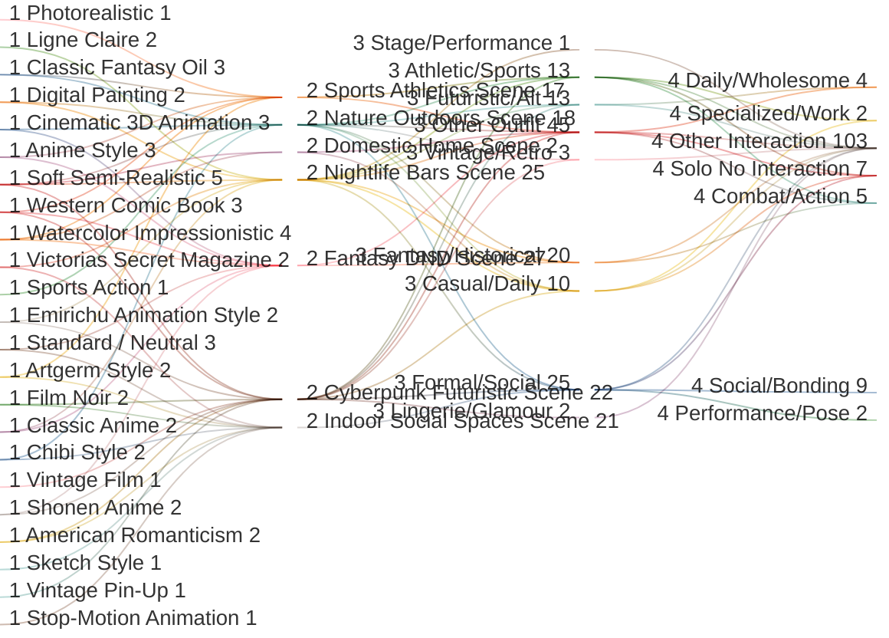

# 🕵️ PromptBuilder Comprehensive Audit
**Generated:** 2026-01-17 17:20:41

## 🛂 System Health Dashboard
| Metric | Value | Status |
|---|---|---|
| **Content Quality** | 2.4% Failure Rate | 🟢 HEALTHY |
| **Data Integrity** | 0 Logic / 13 Media | 🔴 ERROR |
| **Thematic Reach** | 6 Strong Hubs / 18 Potential | 🟡 LOW DIVERSITY |
| **Char Accessibility** | 0 Isolated Characters | 🟢 OK |

---

## 📑 Static Integrity Audit


## 📊 System Health Dashboard
- **Total Assets Audited**: 906
- **Failure Rate**: 2.4%
- **Integrity Errors**: 0
- **Media Errors**: 13

### 🚩 Critical Errors
- **Media**: Missing photo for aryan_kapoor.md: aryan_kapoor_photo.jpeg
- **Media**: Missing photo for callum_doherty.md: callum_doherty_photo.jpeg
- **Media**: Missing photo for chayton_red_elk.md: chayton_redelk_photo.jpeg
- **Media**: Missing photo for elena_rosales.md: elena_rosales_photo.jpeg
- **Media**: Missing photo for elias_thorne.md: elias_thorne_photo.jpeg
- **Media**: Missing photo for julian_blackwood.md: julian_blackwood_photo.jpeg
- **Media**: Missing photo for kaito_sato.md: kaito_sato_photo.jpeg
- **Media**: Missing photo for oliver_st_james.md: oliver_st_james_photo.jpeg
- **Media**: Missing photo for priya_sharma.md: priya_sharma_photo.jpeg
- **Media**: Missing photo for roxanna_perez.md: roxanna_photo.png
- **Media**: Missing photo for sina_tuilagi.md: sina_tuilagi_photo.jpeg
- **Media**: Missing photo for siofra_quinn.md: siofra_photo.png
- **Media**: Missing photo for zahara_el_amin.md: zahara_elamin_photo.png

### Characters (69/82 Passed)
| Asset Name | Issues |
|---|---|
| aryan_kapoor.md | Broken photo link |
| callum_doherty.md | Broken photo link |
| chayton_red_elk.md | Broken photo link |
| elena_rosales.md | Broken photo link |
| elias_thorne.md | Broken photo link |
| julian_blackwood.md | Broken photo link |
| kaito_sato.md | Broken photo link |
| oliver_st_james.md | Broken photo link |
| priya_sharma.md | Broken photo link |
| roxanna_perez.md | Broken photo link |
| sina_tuilagi.md | Broken photo link |
| siofra_quinn.md | Broken photo link |
| zahara_el_amin.md | Broken photo link |

### Scenes (159/159 Passed)
✅ All items meet the standard.

### Poses (215/215 Passed)
✅ All items meet the standard.

### Interactions (223/223 Passed)
✅ All items meet the standard.

### Outfits (218/227 Passed)
| Asset Name | Issues |
|---|---|
| Casual Wear\Comfort.txt | Missing 'tags' field |
| Casual Wear\Country Casual.txt | Missing 'tags' field |
| Casual Wear\Sundress.txt | Missing 'tags' field |
| Casual Wear\Urban Butterfly Crop.txt | Section [H] too brief (0 words) |
| Fantasy\Druid.txt | Missing 'tags' field |
| Fantasy\Paladin.txt | Missing 'tags' field |
| Fashion & Glamour\Infinity Maxi Dress.txt | Section [H] too brief (0 words) |
| History & Culture\1920s Jazz Age.txt | Missing 'tags' field |
| Seasonal  Swimwear\Turquoise Bikini.txt | Section [H] too brief (0 words) |


---

## 📑 Hub & Spoke Connectivity


## 🏛️ Established Hubs
Tags meeting the 1/2/3/3 coverage threshold.

| Hub Tag | Score | Style | Scene | Outfit | Int |
|---|---|---|---|---|---|
| **fantasy** | 50 | 3 | 14 | 26 | 7 |
| **sport** | 46 | 2 | 3 | 9 | 32 |
| **casual** | 42 | 4 | 2 | 31 | 5 |
| **work** | 31 | 1 | 5 | 17 | 8 |
| **urban** | 29 | 2 | 21 | 3 | 3 |
| **sci-fi** | 20 | 1 | 6 | 9 | 4 |

## ⚠️ Weak/Potential Hubs
Tags that are almost hubs but missing coverage in 1-2 categories.

| Potential Tag | Missing Category |
|---|---|
| romantic | Scene, Outfit |
| vintage | Interaction |
| social | Outfit |
| formal | Interaction |
| outdoor | Interaction |
| cultural | Style |
| combat_sport | Style, Scene |
| luxury | Style, Interaction |
| historical | Style, Interaction |
| noir | Interaction |
| nature | Interaction |
| tech | Style |
| dynamic | Scene, Outfit |
| fashion | Interaction |
| cyberpunk | Interaction |
| intimate | Outfit |
| team | Style, Scene |
| action | Scene, Outfit |
| music | Style |
| event | Style, Interaction |
| mma | Outfit |
| anime | Outfit, Interaction |
| retro | Interaction |
| elegant | Style, Scene |
| school | Outfit |
| magic | Scene |
| dark | Outfit, Interaction |
| traditional | Scene, Interaction |
| home | Outfit, Interaction |
| bowling | Style, Outfit |
| sexy | Style, Interaction |
| fun | Style, Outfit |
| cute | Scene, Outfit |
| nightlife | Outfit, Interaction |
| art | Outfit |
| glamour | Scene, Interaction |
| relaxed | Style, Outfit |
| dance | Style, Outfit |
| cinematic | Scene, Outfit |
| adventure | Scene, Outfit |
| summer | Style, Interaction |
| winter | Style, Interaction |
| soft | Scene, Interaction |
| football | Scene, Outfit |
| volleyball | Outfit, Interaction |
| basketball | Scene, Outfit |
| gym | Outfit, Interaction |
| creative | Outfit, Interaction |

## 👥 Character Reach
How many thematic Hubs each character can access.

| Character | Hub Count | Accessible Hubs |
|---|---|---|
| Amira Khalil | 1 | urban |
| Astrid Nielsen | 1 | urban |
| Callum Doherty | 1 | casual |
| Camila Vargas | 1 | sport |
| Daisy Dawson | 1 | casual |
| Elena Moretti | 1 | urban |
| Esme Dubois | 1 | urban |
| Hailey Bennett | 1 | casual |
| Isla MacLeod | 1 | urban |
| Jin Park | 1 | urban |
| Keiko Yamamoto | 1 | sport |
| Luna Vex | 1 | casual |
| Malik Farrah | 1 | casual |
| Marley Thompson | 1 | casual |
| Oliver St. James | 1 | casual |
| Rafael Costa | 1 | casual |
| Silas Burnside | 1 | casual |
| Zahara El-Amin | 1 | urban |
| Aryan Kapoor | 2 | urban, work |
| Audrey Thorne | 2 | casual, urban |
| Celine Voss | 2 | urban, work |
| Chayton Red-Elk | 2 | casual, urban |
| Chiara Lombardi | 2 | casual, urban |
| Clara Thorne | 2 | casual, work |
| Elena Rosales | 2 | urban, work |
| Elias Thorne | 2 | urban, work |
| Hana Park | 2 | casual, urban |
| Harper Mae Sullivan | 2 | casual, urban |
| Inara Velez | 2 | casual, sport |
| Ines Santos | 2 | casual, urban |
| Jamal Rivers | 2 | casual, urban |
| Jax Chen | 2 | casual, sport |
| Jena Marlowe | 2 | casual, urban |
| Julian Blackwood | 2 | casual, urban |
| Kaia Vaitupu | 2 | sci-fi, work |
| Linh Nguyen | 2 | casual, sport |
| Marisol Rivera | 2 | sport, urban |
| Mela Hart | 2 | casual, sport |
| Nora Alvarez | 2 | casual, urban |
| Samira Mansour | 2 | casual, urban |
| Simone Brooks | 2 | urban, work |
| Siofra Quinn | 2 | casual, sport |
| Sitara Saanvi | 2 | casual, urban |
| Sophie Summers | 2 | casual, urban |
| Suki Nakamura | 2 | urban, work |
| Talia Levi | 2 | urban, work |
| Theo Okonkwo | 2 | casual, urban |
| Valentina "Tina" Kovač | 2 | casual, urban |
| Yuki Tanaka | 2 | casual, urban |
| Zemen Ayele | 2 | urban, work |
| Aaliyah Chen | 3 | casual, sport, urban |
| Aiyana Blackfeather | 3 | sport, urban, work |
| Amina Benali | 3 | casual, urban, work |
| Avery Blake | 3 | sport, urban, work |
| Diego Morales | 3 | casual, sport, urban |
| Diesel Murphy | 3 | casual, urban, work |
| Efe Kouadio | 3 | casual, urban, work |
| Fiona O'Sullivan | 3 | casual, urban, work |
| Hallie Bennett | 3 | casual, sport, urban |
| Harald Bjornson | 3 | casual, urban, work |
| Kaito Sato | 3 | casual, sport, urban |
| Kendra Mitchell | 3 | sport, urban, work |
| Leilani Te'o | 3 | sport, urban, work |
| Leonidas Stratos | 3 | sport, urban, work |
| Lila Reyes | 3 | sport, urban, work |
| Lucía Reyes | 3 | casual, urban, work |
| Maya Rose | 3 | casual, urban, work |
| Mei Chen | 3 | casual, urban, work |
| Natsumi Maki | 3 | casual, sport, urban |
| Priya Sharma | 3 | casual, sport, urban |
| Rosa Torres | 3 | casual, urban, work |
| Sasha King | 3 | casual, sport, urban |
| Sina Tuilagi | 3 | sport, urban, work |
| Zara Washington | 3 | casual, urban, work |
| Elara Soledad | 4 | casual, sport, urban, work |
| Enzo Rossi | 4 | casual, sport, urban, work |
| Freydis Holm | 4 | casual, sport, urban, work |
| Jordan Vance | 4 | casual, sport, urban, work |
| Kassandra Lykaios | 4 | casual, sport, urban, work |
| Maki Cruz | 4 | casual, sport, urban, work |
| Marcus Thompson | 4 | casual, sport, urban, work |
| Roxanna Perez | 4 | casual, sport, urban, work |


---

## 📑 Vibe Cohesion Analysis


## Top Vibe Mixes (Multi-faceted Prompts)

## Potential Thematic Mismatches
- No major thematic mismatches detected! (High Vibe Cohesion)


---

## 📑 Prompt Scoring Analysis (Best & Worst)


## 📊 Statistical Summary

- **Total Prompts Analyzed:** 50
- **Mean Score:** 346.00
- **Median Score:** 312.5
- **Mode Score:** 200
- **Standard Deviation:** 161.56
- **Score Range:** 150 - 835

## 🏆 Top 3 Best Prompts

### 1. gen_only_1768688436_14.txt (Score: 835)
```text
Generate an image of: Rendering
1990s TV animation aesthetic. Flat colors with very simple two-tone shading (highlight and shadow). Line work is standard uniform width. Colors are slightly muted or "faded" to simulate analog broadcast.

Character Accuracy
Standardized facial proportions. Eyes are large but not excessive. Features are balanced and friendly. Expressions are readable standard archetypes.

Body Types
Average, relatable anatomy. Not overly muscular or overly slender. Poses are static or "keyframe" style.

Hair & Clothing
Hair: Solid blocks of color with simple white zigzag highlights. Clothing: everyday casual or uniform. Folds are minimal and functional.

Details
Hand-painted watercolor style backgrounds . Minimal visual effects—no bloom or complex lighting. The image looks like a screen capture from a CRT television.

---

**SCENE/SETTING:**
**Visual Description:**
A district that comes alive at night. Every surface is painted with the reflection of towering neon signs in pinks, blues, and electric greens.

**Sensory/Atmospheric Details:**

- **Lighting:** Saturated, colorful, artificial; high contrast.
- **Atmosphere:** Buzzing, cinematic, restless, futuristic.
- **Key Elements:** Neon signage, wet pavement, street food stalls, crowds.
---

**CHARACTER: Lucía Reyes**
**Appearance:**
* **Body:** Romantic frame; wave plush softness; full hourglass proportions; moderate vertical.
* **Face:** Rounded facial structure; heart-shaped face; full cheeks; warm expressive eyes; joyful resting expression.
* **Hair:** Type 2B–2C waves; high density; long layered cut; side part; healthy sheen.
* **Skin:** Warm golden skin with radiant glow.
**Outfit:**
- **Top:** Oversized boxy hoodie featuring a **faded vintage wash** and distressed hems.
  - **Fit:** Oversized boxy; Drop-shoulder.
  - **Material:** Heavyweight 450gsm French Terry.
  - **Pattern:** Variable featuring a **faded vintage wash** and distressed hems.
  - **Neckline:** Hooded.
  - **Sleeve:** Long sleeves with ribbed cuffs.
- **Bottom:** Wide-leg tactical cargo trousers.
  - **Fit:** Billowing tactical.
  - **Material:** Ripstop nylon.
  - **Pattern:** Solid.
  - **Waist:** Adjustable velcro clinch.
  - **Length:** Ankle-length.
- **Footwear:** Bulky deconstructed platform sneakers.
- **Accessories:** Crossbody sling bag; silver curb chain.
- _expanded_tags: {'high definition', 'Casual', 'realistic', 'photography', 'Textured', 'everyday', 'mood:realistic', 'urban', 'Urban', 'contemporary', 'life', 'modern'}
---

**CHARACTER 2: Elena Moretti**
**Appearance:**
* **Body:** Soft Natural frame; fleshy and soft curves layered over a strong, muscular foundation; defined waist with a striking hourglass ratio; strong, athletic shoulders and thighs that project power and grace.
* **Face:** Softened planes with full, inviting cheeks; almond-shaped warm brown eyes set under well-defined brows; straight nose with a soft, rounded tip; full and defined lips; resting expression is playful yet self-assured.
* **Hair:** Type 2A/2B texture (loose waves); dark espresso brown to black with high density and volume; reaching mid-back in length; cut with heavy fringe bangs and dramatic face-framing layers.
* **Skin:** Fair to light-medium depth; cool pink undertones that are prone to natural flushing; smooth, healthy texture with a radiant, hydrated finish.
**Outfit:**
- **Top:** Flowing floral midi dress .
  - **Fit:** Flowing.
  - **Material:** Linen.
  - **Pattern:** Ditsy floral.
  - **Neckline:** Variable .
  - **Sleeve:** Puffed sleeves.
- **Bottom:** Integrated skirt of dress.
  - **Fit:** Flared A-line.
  - **Material:** Linen.
  - **Pattern:** Floral Print.
  - **Waist:** Natural.
  - **Length:** Midi-length.
- **Footwear:** Lace-up leather boots.
- **Accessories:** Woven basket, delicate gold jewelry, floral hair clip.
- _expanded_tags: {'serene', 'high definition', 'Casual', 'peaceful', 'realistic', 'photography', 'static', 'everyday', 'quiet', 'gentle', 'mood:realistic', 'Country', 'life', 'pastel', 'calm', 'Soft'}
---

**Additional Notes:**
Lucía Reyes driving hard toward the hoop while Elena Moretti slides their feet in a low defensive block, set against a concrete court with long chain-link fence shadows.
```

### 2. gen_only_1768688436_5.txt (Score: 780)
```text
Generate an image of: Rendering
High-resolution vector-style illustration. Sharp, non-aliased distinct line art. Coloring uses "hard shading" (clear separation between light and dark) with minimal gradients. Colors are highly saturated and distinct.

Character Accuracy
Stylized facial proportions: large eyes, simplified noses/mouths. Chin and jawlines are sharp and angular. Expressions are clearly readable and slightly exaggerated for emotional clarity.

Body Types
Idealized anime anatomy. Elongated limbs and exaggerated posture. Anatomy is simplified into aesthetically pleasing shapes rather than biological realism.

Hair & Clothing
Hair: Gravity-defying clumps with distinct "shiny" highlight bands. Clothing: Folds are sharp, triangular, and dramatic. Fabric behaves dynamically to emphasize motion lines.

Details
"Screen tone" dots for shading texture. Speed lines or radial focus lines in the background. Lens flare is stylized (starbursts). Pop-art color palettes.

---

**SCENE/SETTING:**
**Visual Description:**
A third-wave coffee shop interior designed for lingering. Warm wood tones, exposed brick, and eclectic furniture create a welcoming texture. Steam rises from the espresso machine.

**Sensory/Atmospheric Details:**

- **Lighting:** Warm ambient hanging bulbs; soft window light.
- **Atmosphere:** Aromatic (coffee beans), humming with low conversation, creative.
- **Key Elements:** Wooden tables, espresso bar, chalkboard menu, ceramic mugs.
---

**CHARACTER: Zemen Ayele**
**Appearance:**
* **Body:** Soft Classic frame; elegant and poised density; moderate-to-tall vertical (5'7"-5'8"); narrow shoulders; balanced proportions with a dignified, upright posture; projects a sense of calm, intellectual authority.
* **Face:** Balanced-refined facial structure; long oval face; high-bridged aquiline nose; high, defined cheekbones; large, observant dark amber-brown eyes with a focused, analytical gaze; full lips with a natural terracotta tint; expression is usually one of contemplative silence or intense focus.
* **Hair:** Type 3C texture; high density; natural dark brown ringlet curls with a high-gloss sheen; typically worn loose and voluminous, framing her face and falling to her collarbones; natural center part; healthy and well-maintained.
* **Skin:** Deep bronze with warm reddish undertones (Habesha/Highland coloring); smooth, matte finish; clear complexion that reflects her meticulous care and "indoor" scholastic life. leather-bound research journal with intricate embossed patterns
**Outfit:**
- **Top:** Striped Camisole under Oversized Bomber Jacket.
  - **Fit:** Fitted camisole; Slouchy jacket.
  - **Material:** Cotton camisole; Red nylon/satin jacket.
  - **Pattern:** Red and white pin-stripes.
  - **Neckline:** Spaghetti straps.
  - **Sleeve:** Sleeveless (camisole) under Voluminous Sleeves (jacket).
- **Bottom:** Athletic Track Shorts.
  - **Fit:** Vintage dolphin hem cut.
  - **Material:** Orange-red synthetic fabric.
  - **Pattern:** White vertical side stripes.
  - **Waist:** Elastic waistband.
  - **Length:** Short.
- **Footwear:** White retro sneakers (implied).
- **Accessories:** Simple gold pendant necklace, minimal jewelry.
- _expanded_tags: {'old-school', 'Sport', 'retro', 'everyday', 'training', 'vintage', 'Casual', 'realistic', 'nostalgic', 'sport', 'fitness', 'life', 'high definition', 'active', 'athletic', 'Retro', 'sports', 'photography', 'mood:realistic'}
---

**CHARACTER 2: Audrey Thorne**
**Appearance:**
* **Body:** Heavy Curvy Hourglass / Spoon Shape; statuesque height at 5'7"; 43.5-37-48 proportions; thick, soft flesh quality; substantial bust carried high, transitioning into a defined but thick waist, which flares dramatically into wide, shelf-like hips and heavy thighs; bottom-heavy silhouette balanced by a full chest; voluptuous density with soft anatomical markers.
* **Face:** Soft Heart-shaped structure with a "baby face" quality; full, rounded cheeks (apple cheeks) and a soft, non-angular jawline; gentle chin; distinctively pale, porcelain complexion with pink undertones; focal heavy-lidded / slightly hooded eyes with hazel-brown irises and relaxed, downward-sloping upper lids giving a calm, sultry expression; natural, slightly arched brows; small to medium mouth width with full, pillowy lips and a clearly defined cupid's bow.
* **Hair:** Type 2B (wavy); high density; tousled, voluminous layered silhouette; collarbone-length; deep side part with height at the root; healthy natural sheen; common styling includes a loose, textured blowout. Medium chestnut brown with copper/golden undertones.
* **Skin:** Fair/Light depth; cool pink undertones with a smooth, matte-satin finish; clear complexion with natural flushing on the cheeks.
**Outfit:**
- **Top:** Tight white bandeau top.
  - **Fit:** Tight skin-hugging.
  - **Material:** Ribbed Cotton.
  - **Pattern:** Solid.
  - **Neckline:** Bandeau.
  - **Sleeve:** Sleeveless.
- **Bottom:** High leg low cut jean shorts.
  - **Fit:** Tight high-leg cut.
  - **Material:** Denim.
  - **Waist:** Low-waist.
  - **Length:** Micro-short.
- **Footwear:** White sneakers (implied).
- _expanded_tags: {'high definition', 'Casual', 'realistic', 'photography', 'everyday', 'mood:realistic', 'life', 'Basic'}
---

**Additional Notes:**
Zemen Ayele and Audrey Thorne pacing each other on a trail run, sweat glistening on their skin and rhythmic gaits matched in a moment of shared athletic discipline.
```

### 3. gen_only_1768688436_34.txt (Score: 660)
```text
Generate an image of: Rendering
Ultra-glamorous high-fashion photography style. High-key studio lighting with a mix of soft-boxes and dramatic ring lights. 8K resolution with a "glossy magazine" finish. Warm, sun-kissed color palette with subtle pink and gold undertones. Shallow depth of field with a soft, expensive-looking bokeh.

Character Accuracy
Focus on high-fashion contouring and shimmering eyeshadow. Eyes are rendered with detailed corneal reflections. Professional-grade makeup aesthetic with glossy lips and perfectly groomed brows. Facial features are enhanced by flattering, diffuse light that minimizes harsh shadows.

Body Types
Focus on luminous skin rendering with a soft-focus glow. Skin texture highlights muscle definition and natural curves through high-specularity "body oil" effects. Shadows are soft and warm, emphasizing form through gentle transitions rather than hard lines.

Hair & Clothing
Hair: Rendered with massive volume and high specularity to simulate a professional studio finish. Clothing: Emphasis on the specularity and luxe texture of fabrics. Materials interact dynamically with the lighting setup to create a sense of premium quality.

Details
Soft bloom on highlights, subtle lens flare, and a faint shimmering particle effect in the air. Backgrounds are rendered as high-end studio environments or sun-drenched luxury locations. The overall finish simulates a prestigious multi-page magazine spread with a clean, commercial aesthetic.

---

**SCENE/SETTING:**
**Visual Description:**
A finished basement retreat designed for leisure, featuring wood-paneled walls and deep, comfortable seating. The space feels subterranean and enclosed, separated from the day-to-day bustle of the main house.

**Sensory/Atmospheric Details:**

- **Lighting:** Recessed dimmable pot-lights creating pools of warm illumination; lack of natural light.
- **Atmosphere:** Relaxed, sound-dampened, cool air, casual hangout vibe.
- **Key Elements:** Plush sectional sofa, large TV screen, soft carpet, faint hum of a mini-fridge.
---

**CHARACTER: Priya Sharma**
**Appearance:**
* **Body:** Flamboyant Gamine frame; straight athletic flesh; compact powerful proportions; petite vertical.
* **Face:** Soft oval face with gentle rounded features; warm expressive dark brown eyes; friendly approachable expression; fuller cheeks; soft jawline; warm genuine smile.
* **Hair:** Type 2B-2C waves; medium-high density; long dark brown hair (almost black at roots) with warm caramel-brown highlights throughout mid-lengths and ends; natural body and volume; beachy waves.
* **Skin:** Deep warm brown skin with rich golden undertones; natural healthy glow. small black bindi dot on forehead
**Outfit:**
- **Top:** Oversized graphic t-shirt.
  - **Fit:** Oversized loose.
  - **Material:** Heavy cotton jersey.
  - **Pattern:** Vintage graphic.
  - **Neckline:** Crew neck.
  - **Sleeve:** Short sleeves (drop shoulder).
- **Bottom:** Baggy durable pants (Dickies style).
  - **Fit:** Baggy straight leg.
  - **Material:** Canvas or Twill.
  - **Waist:** Low-waist.
  - **Length:** Cuffed at ankle.
- **Footwear:** Canvas skate shoes (Vans or Converse).
- **Accessories:** Beanie, chain wallet, skate tool.
- _expanded_tags: {'Skate', 'everyday', 'training', 'Casual', 'realistic', 'sport', 'fitness', 'life', 'high definition', 'skater', 'urban', 'active', 'athletic', 'skate', 'sports', 'photography', 'mood:realistic', 'Urban', 'contemporary', 'modern'}
---

**CHARACTER 2: Audrey Thorne**
**Appearance:**
* **Body:** Heavy Curvy Hourglass / Spoon Shape; statuesque height at 5'7"; 43.5-37-48 proportions; thick, soft flesh quality; substantial bust carried high, transitioning into a defined but thick waist, which flares dramatically into wide, shelf-like hips and heavy thighs; bottom-heavy silhouette balanced by a full chest; voluptuous density with soft anatomical markers.
* **Face:** Soft Heart-shaped structure with a "baby face" quality; full, rounded cheeks (apple cheeks) and a soft, non-angular jawline; gentle chin; distinctively pale, porcelain complexion with pink undertones; focal heavy-lidded / slightly hooded eyes with hazel-brown irises and relaxed, downward-sloping upper lids giving a calm, sultry expression; natural, slightly arched brows; small to medium mouth width with full, pillowy lips and a clearly defined cupid's bow.
* **Hair:** Type 2B (wavy); high density; tousled, voluminous layered silhouette; collarbone-length; deep side part with height at the root; healthy natural sheen; common styling includes a loose, textured blowout. Medium chestnut brown with copper/golden undertones.
* **Skin:** Fair/Light depth; cool pink undertones with a smooth, matte-satin finish; clear complexion with natural flushing on the cheeks.
**Outfit:**
- **Top:** Black sleeveless crop top featuring small yellow/gold butterfly motifs on the chest.
  - **Fit:** Fitted crop.
  - **Material:** Ribbed cotton.
  - **Pattern:** Butterfly motifs.
  - **Neckline:** Round neck.
  - **Sleeve:** Sleeveless.
- **Bottom:** High-waisted denim shorts with a raw, frayed hem.
  - **Fit:** High-waisted.
  - **Material:** Distressed denim.
  - **Waist:** High-rise.
  - **Length:** Mini.
- **Footwear:** White lifestyle trainers with light blue accents.
- **Accessories:** Wide-brim straw hat with a black band; brown leather fanny pack/crossbody bag; aviator sunglasses.
- _expanded_tags: {'high definition', 'Casual', 'realistic', 'photography', 'Summer', 'everyday', 'mood:realistic', 'urban', 'Urban', 'contemporary', 'life', 'modern'}
---

**Additional Notes:**
Priya Sharma handing a chilled water bottle to a sweating Audrey Thorne, both taking a moment to catch their breath and hydrate, shoulders slumped in shared exhaustion.
```


## 📉 Bottom 3 Worst Prompts

### 1. gen_only_1768688436_19.txt (Score: 150)
```text
Generate an image of: Rendering
Soft-shaded vector illustration or vinyl toy aesthetic. Bright, pastel, or primary-heavy color palettes. Gradient shading is minimal and smooth, giving surfaces a matte plastic or "squishy" appearance. Thick, rounded line art (or lineless "sticker" style).

Character Accuracy
Extreme anatomical exaggeration (SD or Super Deformed). Heads are 1:1 or 1:2 ratio with the body. Eyes are massive, taking up 50% of the face, with simplified sparkles. Noses are absent or mere dots. Mouths are simple curves.

Body Types
"Bean" shaped torsos. Limbs are short, stubby cylinders with no muscle definition. Hands are simple spheres or "mitten" shapes; feet are rounded nubs. The silhouette is fundamentally cute and non-threatening.

Hair & Clothing
Hair: Simplified into large, chunky shapes with high volume and minimal strand detail. Clothing: Reduced to iconic elements—details like shoelaces or buttons are oversized and simplified for readability.

Details
Floating iconography (hearts, stars, sweat drops, anger veins) near the head. Backgrounds are simple patterns (polka dots, stripes) or solid soft colors. A thick white outline often surrounds the entire character like a die-cut sticker.

---

**SCENE/SETTING:**
**Visual Description:**
A raw concrete basement repurposed for rave culture. There is no decor, only sound equipment, fog machines, and a mass of dancers.

**Sensory/Atmospheric Details:**

- **Lighting:** Minimal, harsh strobes; almost pitch black otherwise.
- **Atmosphere:** Intense, humid, bass-heavy, trance-like.
- **Key Elements:** Concrete walls, massive speakers, fog, sweat.
---

**CHARACTER: Amina Benali**
**Appearance:**
- **Body:** Soft Natural frame; natural-soft flesh; balanced proportions with gentle curves, defined waist, moderate bust (C cup), soft rounded hips; moderate height (5'5"-5'6"); soft feminine build with subtle athleticism
- **Face:** Soft-balanced facial structure; oval-to-heart face shape with gentle angles; smooth clear planes; large expressive almond-shaped eyes, wide-set, dark brown with natural warmth and camera-aware sparkle; defined arched eyebrows (professionally maintained); straight refined nose; full lips with natural cupid's bow; soft jawline; warm engaging expression—the "streaming face" of genuine enthusiasm mixed with performative energy; dimples when smiling fully.
- **Hair:** Type 2B-2C waves; very high density; long length past shoulders to mid-back; natural volume and body; center or slight side part; healthy high-gloss finish; commonly worn loose with volume (camera-ready), half-up with claw clip (casual streams), or sleek ponytail (competitive mode); rich dark brown to black with subtle caramel balayage highlights framing face.
- **Skin:** Medium-tan with warm golden-olive undertones (North African coloring); smooth luminous finish; flawless complexion maintained for camera work; natural healthy glow enhanced by ring lights and skincare routine. stylish clear-framed gaming glasses with a slight cat-eye shape
**Outfit:**
- **Top:** Pigeon-breast (blouson) bodice.
  - **Fit:** Blouson torso; Fitted waist.
  - **Material:** ; Lace inserts.
  - **Pattern:** Pintuck pleats; Broderie anglaise.
  - **Neckline:** High lace collar (lace choker effect).
  - **Sleeve:** Gigot (leg of mutton) or bishop sleeves.
- **Bottom:** Gored skirt.
  - **Fit:** Fitted at hips; Flaring at hem.
  - **Material:** matching .
  - **Waist:** Corseted natural waist.
  - **Length:** Floor-length.
- **Footwear:** Two-tone button boots.
- **Accessories:** Lace parasol; straw boater hat with ribbon; cameo brooch.
- _expanded_tags: {'Vintage', 'old-school', 'retro', 'nostalgic', 'Elegant', 'historical', 'vintage', 'edwardian', '1900s', 'Coastal'}
**Pose/Action:**
Sitting at a table with a reflective posture, gazing out of a window with a serene and cozy expression.
---
```

### 2. gen_only_1768688436_41.txt (Score: 150)
```text
Generate an image of: Character Accuracy
Anatomically perfect. Skin texture includes pores, vellus hair, uneven pigmentation, and micro-wrinkles. Eyes reflect the environment realistically (corneal reflection). Asymmetry in the face is preserved for realism.

Body Types
Biologically accurate weight distribution. Muscles and fat interact realistically with clothing and gravity. Skin acts like real tissue, compressing and stretching at joints.

Hair & Clothing
Hair: Every individual strand is rendered. Scalp visibility is realistic. Clothing: Micro-details like pilling on fabric, stitching thread count, and realistic material weight (leather stiffness vs. silk flow).

Details
ISO noise in shadow areas. Chromatic aberration only at extreme edges. Realistic interaction with props (fingerprints on glasses, dust on shoulders). Lighting interacts complexly with materials (subsurface scattering on ears/fingers).

---

**SCENE/SETTING:**
**Visual Description:**
A raw concrete basement repurposed for rave culture. There is no decor, only sound equipment, fog machines, and a mass of dancers.

**Sensory/Atmospheric Details:**

- **Lighting:** Minimal, harsh strobes; almost pitch black otherwise.
- **Atmosphere:** Intense, humid, bass-heavy, trance-like.
- **Key Elements:** Concrete walls, massive speakers, fog, sweat.
---

**CHARACTER: Valentina "Tina" Kovač**
**Appearance:**
- **Body:** Dramatic frame; straight thin flesh with minimal softness; narrow angular proportions with long limbs, prominent joints (elbows, wrists, knees), flat planes, minimal bust (A cup), straight hips, long fingers and toes; tall-moderate vertical (5'8"-5'9"); very low body density—visible bone structure, delicate appearance but wiry strength, lean muscle definition without bulk; bird-like presence that seems too delicate yet surprisingly resilient.
- **Face:** Sharp angular structure; long oval-to-diamond face; high prominent cheekbones creating dramatic shadows; deep-set eyes, almond-shaped, close-set, Intense dark brown to black with penetrating gaze; strong straight nose with high bridge; defined angular jawline; hollow cheeks even at healthy weight; neutral resting expression is intense and assessing with slight suspicious edge—reads as guarded or challenging.
- **Hair:** Type 2C-3A waves/curls; medium-high density but fine texture; long length past shoulders; no defined part, tousled and wild; matte-to-low sheen finish; deliberately unkempt aesthetic; commonly worn loose and chaotic, half-up with tendrils escaping, or messy bun with pieces falling; deep black-brown with occasional henna-red undertones or temporary colored streaks (artistic expression).
- **Skin:** Light-olive with warm golden undertones (Roma coloring); smooth but slightly weathered from outdoor living/art-making; paint stains semi-permanent on hands and forearms; small scattered tattoos (DIY stick-and-poke aesthetic); natural bohemian finish.
**Outfit:**
- **Top:** Vibrant crimson damask walking dress bodice.
  - **Fit:** 1890s fitted bodice; Corseted silhouette.
  - **Material:** Red damask silk; Velvet ribbon detailing.
  - **Pattern:** Tone-on-tone floral weave.
  - **Neckline:** High standing collar with ruffled edge.
  - **Sleeve:** Long fitted sleeves with shoulder cap puff.
- **Bottom:** Matching A-line skirt.
  - **Fit:** A-line; No bustle (practical for movement).
  - **Material:** matching damask silk.
  - **Waist:** Fitted natural waist.
  - **Length:** Floor-length.
- **Footwear:** Lace-up leather boots.
- **Accessories:** Antique brass locket; lace-up boots.
- _expanded_tags: {'Vintage', 'old-school', 'victorian', 'retro', 'nostalgic', 'historical', 'formal', 'vintage', 'Detective', 'elegant', '1890s', 'evening', 'Formal'}
**Pose/Action:**
Standing in a majestic position with the chin lifted high and arms spread wide in a gesture of divine authority, radiating an ethereal and commanding presence.
---
```

### 3. gen_only_1768688436_39.txt (Score: 160)
```text
Generate an image of: Rendering
Wet-on-wet traditional watercolor simulation. Pigment pooling, paper grain texture, and natural capillary bleeding edges. High-key lighting with white paper negative space used for highlights. Colors are transparent and layered, lacking harsh black outlines. Inspired by **Agnes Cecile** and **David Mack**.

Character Accuracy
Facial features are suggested through shadow shapes and color temperature shifts rather than line art. Eyes and expressions are soft and diffused. Likeness is captured through "gestural" paint application rather than photographic precision.

Body Types
Figures are grounded in gesture drawing techniques. Limbs and torso shapes are defined by broad washes of color. Edges of the body dissolve softly into the background, creating a dreamy, ethereal connection to the environment.

Hair & Clothing
Hair: Rendered as loose, flowing pools of color with wet edges. Clothing: Fabrics are depicted through variegation in color saturation. Folds are soft gradients where paint creates "blooms." No sharp stitching or texture detailing.

Details
Splatter droplets, dry-brush scratch marks, and visible pencil under-drawing. The palette is harmonious and desaturated. Backgrounds are abstract washes suggesting environment without explicit detail.

---

**SCENE/SETTING:**
Neutral seamless backdrop, professional three-point studio lighting with softboxes, clean minimalist setup. Subtle hum of cooling fans, scent of fresh paint and ozone.
---

**CHARACTER: Aryan Kapoor**
**Appearance:**
* **Body:** Dramatic Classic frame; moderate muscularity with a lean, tailored silhouette; balanced proportions that look exceptional in suiting; moderate vertical (5'10"-5'11"); posture is military-straight but relaxed; projects a refined, expensive stability.
* **Face:** Symmetrical, high-contrast structure; strong square jawline covered by a meticulously groomed "designer stubble" to short boxed beard; high cheekbones; piercing amber-brown eyes with thick lashes; straight aristocratic nose; expression is usually a knowing, confident smirk.
* **Hair:** Type 2A waves; high density; styled in a classic "quiff" or side-part with volume; sides are tapered clean; glossy, healthy finish; jet black with a blueish tint under light.
* **Skin:** Medium-deep tan with warm golden-olive undertones; hyper-smooth texture suggestive of a high-end skincare routine.
**Outfit:**
- **Top:** Leather or brocade vest over white dress shirt.
  - **Fit:** Tailored.
  - **Material:** Leather/Brocade; Cotton.
  - **Neckline:** Cravat or bow tie.
  - **Sleeve:** Long.
- **Bottom:** High-waist trousers.
  - **Fit:** Straight.
  - **Material:** Wool or Tweed.
  - **Pattern:** Striped or solid.
  - **Waist:** High-waisted.
  - **Length:** Full.
- **Footwear:** Lace-up boots.
- **Accessories:** Goggles; pocket watch with chain; gears/brass accessories; top hat.
- _expanded_tags: {'Historical', 'Sci-Fi'}
---

**CHARACTER 2: Hailey Bennett**
**Appearance:**
* **Body:** Soft Natural frame; moderate vertical line with a slightly petite essence; soft flesh over a frame with gentle width; relaxed but engaged posture.
* **Face:** Soft heart-shaped structure; rounded cheeks; wide, expressive blue-grey eyes with a bright engaging gaze; uniform white teeth and a symmetrical, wide smile that reaches her eyes.
* **Hair:** Type 2A/2B waves; high density and volume; "butterfly cut" featuring heavy layering and curtain bangs; dimensional honey blonde with heavy platinum face-framing "money piece" highlights.
* **Skin:** Fair with cool pink undertones; "glass skin" finish with a natural, healthy flush; light dusting of faint freckles across the nose bridge and cheeks.
**Outfit:**
- **Top:** Halter-neck jumpsuit in **shimmering Qiana nylon** with bold floral print.
  - **Fit:** Fitted torso.
  - **Material:** in **shimmering Qiana nylon** with bold floral print (Lamé/Nylon/Polyester).
  - **Pattern:** Shimmering or Bold Floral.
  - **Neckline:** Plunging halter V-neck with sash tie.
  - **Sleeve:** Sleeveless (open back).
- **Bottom:** Integrated bell-bottom legs.
  - **Fit:** Extreme flare from the knee down.
  - **Material:** matching in **shimmering Qiana nylon** with bold floral print.
  - **Waist:** Natural waist (belted/sash).
  - **Length:** Floor-length (concealing platforms).
- **Footwear:** Cork-wedge platform shoes.
- **Accessories:** Oversized amber sunglasses; disco-ball earrings; feather boa.
- _expanded_tags: {'old-school', 'glamour', 'beauty', 'retro', 'alluring', 'vintage', 'artistic', 'fashion', 'alternative', 'nostalgic', 'boudoir', 'bedroom', 'Disco', 'intimate', 'romantic', 'Vintage', 'art', 'sensual', 'boho', '1970s', 'creative', 'sultry', 'bohemian', 'historical', 'flirty', 'Glamour'}
---

**Additional Notes:**
Aryan Kapoor and Hailey Bennett jumping into perfect splits simultaneously on a padded floor, captured in a moment of stunning artistic gymnastics and high-energy synchronization.
```


---

## 📑 Distribution Visualizations





---

## 📑 Tag Flow


```mermaid
sankey-beta
"Scene","Style",100
"Theme/Genre","Style",96
"Scene","Theme/Genre",50
"Theme/Genre","Theme/Genre",48
"Scene","Anatomy/Body",20
"Scene","Action/Pose",20
"Theme/Genre","Anatomy/Body",18
"Theme/Genre","Action/Pose",18
"Scene","Mood/Vibe",4
"Theme/Genre","Mood/Vibe",4
"Action/Pose","Style",4
"Action/Pose","Anatomy/Body",2
"Action/Pose","Action/Pose",2
"Action/Pose","Theme/Genre",2
"Style","Outfit",49
"Theme/Genre","Outfit",25
"Style","Theme/Genre",20
"Theme/Genre","Theme/Genre",14
"Anatomy/Body","Outfit",9
"Action/Pose","Outfit",9
"Mood/Vibe","Outfit",2
"Anatomy/Body","Theme/Genre",2
"Mood/Vibe","Theme/Genre",1
"Style","Action/Pose",1
"Theme/Genre","Action/Pose",1
"Action/Pose","Theme/Genre",1
```


---

