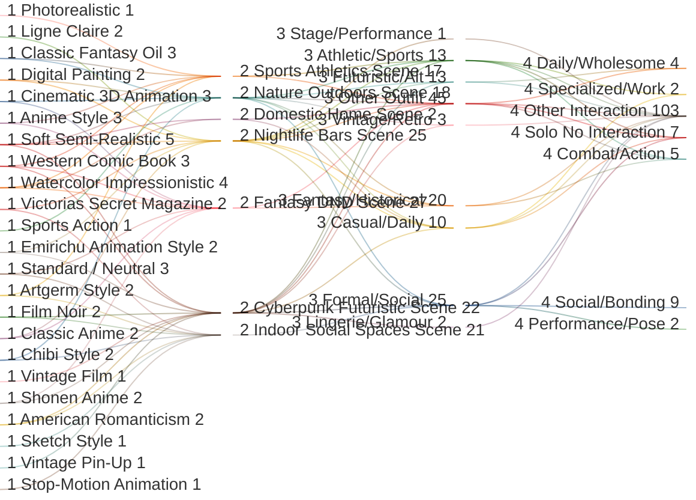

# 🕵️ PromptBuilder Comprehensive Audit
**Generated:** 2026-01-17 21:56:03

## 🛂 System Health Dashboard
| Metric | Value | Status |
|---|---|---|
| **Content Quality** | 2.3% Failure Rate | 🟢 HEALTHY |
| **Data Integrity** | 0 Logic / 13 Media | 🔴 ERROR |
| **Thematic Reach** | 7 Strong Hubs / 19 Potential | 🟡 LOW DIVERSITY |
| **Char Accessibility** | 2 Isolated Characters | 🔴 RE-TAG NEEDED |

---

## 📑 Static Integrity Audit


## 📊 System Health Dashboard
- **Total Assets Audited**: 969
- **Failure Rate**: 2.3%
- **Integrity Errors**: 0
- **Media Errors**: 13

### 🚩 Critical Errors
- **Media**: Missing photo for aryan_kapoor.md: aryan_kapoor_photo.jpeg
- **Media**: Missing photo for callum_doherty.md: callum_doherty_photo.jpeg
- **Media**: Missing photo for chayton_red_elk.md: chayton_redelk_photo.jpeg
- **Media**: Missing photo for elena_rosales.md: elena_rosales_photo.jpeg
- **Media**: Missing photo for elias_thorne.md: elias_thorne_photo.jpeg
- **Media**: Missing photo for julian_blackwood.md: julian_blackwood_photo.jpeg
- **Media**: Missing photo for kaito_sato.md: kaito_sato_photo.jpeg
- **Media**: Missing photo for oliver_st_james.md: oliver_st_james_photo.jpeg
- **Media**: Missing photo for priya_sharma.md: priya_sharma_photo.jpeg
- **Media**: Missing photo for roxanna_perez.md: roxanna_photo.png
- **Media**: Missing photo for sina_tuilagi.md: sina_tuilagi_photo.jpeg
- **Media**: Missing photo for siofra_quinn.md: siofra_photo.png
- **Media**: Missing photo for zahara_el_amin.md: zahara_elamin_photo.png

### Characters (69/82 Passed)
| Asset Name | Issues |
|---|---|
| aryan_kapoor.md | Broken photo link |
| callum_doherty.md | Broken photo link |
| chayton_red_elk.md | Broken photo link |
| elena_rosales.md | Broken photo link |
| elias_thorne.md | Broken photo link |
| julian_blackwood.md | Broken photo link |
| kaito_sato.md | Broken photo link |
| oliver_st_james.md | Broken photo link |
| priya_sharma.md | Broken photo link |
| roxanna_perez.md | Broken photo link |
| sina_tuilagi.md | Broken photo link |
| siofra_quinn.md | Broken photo link |
| zahara_el_amin.md | Broken photo link |

### Scenes (159/159 Passed)
✅ All items meet the standard.

### Poses (215/215 Passed)
✅ All items meet the standard.

### Interactions (271/271 Passed)
✅ All items meet the standard.

### Outfits (233/242 Passed)
| Asset Name | Issues |
|---|---|
| Casual Wear\Comfort.txt | Missing 'tags' field |
| Casual Wear\Country Casual.txt | Missing 'tags' field |
| Casual Wear\Sundress.txt | Missing 'tags' field |
| Casual Wear\Urban Butterfly Crop.txt | Section [H] too brief (0 words) |
| Fantasy\Druid.txt | Missing 'tags' field |
| Fantasy\Paladin.txt | Missing 'tags' field |
| Fashion & Glamour\Infinity Maxi Dress.txt | Section [H] too brief (0 words) |
| History & Culture\1920s Jazz Age.txt | Missing 'tags' field |
| Seasonal  Swimwear\Turquoise Bikini.txt | Section [H] too brief (0 words) |


---

## 📑 Hub & Spoke Connectivity


## 🏛️ Established Hubs
Tags meeting the 1/2/3/3 coverage threshold.

| Hub Tag | Score | Style | Scene | Outfit | Int |
|---|---|---|---|---|---|
| **casual** | 60 | 4 | 2 | 45 | 9 |
| **fantasy** | 60 | 3 | 14 | 26 | 17 |
| **social** | 49 | 1 | 5 | 3 | 40 |
| **outdoor** | 36 | 1 | 22 | 7 | 6 |
| **work** | 32 | 1 | 5 | 17 | 9 |
| **urban** | 30 | 2 | 21 | 3 | 4 |
| **sci-fi** | 20 | 1 | 6 | 9 | 4 |

## ⚠️ Weak/Potential Hubs
Tags that are almost hubs but missing coverage in 1-2 categories.

| Potential Tag | Missing Category |
|---|---|
| romantic | Scene, Outfit |
| vintage | Interaction |
| formal | Interaction |
| cultural | Style |
| combat_sport | Style, Scene |
| luxury | Style, Interaction |
| historical | Style, Interaction |
| professional | Style, Scene |
| tech | Style |
| noir | Interaction |
| nature | Interaction |
| dynamic | Scene, Outfit |
| fashion | Interaction |
| cyberpunk | Interaction |
| intimate | Outfit |
| music | Style |
| team | Style, Scene |
| action | Scene, Outfit |
| cozy | Style |
| event | Style, Interaction |
| sport | Interaction |
| magic | Scene |
| mma | Outfit |
| anime | Outfit, Interaction |
| retro | Interaction |
| elegant | Style, Scene |
| school | Outfit |
| relaxed | Style |
| fun | Style, Outfit |
| dark | Outfit, Interaction |
| traditional | Scene, Interaction |
| home | Outfit, Interaction |
| bowling | Style, Outfit |
| sexy | Style, Interaction |
| athletic | Scene, Outfit |
| cute | Scene, Outfit |
| nightlife | Outfit, Interaction |
| art | Outfit |
| glamour | Scene, Interaction |
| dance | Style, Outfit |
| summer | Style, Interaction |
| winter | Style, Interaction |
| cinematic | Scene, Outfit |
| modern | Scene, Interaction |
| adventure | Scene, Outfit |
| creative | Outfit, Interaction |
| soft | Scene, Interaction |
| football | Scene, Outfit |
| volleyball | Outfit, Interaction |
| office | Style, Interaction |
| basketball | Scene, Outfit |
| baseball | Scene, Outfit |
| gym | Outfit, Interaction |

## 👥 Character Reach
How many thematic Hubs each character can access.

| Character | Hub Count | Accessible Hubs |
|---|---|---|
| Camila Vargas | 0 | ❌ NONE |
| Keiko Yamamoto | 0 | ❌ NONE |
| Amira Khalil | 1 | urban |
| Astrid Nielsen | 1 | urban |
| Elena Moretti | 1 | urban |
| Esme Dubois | 1 | urban |
| Inara Velez | 1 | casual |
| Isla MacLeod | 1 | urban |
| Jin Park | 1 | urban |
| Marisol Rivera | 1 | urban |
| Zahara El-Amin | 1 | urban |
| Aiyana Blackfeather | 2 | urban, work |
| Aryan Kapoor | 2 | urban, work |
| Avery Blake | 2 | urban, work |
| Callum Doherty | 2 | casual, outdoor |
| Celine Voss | 2 | urban, work |
| Clara Thorne | 2 | casual, work |
| Daisy Dawson | 2 | casual, outdoor |
| Elena Rosales | 2 | urban, work |
| Elias Thorne | 2 | urban, work |
| Hailey Bennett | 2 | casual, social |
| Jax Chen | 2 | casual, outdoor |
| Julian Blackwood | 2 | casual, urban |
| Kaia Vaitupu | 2 | sci-fi, work |
| Kendra Mitchell | 2 | urban, work |
| Leilani Te'o | 2 | urban, work |
| Leonidas Stratos | 2 | urban, work |
| Lila Reyes | 2 | urban, work |
| Luna Vex | 2 | casual, outdoor |
| Malik Farrah | 2 | casual, outdoor |
| Marley Thompson | 2 | casual, social |
| Oliver St. James | 2 | casual, social |
| Simone Brooks | 2 | urban, work |
| Sina Tuilagi | 2 | urban, work |
| Siofra Quinn | 2 | casual, outdoor |
| Suki Nakamura | 2 | urban, work |
| Talia Levi | 2 | urban, work |
| Valentina "Tina" Kovač | 2 | casual, urban |
| Zemen Ayele | 2 | urban, work |
| Aaliyah Chen | 3 | casual, social, urban |
| Audrey Thorne | 3 | casual, outdoor, urban |
| Chayton Red-Elk | 3 | casual, outdoor, urban |
| Chiara Lombardi | 3 | casual, outdoor, urban |
| Diego Morales | 3 | casual, social, urban |
| Hallie Bennett | 3 | casual, social, urban |
| Hana Park | 3 | casual, outdoor, urban |
| Harper Mae Sullivan | 3 | casual, social, urban |
| Jamal Rivers | 3 | casual, social, urban |
| Jena Marlowe | 3 | casual, social, urban |
| Kaito Sato | 3 | casual, outdoor, urban |
| Linh Nguyen | 3 | casual, outdoor, social |
| Mela Hart | 3 | casual, outdoor, social |
| Natsumi Maki | 3 | casual, outdoor, urban |
| Nora Alvarez | 3 | casual, outdoor, urban |
| Rafael Costa | 3 | casual, outdoor, social |
| Samira Mansour | 3 | casual, social, urban |
| Sasha King | 3 | casual, outdoor, urban |
| Silas Burnside | 3 | casual, outdoor, social |
| Sitara Saanvi | 3 | casual, outdoor, urban |
| Sophie Summers | 3 | casual, social, urban |
| Yuki Tanaka | 3 | casual, social, urban |
| Amina Benali | 4 | casual, social, urban, work |
| Diesel Murphy | 4 | casual, outdoor, urban, work |
| Enzo Rossi | 4 | casual, outdoor, urban, work |
| Fiona O'Sullivan | 4 | casual, social, urban, work |
| Freydis Holm | 4 | casual, outdoor, urban, work |
| Harald Bjornson | 4 | casual, outdoor, urban, work |
| Ines Santos | 4 | casual, outdoor, social, urban |
| Jordan Vance | 4 | casual, outdoor, urban, work |
| Kassandra Lykaios | 4 | casual, outdoor, urban, work |
| Maki Cruz | 4 | casual, outdoor, urban, work |
| Marcus Thompson | 4 | casual, social, urban, work |
| Priya Sharma | 4 | casual, outdoor, social, urban |
| Roxanna Perez | 4 | casual, outdoor, urban, work |
| Theo Okonkwo | 4 | casual, outdoor, social, urban |
| Efe Kouadio | 5 | casual, outdoor, social, urban, work |
| Elara Soledad | 5 | casual, outdoor, social, urban, work |
| Lucía Reyes | 5 | casual, outdoor, social, urban, work |
| Maya Rose | 5 | casual, outdoor, social, urban, work |
| Mei Chen | 5 | casual, outdoor, social, urban, work |
| Rosa Torres | 5 | casual, outdoor, social, urban, work |
| Zara Washington | 5 | casual, outdoor, social, urban, work |


---

## 📑 Vibe Cohesion Analysis


## Top Vibe Mixes (Multi-faceted Prompts)

## Potential Thematic Mismatches
- No major thematic mismatches detected! (High Vibe Cohesion)


---

## 📑 Prompt Scoring Analysis (Best & Worst)


## 📊 Statistical Summary

- **Total Prompts Analyzed:** 50
- **Mean Score:** 331.20
- **Median Score:** 327.5
- **Mode Score:** 340
- **Standard Deviation:** 137.55
- **Score Range:** 20 - 680

## 🏆 Top 3 Best Prompts

### 1. gen_only_1768704957_25.txt (Score: 680)
```text
Generate an image of: Rendering
Soft, pastel-heavy cel-shading. Lines are thin, sepia or colored (not black), and delicate. Lighting is "overexposed" with soft gradients. Texture overlays of bubbles, flowers, or sparkles are common.

Character Accuracy
Huge, shimmering eyes with distinct eyelashes and complex iris reflections. Noses and mouths are tiny or non-existent. Expressions are emotionally vulnerable, gentle, or joyful.

Body Types
Slender, elongated proportions (clamped style). Shoulders are narrow; limbs are long and thin. Posture is elegant, turning inward, or floating.

Hair & Clothing
Hair: Exceptionally detailed, fine line-work for every strand. Clothing: Fabric folds are rendered with delicate, weightless fluidity. Lace and frills (if present) are drawn with high detail.

Details
Bokeh effects (light orbs). Floral framing. The atmosphere is dreamy and hazy. A "vignette" of white or pink often softens the edges of the image.

---

**SCENE/SETTING:**
**Visual Description:**
A district that comes alive at night. Every surface is painted with the reflection of towering neon signs in pinks, blues, and electric greens.

**Sensory/Atmospheric Details:**

- **Lighting:** Saturated, colorful, artificial; high contrast.
- **Atmosphere:** Buzzing, cinematic, restless, futuristic.
- **Key Elements:** Neon signage, wet pavement, street food stalls, crowds.
---

**CHARACTER: Clara Thorne**
**Appearance:**
- **Body:** Petite Soft Classic frame; slim but with a delicate softness and narrow silhouette; short vertical line with compact, balanced proportions; stands at 5'2"; light, graceful presence that feels diminutive and thoughtful.
- **Face:** Softly rounded heart-shaped face with a youthful, radiant glow; bright, expressive blue-grey eyes that crinkle endearingly at the corners when she smiles; petite, cute "button" nose; soft, natural pink lips; wide, gentle forehead and high, rounded "apple" cheeks that emphasize her approachable, "real-girl" warmth.
- **Hair:** Long, silky golden honey blonde; high density with a Type 1B/2A texture (straight with slight body); styled in long layers with a deep side part; natural, healthy sheen without artificial highlights.
- **Skin:** Fair neutral-cool complexion; smooth porcelain texture; prone to a natural rosy flush on the cheeks during social interaction.
**Outfit:**
- **Top:** Halter Crop Top.
  - **Fit:** Fitted silhouette.
  - **Material:** Ribbed knit cotton.
  - **Pattern:** Solid ((default:white)).
  - **Neckline:** Tie-neck closure.
  - **Sleeve:** Sleeveless.
- **Bottom:** Vintage Blue Jeans .
  - **Fit:** Variable .
  - **Material:** Heavyweight denim.
  - **Pattern:** Contrast stitching.
  - **Waist:** High-waisted.
  - **Length:** Ankle-length or pooling.
- **Footwear:** Platform clogs or canvas sneakers.
- **Accessories:** Paisley bandana, silver hoop earrings.
- _expanded_tags: {'photography', 'high definition', 'mood:realistic', 'retro', 'old-school', 'nostalgic', 'realistic', 'Vintage', 'Casual', 'vintage', 'everyday', 'life'}
**Pose/Action:**
Kneeling on a plush white bed with knees together and torso leaning forward comfortably, hands resting in the lap with fingers loosely interlaced, reflecting a bright and approachable bedroom energy.
---

**CHARACTER 2: Marley Thompson**
**Appearance:**
* **Body:** Romantic frame; wave-lush flesh quality; voluptuous hourglass proportions with full bust (DD-E cup), dramatically defined waist, wide rounded hips, full thighs; moderate height (5'5"-5'6"); soft density with feminine curves throughout, rounded shoulders, shapely legs; magnetizing maternal presence.
* **Face:** Soft-rounded facial structure; heart-to-round face shape; full cheeks with natural warmth; large expressive dark brown eyes, wide-set, warm inviting gaze; full lips with natural cupid's bow; soft jawline; neutral resting expression is serene and welcoming with gentle smile—radiates nurturing warmth and domestic contentment.
* **Hair:** Type 4A coils; very high density; medium-long length (past shoulders); high volume and body; commonly worn in protective styles that are polished and feminine—twist-outs with defined curls, elegant bun with decorative pins, braided crown styles, occasionally heat-styled into bouncy curls for special occasions; natural black with warm brown undertones; always well-maintained and styled.
* **Skin:** Deep warm brown with rich golden undertones; smooth luminous finish; healthy glow from good skincare; natural radiance.
**Outfit:**
- **Top:** Oversized pullover hoodie in #001F3F.
  - **Fit:** Oversized drop-shoulder.
  - **Material:** Fleece-lined cotton.
  - **Pattern:** Solid or minimal logo.
  - **Neckline:** Hood with drawstring.
  - **Sleeve:** Long sleeves.
- **Bottom:** High-waisted joggers or leggings in #0074D9.
  - **Fit:** Relaxed joggers or fitted leggings.
  - **Material:** Cotton blend or athletic fabric.
  - **Waist:** High-waisted elastic.
  - **Length:** Ankle length.
- **Footwear:** Chunky sneakers or slides.
- **Accessories:** Baseball cap; small backpack.
- _expanded_tags: {'photography', 'contemporary', 'high definition', 'casual', 'urban', 'modern', 'cozy', 'mood:realistic', 'relaxed', 'realistic', 'everyday', 'comfortable', 'life'}
**Pose/Action:**
Sitting on a surface with a scholarly posture, leaning forward with the left hand supporting the chin while the right hand turns a page, lost in deep research.
---

**CHARACTER 3: Siofra Quinn**
**Appearance:**
* **Body:** Dramatic Gamine frame; straight athletic flesh with lean definition; narrow agile proportions with long limbs and compact torso; moderate-tall vertical (5'7"-5'8"); lean sinewy muscle built for speed, agility, and upper body precision—visible shoulder definition, strong forearms, powerful back muscles from draw weight; warrior-scholar presence combining lethal capability with thoughtful discipline.
* **Face:** Angular compact structure; diamond-leaning oval face; intense eyes; focused warrior expression.
* **Hair:** Type 2A waves; high density; long hair with copper-red tones; versatile styling options, often favoring practical braids that keep hair secure.
* **Skin:** Fair neutral skin with weathered undertone.
**Outfit:**
- **Top:** Simple pullover knit dress in #4B2E83.
  - **Fit:** Relaxed A-line or bodycon.
  - **Material:** Soft knit jersey.
  - **Pattern:** Solid or subtle texture.
  - **Neckline:** Crew or V-neck.
  - **Sleeve:** Long sleeves or 3/4 sleeves.
- **Bottom:** Integrated dress.
  - **Fit:** Flows from waist.
  - **Material:** Matching knit.
  - **Waist:** Natural or empire.
  - **Length:** Knee-length or midi.
- **Footwear:** Ankle boots or ballet flats.
- **Accessories:** Belt (optional); simple earrings.
- _expanded_tags: {'photography', 'contemporary', 'high definition', 'casual', 'urban', 'modern', 'mood:realistic', 'versatile', 'realistic', 'feminine', 'everyday', 'comfortable', 'life'}
**Pose/Action:**
Standing with weight shifted to the right hip, arms crossed firmly at the chest, shoulders back, projecting a calm and self-assured presence.
---
```

### 2. gen_only_1768704957_39.txt (Score: 675)
```text
Generate an image of: Rendering
1950s commercial illustration style. Smooth, airbrushed gradients with soft vector-like outlines. High-key, flattering studio lighting. Colors are warm, vibrant, and nostalgic (technicolor simulation).

Character Accuracy
Faces are idealized with "doll-like" perfection. Rosy cheeks, perfect symmetry, and sparkling eyes. Expressions are consistently inviting, playful, or confident.

Body Types
Curvaceous, hourglass silhouettes. Skin is rendered as flawlessly smooth (porcelain finish) with a slight oily sheen to highlight curves. Poses are theatrical and designed to create pleasing S-curves.

Hair & Clothing
Hair: Stylized volume with smooth, soft rolling wave rendering. Clothing: Rendered with smooth, plastic-like shading on folds. Fabric patterns (if present) are rendered as bold and graphic.

Details
Vignette fading at the corners. A slight "bloom" effect on highlights. Props are rendered with high gloss. The overall finish feels like a vintage magazine cover or calendar art.

---

**SCENE/SETTING:**
**Visual Description:**
A personal sanctuary featuring a comfortable bed with layered linens. The room is designed for rest, with soft textures and a clutter-free, peaceful aesthetic.

**Sensory/Atmospheric Details:**

- **Lighting:** Soft, diffused morning light filtering through sheer curtains.
- **Atmosphere:** Warm, quiet, intimate, slow-paced.
- **Key Elements:** Crisp linen sheets, heavy knit throw, bedside table with personal items, soft shadows.
---

**CHARACTER: Maki Cruz**
**Appearance:**
* **Body:** Flamboyant Natural; straight athletic flesh with lean definition; balanced proportions; subtle shoulder width; straight hip line; moderate vertical (5'6"-5'7"); functional athletic build with core strength; developed calves and quadriceps; visible forearm definition; grounded street-athlete presence.
* **Face:** Balanced-soft structure; rounded square shape; broad forehead; softly defined jawline; midface cheekbone prominence with subtle definition; medium almond-shaped eyes; moderate spacing; dark brown to black irises; monolid or minimal crease structure; direct casual gaze; broad nose bridge with rounded tip; neutral resting expression shows relaxed confidence with a slight asymmetric smirk.
* **Hair:** Type 1B; high density; straight silhouette with medium length to shoulders; no defined part; pushed back casually; matte to low-sheen finish; commonly worn loose and natural, tucked behind ears, or in a low messy bun. Deep black-brown.
* **Skin:** Medium tan; warm golden-yellow undertones; natural matte finish; healthy resilience; scattered small scars on elbows and knees.
**Outfit:**
- **Top:** Crystal-encrusted corset bustier.
  - **Fit:** Structured corset.
  - **Material:** Crystal mesh; Feathers; Silk .
  - **Pattern:** Intricate beadwork.
  - **Neckline:** Sweetheart or plunge.
  - **Sleeve:** Sleeveless.
- **Bottom:** Matching high-cut crystal panties.
  - **Fit:** High-cut leg.
  - **Material:** Crystal mesh .
  - **Waist:** Cinched corset waist.
  - **Length:** Brief/Bodysuit cut.
- **Footwear:** Strappy stiletto sandals extending up the calf.
- **Accessories:** Massive feather wings  (worn on back); diamond choker; body shimmer.
- _expanded_tags: {'glamour', 'sensual', 'intimate', 'Glamour', 'Runway', 'Wings', 'romantic', 'Lingerie', 'boudoir', 'alluring', 'Costume', 'High Fashion', 'beauty', 'sultry', 'fashion', 'flirty', 'bedroom'}
**Pose/Action:**
Sitting on concrete stairs with the left knee drawn up to the chest and the right leg extended down a step, left arm resting on the knee, gazing off into the urban landscape.
---

**CHARACTER 2: Oliver St. James**
**Appearance:**
* **Body:** Soft Natural frame; average height (5'9"-5'10"); "Otter" build—slim but not skinny, with a soft, natural muscularity and a bit of fuzz; rounded shoulders; comfortable and lived-in physicality.
* **Face:** Oval face with soft features; warm, crinkling blue eyes; nose is slightly button-like; jawline is softened by a scruffy, well-maintained short beard (strawberry blonde/ginger tone).
* **Hair:** Type 2C curls; medium density; messy "mop top" style that looks better when tousled; light brown/dark blonde; often falling into his eyes.
* **Skin:** Fair to light; pinkish warm undertones; prone to blushing; smooth complexion. scattered freckles across the nose and arms
**Outfit:**
- **Top:** Bare chest or fitted tank.
  - **Fit:** Fitted.
  - **Material:** Cotton/Spandex blend.
  - **Neckline:** Scoop neck.
  - **Sleeve:** Sleeveless.
- **Bottom:** Fitted boxer briefs or briefs.
  - **Fit:** Fitted; flattering.
  - **Material:** Silk or Cotton blend ().
  - **Waist:** Elastic.
  - **Length:** Brief cut.
- **Footwear:** Barefoot.
- **Accessories:** Minimal jewelry.
- _expanded_tags: {'affectionate', 'romantic', 'glamour', 'sensual', 'Lounge', 'boudoir', 'alluring', 'intimate', 'Intimate', 'intense', 'Sexy', 'beauty', 'sultry', 'lingerie', 'dramatic', 'fashion', 'flirty', 'bedroom'}
**Pose/Action:**
Lying on the side propped up on one elbow, other hand resting on the hip, legs stretched out with the knee slightly bent, projecting a relaxed and graceful silhouette.
---
```

### 3. gen_only_1768704957_26.txt (Score: 605)
```text
Generate an image of: Rendering
Ultra-glamorous high-fashion photography style. High-key studio lighting with a mix of soft-boxes and dramatic ring lights. 8K resolution with a "glossy magazine" finish. Warm, sun-kissed color palette with subtle pink and gold undertones. Shallow depth of field with a soft, expensive-looking bokeh.

Character Accuracy
Focus on high-fashion contouring and shimmering eyeshadow. Eyes are rendered with detailed corneal reflections. Professional-grade makeup aesthetic with glossy lips and perfectly groomed brows. Facial features are enhanced by flattering, diffuse light that minimizes harsh shadows.

Body Types
Focus on luminous skin rendering with a soft-focus glow. Skin texture highlights muscle definition and natural curves through high-specularity "body oil" effects. Shadows are soft and warm, emphasizing form through gentle transitions rather than hard lines.

Hair & Clothing
Hair: Rendered with massive volume and high specularity to simulate a professional studio finish. Clothing: Emphasis on the specularity and luxe texture of fabrics. Materials interact dynamically with the lighting setup to create a sense of premium quality.

Details
Soft bloom on highlights, subtle lens flare, and a faint shimmering particle effect in the air. Backgrounds are rendered as high-end studio environments or sun-drenched luxury locations. The overall finish simulates a prestigious multi-page magazine spread with a clean, commercial aesthetic.

---

**SCENE/SETTING:**
**Visual Description:**
A cathedral of knowledge, defined by towering rows of wooden bookshelves packed with colorful spines. Studying tables are scattered in the open spaces, lit by green banker's lamps.

**Sensory/Atmospheric Details:**

- **Lighting:** Quiet, diffused natural light from high windows; dust motes dancing.
- **Atmosphere:** Hushed, reverent, smelling of old paper and wood polish.
- **Key Elements:** Bookshelves, rolling ladder, study tables, silence.
---

**CHARACTER: Diesel Murphy**
**Appearance:**
- **Body:** Natural frame; straight athletic flesh with functional density; balanced proportions with broadened shoulders from upper body work, minimal waist definition, and straight hip line; moderate-to-tall vertical (5'7"-5'8"); working-class athletic build with developed forearms and shoulders from mechanical work, strong hands, visible core strength, practical muscle without aesthetic focus; distinctly female frame with masculine presentation and movement patterns; grounded capable presence.

- **Face:** Balanced-angular structure; square-to-rectangular face shape with broad forehead and strong defined jawline; minimal midface projection with subtle cheekbones; medium-to-small eyes with moderate-close spacing, hazel-brown color, minimal lid exposure, direct no-nonsense gaze; straight broad nose with flat bridge and squared tip; strong angular jawline with masculine definition; neutral resting expression shows calm confidence with closed-mouth straight line and steady assessing gaze; rare smile is crooked and genuine.

- **Hair:** Type 2A; medium density; very short length (pixie-to-undercut style); no defined part, textured and pushed back; matte finish; commonly worn tousled and practical, sometimes with small amount of pomade for control; dark brown with sun-lightened tips from outdoor work.

- **Skin:** Light-medium tone with neutral-warm undertones and natural matte finish; scattered scars on hands and forearms from mechanical work; permanent grease staining under short fingernails and in hand creases; sun exposure on forearms and face; textured from outdoor work.
**Outfit:**
- **Top:** Sharp-shouldered blazer.
  - **Fit:** Sharp-shouldered; Tailored.
  - **Material:** Iridescent carbon-fiber weave.
  - **Pattern:** Subtle carbon-fiber weave.
  - **Neckline:** Peak lapel.
  - **Sleeve:** Long.
- **Bottom:** Pencil skirt with digital camouflage.
  - **Fit:** Slim fit.
  - **Material:** High-tech fabric.
  - **Pattern:** Subtle digital camouflage.
  - **Waist:** Natural.
  - **Length:** Knee-length.
- **Footwear:** Chrome-heeled stilettos.
- **Accessories:** Minimalist silver necklace/bio-monitor; smart-glass tablet.
- _expanded_tags: {'glamour', 'sensual', 'Cyberpunk', 'intimate', 'Formal', 'elegant', 'Luxury', 'evening', 'expensive', 'Sci-Fi', 'rich', 'alluring', 'beauty', 'Corporate', 'fashion'}
---

**CHARACTER 2: Priya Sharma**
**Appearance:**
* **Body:** Flamboyant Gamine frame; straight athletic flesh; compact powerful proportions; petite vertical.
* **Face:** Soft oval face with gentle rounded features; warm expressive dark brown eyes; friendly approachable expression; fuller cheeks; soft jawline; warm genuine smile.
* **Hair:** Type 2B-2C waves; medium-high density; long dark brown hair (almost black at roots) with warm caramel-brown highlights throughout mid-lengths and ends; natural body and volume; beachy waves.
* **Skin:** Deep warm brown skin with rich golden undertones; natural healthy glow. tiny sparkling silver nose stud
**Outfit:**
- **Top:** Sharp-shouldered blazer.
  - **Fit:** Sharp-shouldered; Tailored.
  - **Material:** Iridescent carbon-fiber weave.
  - **Pattern:** Subtle carbon-fiber weave.
  - **Neckline:** Peak lapel.
  - **Sleeve:** Long.
- **Bottom:** Pencil skirt with digital camouflage.
  - **Fit:** Slim fit.
  - **Material:** High-tech fabric.
  - **Pattern:** Subtle digital camouflage.
  - **Waist:** Natural.
  - **Length:** Knee-length.
- **Footwear:** Chrome-heeled stilettos.
- **Accessories:** Minimalist silver necklace/bio-monitor; smart-glass tablet.
- _expanded_tags: {'glamour', 'sensual', 'Cyberpunk', 'intimate', 'Formal', 'elegant', 'Luxury', 'evening', 'expensive', 'Sci-Fi', 'rich', 'alluring', 'beauty', 'Corporate', 'fashion'}
---

**Additional Notes:**
Diesel Murphy effortlessly lifting Priya Sharma into a bridal carry with powerful arms, Priya Sharma holding tightly onto Diesel Murphy's neck and looking into their eyes with a soft and adoring smile.
```


## 📉 Bottom 3 Worst Prompts

### 1. gen_only_1768704957_44.txt (Score: 20)
```text
Generate an image of: Rendering
Ray-traced digital rendering with high-contrast `chiaroscuro`. Dominant cyan and magenta rim lighting against deep matte blacks. Heavy volumetric fog, bloom effects on light sources, and chromatic aberration at the edges. Wet-surface reflections and a distinct digital noise overlay. Style by **Josan Gonzalez** and **Syd Mead**.

Character Accuracy
Sharp, angular facial geometry with high-contrast shading. Expressions are rendered with dramatic under-lighting or silhouette emphasis. Focus on hard-surface modeling for features, giving skin a synthetic or plasticky sheen.

Body Types
Anatomy defined by harsh lighting highlights rather than soft gradients. Musculature or body shape is accentuated by reflective contours. Silhouettes are cut sharp against the background with glowing edge detection.

Hair & Clothing
Hair: Rendered with high specularity (shine) and sharp, unnatural highlights, often with neon/LED strands. Clothing: Textures are rendered with extreme high-contrast sheen, emphasizing the surface topology. Tech-wear accents glow if present.

Details
Glitch art artifacts, holographic UI overlays in the foreground, and lens flare streaks. Backgrounds feature out-of-focus bokeh of city lights. The overall atmosphere is oppressive, high-tech, and gritty.

---

**SCENE/SETTING:**
Infinite white cyclorama wall, bright even studio lighting with high-key exposure. Pristine and clinical atmosphere.
---

**CHARACTER: Aiyana Blackfeather**
**Appearance:**
* **Body:** Natural frame; balanced athletic build with natural softness; moderate proportions; moderate vertical (5'5"-5'6"); powerful legs and core strength from dance; dignified powerful presence.
* **Face:** Balanced-strong facial structure; oval-to-round face; pronounced cheekbones; medium almond-shaped dark eyes with proud gaze; defined epicanthic fold; neutral resting expression shows calm dignity with a slight knowing smile.
* **Hair:** Type 1B-1C; very high density; very long hair to lower back; high-gloss sheen; pure black with blue-black sheen; versatile styling options including traditional braids and loose styles.
* **Skin:** Medium tan with warm red-brown undertones and natural healthy finish.
**Outfit:**
- **One-Piece:** Full-body fleece onesie with hood.
  - **Fit:** Oversized baggy.
  - **Material:** Fleece.
  - **Pattern:** Solid ((default:pastel pink or gray)).
  - **Neckline:** Hooded zip-front.
  - **Sleeve:** Long sleeves.
- **Footwear:** Built-in slipper feet or fuzzy boots.
- **Accessories:** Hot cocoa mug; stuffed animal.
- _expanded_tags: {'Sleep', 'Cute', 'Lounge'}
---

**CHARACTER 2: Lucía Reyes**
**Appearance:**
* **Body:** Romantic frame; wave plush softness; full hourglass proportions; moderate vertical.
* **Face:** Rounded facial structure; heart-shaped face; full cheeks; warm expressive eyes; joyful resting expression.
* **Hair:** Type 2B–2C waves; high density; long layered cut; side part; healthy sheen.
* **Skin:** Warm golden skin with radiant glow.
**Outfit:**
- **Top:** Sleek form-fitting bodysuit with cat-ear hood.
  - **Fit:** Skin-tight.
  - **Material:** High-shine latex or Spandex ((default:black)).
  - **Pattern:** Solid.
  - **Neckline:** High-neck cowl.
  - **Sleeve:** Full-length with clawed gloves.
- **Bottom:** Integrated matching leggings.
  - **Fit:** Skin-tight.
  - **Material:** matching latex/spandex.
  - **Waist:** Natural.
  - **Length:** Full length.
- **Footwear:** Knee-high stiletto boots.
- **Accessories:** Utility belt; stylized whip prop.
- _expanded_tags: {'Edgy', 'cool', 'Costume', 'Latex', 'dark', 'alternative'}
---

**Additional Notes:**
Aiyana Blackfeather and Lucía Reyes jumping into perfect splits simultaneously on a padded floor, captured in a moment of stunning artistic gymnastics and high-energy synchronization.
```

### 2. gen_only_1768704957_10.txt (Score: 145)
```text
Generate an image of: Rendering
Aggressive cel-shading with heavy black shadows. High contrast "Impact" lighting. Line art is thick, varied, and jagged. Color palette is intense, using primary colors and harsh lighting effects.

Character Accuracy
Features are sharp and determined. Eyes are smaller and more angular than standard anime. Expressions focus on intensity: gritted teeth, shouting, or intense focus. Facial structure is blockier and more masculine/androgynous.

Body Types
Hyper-athletic. Muscles are drawn with distinct, sharp lines. Posture is exaggerated for "action readiness" (foreshortening). Hands and feet are often drawn larger to emphasize power.

Hair & Clothing
Hair: Spiky, angular rendering with distinct shading blocks. Clothing: Folds are sharp and dramatic, emphasizing movement and impact curves.

Details
"Kirby Dots" or energy crackles surrounding the figure. Impact lines. Debris floating in the air. The background is often a radial blur or abstract speed lines.

---

**SCENE/SETTING:**
**Visual Description:**
A intimate view of a morning routine at the kitchen counter. Sunlight hits the surface where breakfast items are casually arranged.

**Sensory/Atmospheric Details:**

- **Lighting:** Bright, direct morning sun casting long shadows from objects.
- **Atmosphere:** Casual, domestic, slow-start-to-the-day.
- **Key Elements:** Coffee mug, plate of food, granite or wood counter texture, window in background.
---

**CHARACTER: Zahara El-Amin**
**Appearance:**
* **Body:** Dramatic; tall vertical (5'9"); lean and angular frame with long limbs; graceful, measured density; poised and commanding presence.
* **Face:** Sharp-balanced structure; diamond face shape with high, prominent cheekbones; large, intelligent dark brown eyes; straight, high-bridged nose; well-defined, narrow jawline; neutral expression is focused and contemplative.
* **Hair:** (Covered) Long dark hair typically styled in a low, secure bun beneath her hijab.
* **Skin:** Rich mahogany depth with warm, luminous undertones (Sub-Saharan/North African transition); smooth matte finish; clear, even complexion that catches the light on high points of the face.
**Outfit:**
- **Hijab:** Red or white jersey sports hijab.
- **Top:** Striped Long-Sleeve Tunic under Oversized Bomber Jacket.
  - **Fit:** Loose tunic; Voluminous jacket.
  - **Material:** Cotton; Red jacket.
  - **Pattern:** Red and white pin-stripes.
  - **Neckline:** High-neck.
  - **Sleeve:** Long sleeves.
- **Bottom:** Athletic Track Pants.
  - **Fit:** Relaxed athletic.
  - **Material:** Orange-red fabric.
  - **Pattern:** White side stripes.
  - **Waist:** Elastic waistband.
  - **Length:** Full length.
- **Footwear:** Retro sneakers.
- **Accessories:** Simple gold pendant necklace.
- _expanded_tags: {'photography', 'high definition', 'mood:realistic', 'retro', 'Sport', 'old-school', 'nostalgic', 'realistic', 'Casual', 'vintage', 'everyday', 'life', 'Retro'}
**Pose/Action:**
Standing at a kitchen counter with the left hand steadying a bundle of herbs, the right hand expertly wielding a chef's knife over a wooden cutting board, focused on the craft.
---
```

### 3. gen_only_1768704957_23.txt (Score: 150)
```text
Generate an image of: Rendering
Thick, painterly application simulating oil or acrylics. Visible brush strokes with directional texture. Heavy use of "Chiaroscuro" (dramatic light and dark contrast). Edges range from sharp palette-knife cuts to soft blended strokes.

Character Accuracy
Likeness is captured through value planes rather than outlines. Features are constructed by blocks of color. Expressions are emotive and moody, emphasizing the "feeling" of the character over precise anatomy.

Body Types
Figures are sculpted with light and shadow. The solidity of the form is conveyed through the direction of the brushstrokes (e.g., strokes wrapping around the arm). Anatomy is artistic and interpretive.

Hair & Clothing
Hair: Painted as large masses and shapes, with loose strokes indicating strands. Clothing: Fabric texture is suggested by the roughness of the brushwork. Highlights on cloth are thick dabs of paint.

Details
Canvas weave texture visible in the background. Color vibration (placing complementary colors next to each other). Atmospheric perspective is achieved through loose, hazy brushwork in the distance.

---

**SCENE/SETTING:**
**Visual Description:**
A intimate view of a morning routine at the kitchen counter. Sunlight hits the surface where breakfast items are casually arranged.

**Sensory/Atmospheric Details:**

- **Lighting:** Bright, direct morning sun casting long shadows from objects.
- **Atmosphere:** Casual, domestic, slow-start-to-the-day.
- **Key Elements:** Coffee mug, plate of food, granite or wood counter texture, window in background.
---

**CHARACTER: Harper Mae Sullivan**
**Appearance:**
* **Body:** Soft Natural frame; natural-wave flesh blend; balanced proportions with gentle curves and natural waist definition; moderate vertical; soft athletic build with graceful ease.
* **Face:** Soft oval-to-heart facial structure; gentle rounded features; warm expressive blue-green eyes with slight upward tilt, moderately spaced; constellation of freckles across nose and cheeks; soft defined jawline; neutral resting expression is warm and inviting with easy dimpled smile and sparkling eyes.
* **Hair:** Type 2B-2C waves; high density; long sun-lightened layers past shoulders; natural loose part; healthy bounce; warm honey-blonde with natural golden highlights from sun exposure; commonly worn half-up with loose tendrils or in relaxed low ponytail.
* **Skin:** Fair-to-light warm peachy undertones with natural healthy glow; prominent freckles across nose, cheeks, and shoulders that intensify with sun; soft luminous finish.
**Outfit:**
- **Top:** Tie-front western shirt in **embroidered western snap-shirt**.
  - **Fit:** Cropped tie-front.
  - **Material:** Pearl-snap cotton.
  - **Pattern:** Variable in **embroidered western snap-shirt**.
  - **Neckline:** Collared.
  - **Sleeve:** Short (rolled).
- **Bottom:** High-waisted cut-off denim hotpants.
  - **Fit:** Tight distressed.
  - **Material:** Denim.
  - **Pattern:** Raw hem.
  - **Waist:** High-waisted.
  - **Length:** Short (micro).
- **Footwear:** Distressed cowboy boots.
- **Accessories:** Tooled leather belt, bandana.
- _expanded_tags: set()
---

**CHARACTER 2: Linh Nguyen**
**Appearance:**
* **Body:** Gamely Natural frame; petite and energetic density; moderate vertical (5'2"-5'3"); youthful, balanced proportions with a soft athletic ease; moves with a quick, light-footed grace.
* **Face:** Friendly-refined facial structure; heart-shaped face with soft youthful roundness and high "apple" cheeks; warm dark brown eyes with a subtle upward tilt and a constant sparkle; petite straight nose; bright dimpled smile that reaches her eyes; neutral resting expression is attentive and inviting.
* **Hair:** Type 1A-1B straight; high density; long length falling to mid-back; styled with a distinctive high half-up bun at the crown; deep obsidian base with sun-kissed honey-blonde money pieces framing her face and highlights through the lower layers; silky and disciplined finish.
* **Skin:** Warm golden-tan with sun-kissed peach undertones; smooth, luminous texture; flawless "morning-fresh" glow. a red-and-white beaded "friendship" bracelet on her right wrist; stack of red and white bracelets
**Outfit:**
- **Top:** Tailored blazer over blouse in #2774AE.
  - **Fit:** Fitted blazer.
  - **Material:** Wool blend or ponte.
  - **Pattern:** Solid.
  - **Neckline:** Notch lapel over blouse.
  - **Sleeve:** Long sleeves.
- **Bottom:** Dress pants or pencil skirt in #FFD100.
  - **Fit:** Straight pants or fitted skirt.
  - **Material:** Wool blend or structured cotton.
  - **Waist:** Mid to high-rise.
  - **Length:** Full length or knee-length.
- **Footwear:** Pumps or loafers.
- **Accessories:** Structured tote; simple jewelry.
- _expanded_tags: {'photography', 'high definition', 'elegant', 'polished', 'casual', 'evening', 'business', 'office', 'mood:realistic', 'professional', 'formal', 'realistic', 'everyday', 'life'}
---

**Additional Notes:**
Harper Mae Sullivan and Linh Nguyen standing together with a comfortable and familiar presence, weight shifted casually, both looking forward with a relaxed and confident aura.
```


---

## 📑 Distribution Visualizations





---

## 📑 Tag Flow


```mermaid
sankey-beta
"Scene","Style",100
"Theme/Genre","Style",98
"Scene","Theme/Genre",56
"Theme/Genre","Theme/Genre",54
"Theme/Genre","Action/Pose",10
"Scene","Action/Pose",10
"Theme/Genre","Anatomy/Body",10
"Scene","Anatomy/Body",10
"Theme/Genre","Mood/Vibe",4
"Scene","Mood/Vibe",4
"Action/Pose","Theme/Genre",2
"Action/Pose","Style",2
"Style","Outfit",50
"Style","Theme/Genre",30
"Theme/Genre","Outfit",28
"Theme/Genre","Theme/Genre",17
"Action/Pose","Outfit",5
"Anatomy/Body","Outfit",5
"Style","Action/Pose",3
"Anatomy/Body","Theme/Genre",3
"Action/Pose","Theme/Genre",2
"Mood/Vibe","Theme/Genre",2
"Mood/Vibe","Outfit",2
"Theme/Genre","Action/Pose",1
```


---

