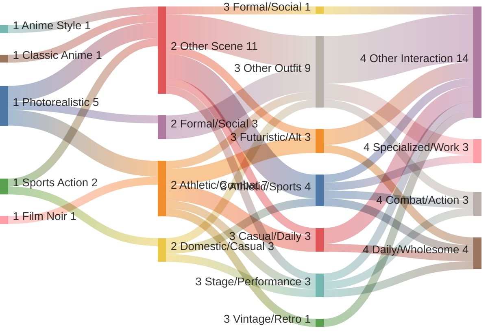

# PromptBuilder Comprehensive Audit Report
**Generated:** 2026-01-12 22:46:33

This document combines all individual audit modules into a single overview of system health, content quality, and generation logic performance.

---

<div style='page-break-before: always;'></div>

# 📑 Distribution Visualizations

## Prompt Distribution Flow




---

<div style='page-break-before: always;'></div>

# 📑 Standards Audit: Characters

## Character Standards Audit Report

**Date:** characters

| Filename | Status | Score | Issues |
|---|---|---|---|
| aaliyah_chen.md | PASS | 100 | None |
| aiyana_blackfeather.md | PASS | 100 | None |
| amina_benali.md | PASS | 100 | None |
| amira_khalil.md | PASS | 100 | None |
| aryan_kapoor.md | PASS | 100 | None |
| astrid_nielsen.md | PASS | 100 | None |
| audrey_thorne.md | PASS | 100 | None |
| avery_glam.md | PASS | 100 | None |
| callum_doherty.md | PASS | 100 | None |
| camila_vargas.md | PASS | 100 | None |
| celine_voss.md | PASS | 100 | None |
| chayton_red_elk.md | PASS | 100 | None |
| chiara_lombardi.md | PASS | 100 | None |
| Diego_Morales.md | PASS | 100 | None |
| diesel_murphy.md | PASS | 100 | None |
| efe_kouadio.md | PASS | 100 | None |
| elara_soledad.md | PASS | 100 | None |
| elena_rosales.md | PASS | 100 | None |
| elias_thorne.md | PASS | 100 | None |
| Enzo_Rossi.md | PASS | 100 | None |
| Esme_Dubois.md | PASS | 100 | None |
| Fiona_OSullivan.md | PASS | 100 | None |
| freydis_holm.md | PASS | 100 | None |
| hallie_bennett.md | PASS | 100 | None |
| hana_park.md | PASS | 100 | None |
| harald_bjornson.md | PASS | 100 | None |
| harper_mae.md | PASS | 100 | None |
| ines_santos.md | PASS | 100 | None |
| isla_macleod.md | PASS | 100 | None |
| jamal_rivers.md | PASS | 100 | None |
| Jax_Chen.md | PASS | 100 | None |
| jena_marlowe.md | PASS | 100 | None |
| jin_park.md | PASS | 100 | None |
| jordan_vance.md | PASS | 100 | None |
| julian_blackwood.md | PASS | 100 | None |
| Kaia_Vaitupu.md | PASS | 100 | None |
| kaito_sato.md | PASS | 100 | None |
| kassandra_lykaios.md | PASS | 100 | None |
| keiko_yamamoto.md | PASS | 100 | None |
| kendra_mitchell.md | PASS | 100 | None |
| leilani_teo.md | PASS | 100 | None |
| leonidas_stratos.md | PASS | 100 | None |
| lila_reyes.md | PASS | 100 | None |
| lucia_reyes.md | PASS | 100 | None |
| luna_vex.md | PASS | 100 | None |
| maki_cruz.md | PASS | 100 | None |
| Malik_Farrah.md | PASS | 100 | None |
| marcus_thompson.md | PASS | 100 | None |
| marisol_rivera.md | PASS | 100 | None |
| marley_thompson.md | PASS | 100 | None |
| maya_rose.md | PASS | 100 | None |
| mei_chen.md | PASS | 100 | None |
| mela_hart.md | PASS | 100 | None |
| natsumi_maki.md | PASS | 100 | None |
| nora_alvarez.md | PASS | 100 | None |
| oliver_st_james.md | PASS | 100 | None |
| priya_sharma.md | PASS | 100 | None |
| rafael_costa.md | PASS | 100 | None |
| rosa_torres.md | PASS | 100 | None |
| roxanna_perez.md | PASS | 100 | None |
| samira_mansour.md | PASS | 100 | None |
| silas_burnside.md | PASS | 100 | None |
| sina_tuilagi.md | PASS | 100 | None |
| siofra_quinn.md | PASS | 100 | None |
| sitara_saanvi.md | PASS | 100 | None |
| suki_nakamura.md | PASS | 100 | None |
| talia_levi.md | PASS | 100 | None |
| theo_okonkwo.md | PASS | 100 | None |
| valentina_kovac.md | PASS | 100 | None |
| Yuki_Tanaka.md | PASS | 100 | None |
| zahara_el_amin.md | PASS | 100 | None |
| zara_washington.md | PASS | 100 | None |


**Summary:** 72/72 Passed (100.0%)


---

<div style='page-break-before: always;'></div>

# 📑 Standards Audit: Scenes

## Scene Standards Audit Report

**Date:** scenes.md

| Scene Name | Status | Issues |
|---|---|---|
| Attic Space | PASS | None |
| Basement Rec Room | PASS | None |
| Bedroom | PASS | None |
| Gourmet Kitchen | PASS | None |
| Home Office | PASS | None |
| Kitchen Counter | PASS | None |
| Modern Living Room | PASS | None |
| Science Laboratory | PASS | None |
| Walk-In Closet | PASS | None |
| Abandoned Warehouse | PASS | None |
| Brick Wall Urban | PASS | None |
| City Street | PASS | None |
| Construction Site | PASS | None |
| Fire Escape Alley | PASS | None |
| Garden | PASS | None |
| Park | PASS | None |
| Rooftop | PASS | None |
| Subway Platform | PASS | None |
| Coffee Shop | PASS | None |
| Library | PASS | None |
| Restaurant | PASS | None |
| Boutique Interior | PASS | None |
| Mall Corridor | PASS | None |
| Record Store | PASS | None |
| Thrift Store | PASS | None |
| Vintage Shop | PASS | None |
| American Football Field | PASS | None |
| Basketball Court | PASS | None |
| Beach Volleyball Court | PASS | None |
| Bowling Alley Lanes | PASS | None |
| Bowling Alley Seating Area | PASS | None |
| Boxing Gym | PASS | None |
| Boxing Ring | PASS | None |
| Cosmic Bowling | PASS | None |
| Dance Studio | PASS | None |
| Gymnastics Center | PASS | None |
| Indoor Volleyball Court | PASS | None |
| Locker Room | PASS | None |
| Martial Arts Dojo | PASS | None |
| MMA Gym | PASS | None |
| MMA Octagon | PASS | None |
| Olympic Pool | PASS | None |
| Rock Climbing Gym | PASS | None |
| Skate Park | PASS | None |
| Yoga Studio | PASS | None |
| Esports Arena | PASS | None |
| Arcade | PASS | None |
| Art Gallery | PASS | None |
| Casino Floor | PASS | None |
| Concert Hall | PASS | None |
| Concert Stage | PASS | None |
| Museum Hall | PASS | None |
| Theater Backstage | PASS | None |
| Cabaret Stage | PASS | None |
| Dive Bar | PASS | None |
| Jazz Club | PASS | None |
| Karaoke Room | PASS | None |
| Neon-Lit Street | PASS | None |
| Nightclub Interior | PASS | None |
| Rooftop Bar | PASS | None |
| Underground Club | PASS | None |
| Art Studio | PASS | None |
| Fashion Atelier | PASS | None |
| Music Recording Studio | PASS | None |
| Photography Studio | PASS | None |
| Pottery Workshop | PASS | None |
| Luxury Bedroom | PASS | None |
| Candlelit Bath | PASS | None |
| Penthouse Balcony Night | PASS | None |
| Wine Cellar | PASS | None |
| Private Pool Night | PASS | None |
| Silk Sheets Bedroom | PASS | None |
| Beach | PASS | None |
| Campfire | PASS | None |
| Desert Landscape | PASS | None |
| Forest Clearing | PASS | None |
| Lakeside | PASS | None |
| Moonlit Forest | PASS | None |
| Mountain Summit | PASS | None |
| Waterfall | PASS | None |
| Country Kitchen | PASS | None |
| Flower Field | PASS | None |
| Garden Path | PASS | None |
| Meadow Picnic | PASS | None |
| Orchard | PASS | None |
| Ancient Ruins | PASS | None |
| Castle Courtyard | PASS | None |
| Cathedral Interior | PASS | None |
| Gothic Castle | PASS | None |
| Japanese Tea House | PASS | None |
| Manor Library | PASS | None |
| Victorian Mansion | PASS | None |
| Victorian Manor Hall | PASS | None |
| Desert Oasis | PASS | None |
| Indian Palace Hall | PASS | None |
| Palace Courtyard | PASS | None |
| Temple Interior | PASS | None |
| Zen Garden | PASS | None |
| Enchanted Forest | PASS | None |
| Medieval Tavern | PASS | None |
| Renaissance Fair Grounds | PASS | None |
| Cyber Cafe | PASS | None |
| Data Stream | PASS | None |
| Futuristic Skybridge | PASS | None |
| Hacker Den | PASS | None |
| Neon Alley | PASS | None |
| Synthwave Street | PASS | None |
| Hospital Corridor | PASS | None |
| Medical Exam Room | PASS | None |
| Operating Room | PASS | None |
| Server Room | PASS | None |
| City Street - Night Noir | PASS | None |
| Dockside Warehouse | PASS | None |
| Hotel Room - Noir | PASS | None |
| Jazz Club - Noir | PASS | None |
| Luxury Penthouse - Noir | PASS | None |
| Nightclub Backstage - Noir | PASS | None |
| Police Station - 1940s | PASS | None |
| Rain-Slicked Alley | PASS | None |
| Smoky Detective Office | PASS | None |
| Beach Cabana | PASS | None |
| Mountain Resort | PASS | None |
| Tiki Bar | PASS | None |
| Tropical Resort Pool | PASS | None |
| Spaceship Bridge | PASS | None |
| Cyberpunk Neon Street | PASS | None |
| High-Tech Lab | PASS | None |
| Luxury Space Hotel | PASS | None |
| Cyberpunk Alley | PASS | None |
| Space Station Corridor | PASS | None |
| Backstage Green Room | PASS | None |
| Carnival Midway | PASS | None |
| Farmers Market | PASS | None |
| Festival Grounds | PASS | None |
| House Party | PASS | None |
| Music Festival Main Stage | PASS | None |
| Street Fair | PASS | None |
| Wedding Reception | PASS | None |
| Tavern Brawl | PASS | None |
| Dragon's Lair | PASS | None |
| Mystic Forest Camp | PASS | None |
| Dungeon Entrance | PASS | None |
| Wizard's Tower | PASS | None |
| Classroom Window Seat | PASS | None |
| School Rooftop | PASS | None |
| School Hallway | PASS | None |
| School Library | PASS | None |
| Gymnasium - School | PASS | None |
| Shoe Lockers | PASS | None |
| Rainy Dark Urban Street | PASS | None |
| Rooftop Garden at Sunset | PASS | None |
| Snowy City Square | PASS | None |
| Giant Aquarium Hall | PASS | None |
| Midnight Rooftop | PASS | None |
| Petal-Strewn Walkway | PASS | None |


**Summary:** 155/155 Passed (100.0%)


---

<div style='page-break-before: always;'></div>

# 📑 Standards Audit: Poses

## Pose Standards Audit Report

**Date:** poses.md
**Total Poses:** 173

| Line | Category | Pose Name | Status | Issues |
|---|---|---|---|---|
| 9 | Basic Poses | Arms Crossed | PASS | None |
| 10 | Basic Poses | Hands on Hips | PASS | None |
| 11 | Basic Poses | Leaning | PASS | None |
| 12 | Basic Poses | Looking Away | PASS | None |
| 13 | Basic Poses | Sitting | PASS | None |
| 14 | Basic Poses | Sitting Cross-Legged | PASS | None |
| 15 | Basic Poses | Standing | PASS | None |
| 16 | Basic Poses | Walking | PASS | None |
| 22 | Expressive & Action Poses | Anime V Sign | PASS | None |
| 23 | Expressive & Action Poses | Candid Laugh | PASS | None |
| 24 | Expressive & Action Poses | Laughing | PASS | None |
| 25 | Expressive & Action Poses | Reaching Up | PASS | None |
| 26 | Expressive & Action Poses | Thinking | PASS | None |
| 32 | Everyday Activities | Book Stack | PASS | None |
| 33 | Everyday Activities | Coffee Shop | PASS | None |
| 34 | Everyday Activities | Drinking | PASS | None |
| 35 | Everyday Activities | Gaming Controller | PASS | None |
| 36 | Everyday Activities | Headphone Vibe | PASS | None |
| 37 | Everyday Activities | Painter at Easel (Seated) | PASS | None |
| 38 | Everyday Activities | Painter at Easel (Standing) | PASS | None |
| 39 | Everyday Activities | Phone Check | PASS | None |
| 40 | Everyday Activities | Chopping Vegetables | PASS | None |
| 41 | Everyday Activities | Stirring Pot | PASS | None |
| 42 | Everyday Activities | Reading | PASS | None |
| 43 | Everyday Activities | Presenting | PASS | None |
| 49 | Fashion & Portrait Poses | Against Wall | PASS | None |
| 50 | Fashion & Portrait Poses | Hand Through Hair | PASS | None |
| 51 | Fashion & Portrait Poses | Hip Pop | PASS | None |
| 52 | Fashion & Portrait Poses | Jacket Over Shoulder | PASS | None |
| 53 | Fashion & Portrait Poses | Mirror Selfie | PASS | None |
| 54 | Fashion & Portrait Poses | Over the Shoulder | PASS | None |
| 55 | Fashion & Portrait Poses | VSCO Squat | PASS | None |
| 56 | Fashion & Portrait Poses | The Angel Wing Stance | PASS | None |
| 57 | Fashion & Portrait Poses | Runway Stride | PASS | None |
| 58 | Fashion & Portrait Poses | Soft Lingerie Lean | PASS | None |
| 64 | Dynamic & Movement Poses | Dancing | PASS | None |
| 65 | Dynamic & Movement Poses | Dress Twirl | PASS | None |
| 66 | Dynamic & Movement Poses | Stretching | PASS | None |
| 67 | Dynamic & Movement Poses | Dribbling | PASS | None |
| 68 | Dynamic & Movement Poses | Shooting Hoop | PASS | None |
| 69 | Dynamic & Movement Poses | Warming Up | PASS | None |
| 70 | Dynamic & Movement Poses | Wind Blown | PASS | None |
| 76 | Relaxed & Intimate Poses | Bed Pose | PASS | None |
| 77 | Relaxed & Intimate Poses | Lying Down | PASS | None |
| 78 | Relaxed & Intimate Poses | Sitting on Edge | PASS | None |
| 79 | Relaxed & Intimate Poses | Staircase Sit | PASS | None |
| 80 | Relaxed & Intimate Poses | Window Seat | PASS | None |
| 86 | Artistic & Dramatic Poses | Back Arch | PASS | None |
| 87 | Artistic & Dramatic Poses | Back Shot | PASS | None |
| 88 | Artistic & Dramatic Poses | Biting Lip | PASS | None |
| 89 | Artistic & Dramatic Poses | Centerfold Classic | PASS | None |
| 90 | Artistic & Dramatic Poses | Golden Hour | PASS | None |
| 91 | Artistic & Dramatic Poses | Peek-a-Boo | PASS | None |
| 92 | Artistic & Dramatic Poses | Wet Hair | PASS | None |
| 93 | Artistic & Dramatic Poses | Silk Robe | PASS | None |
| 94 | Artistic & Dramatic Poses | Bathtub Recline | PASS | None |
| 95 | Artistic & Dramatic Poses | Mirror Gaze | PASS | None |
| 96 | Artistic & Dramatic Poses | Shoulder Touch | PASS | None |
| 97 | Artistic & Dramatic Poses | Lying Stretch | PASS | None |
| 98 | Artistic & Dramatic Poses | Candlelight Portrait | PASS | None |
| 104 | Social Media & Content Poses | Ahegao Tease | PASS | None |
| 105 | Social Media & Content Poses | Camera Zoom/Stare | PASS | None |
| 106 | Social Media & Content Poses | Hand Heart/Kiss | PASS | None |
| 107 | Social Media & Content Poses | Lip Sync Close-up | PASS | None |
| 108 | Social Media & Content Poses | Pointing to Text | PASS | None |
| 109 | Social Media & Content Poses | The Griddy | PASS | None |
| 110 | Social Media & Content Poses | Transition Magic | PASS | None |
| 116 | Bowling | Ball Return Wait | PASS | None |
| 117 | Bowling | Bowling Address Position | PASS | None |
| 118 | Bowling | Bowling Approach | PASS | None |
| 119 | Bowling | Bowling Deep Lunge Release | PASS | None |
| 120 | Bowling | Bowling Follow-Through | PASS | None |
| 121 | Bowling | Bowling Portrait | PASS | None |
| 122 | Bowling | Bowling Release (Low Angle) | PASS | None |
| 123 | Bowling | Bowling Victory Arms Up | PASS | None |
| 124 | Bowling | Checking Score Monitor | PASS | None |
| 125 | Bowling | Disappointed Stance | PASS | None |
| 126 | Bowling | Holding Multiple Balls | PASS | None |
| 127 | Bowling | Lacing Bowling Shoes | PASS | None |
| 128 | Bowling | Pin Watching | PASS | None |
| 129 | Bowling | Polishing Ball | PASS | None |
| 130 | Bowling | Sitting Lane Seat | PASS | None |
| 134 | Team Sports | Basketball Dribbling | PASS | None |
| 135 | Team Sports | Basketball Layup | PASS | None |
| 136 | Team Sports | Basketball Shot | PASS | None |
| 137 | Team Sports | Cheerleading Jump | PASS | None |
| 138 | Team Sports | Cheerleading Liberty | PASS | None |
| 139 | Team Sports | Flag Football Catch | PASS | None |
| 140 | Team Sports | Flag Football Quarterback Throw | PASS | None |
| 141 | Team Sports | Flag Football Ready Stance | PASS | None |
| 142 | Team Sports | High V Cheer | PASS | None |
| 143 | Team Sports | Pompom Shake | PASS | None |
| 144 | Team Sports | Soccer Dribbling | PASS | None |
| 145 | Team Sports | Soccer Goalkeeper Save | PASS | None |
| 146 | Team Sports | Soccer Kick | PASS | None |
| 147 | Team Sports | Softball/Baseball Batting Stance | PASS | None |
| 148 | Team Sports | Softball/Baseball Catching | PASS | None |
| 149 | Team Sports | Softball/Baseball Pitching Windup | PASS | None |
| 150 | Team Sports | Tennis Serve | PASS | None |
| 151 | Team Sports | Professional Tennis Serve | PASS | None |
| 152 | Team Sports | Three-Point Shot | PASS | None |
| 153 | Team Sports | Victory Pose | PASS | None |
| 154 | Team Sports | Volleyball Dig | PASS | None |
| 155 | Team Sports | Volleyball Serve | PASS | None |
| 156 | Team Sports | Volleyball Set | PASS | None |
| 157 | Team Sports | Volleyball Spike | PASS | None |
| 161 | Combat Sports | Fighter Stance | PASS | None |
| 162 | Combat Sports | Grappling Position | PASS | None |
| 163 | Combat Sports | Ground Control | PASS | None |
| 164 | Combat Sports | Heavy Bag Strike | PASS | None |
| 165 | Combat Sports | Sparring Guard | PASS | None |
| 169 | Gym & Fitness | Jump Rope | PASS | None |
| 170 | Gym & Fitness | Stretching Pre-Fight | PASS | None |
| 171 | Gym & Fitness | Swimming Dive | PASS | None |
| 172 | Gym & Fitness | Track Starting Block | PASS | None |
| 173 | Gym & Fitness | Handstand | PASS | None |
| 174 | Gym & Fitness | Backbend | PASS | None |
| 175 | Gym & Fitness | Holding Skateboard | PASS | None |
| 176 | Gym & Fitness | Skater Push | PASS | None |
| 182 | Dance & Performance Poses | Arabesque | PASS | None |
| 183 | Dance & Performance Poses | Ballet Bow | PASS | None |
| 184 | Dance & Performance Poses | Barre Stretch | PASS | None |
| 185 | Dance & Performance Poses | Floor Split | PASS | None |
| 186 | Dance & Performance Poses | Grand Jeté | PASS | None |
| 187 | Dance & Performance Poses | Hip Hop Dance Stance | PASS | None |
| 188 | Dance & Performance Poses | Pirouette | PASS | None |
| 189 | Dance & Performance Poses | Pointe Position | PASS | None |
| 195 | Alternative & Edgy Poses | Cigarette Pose | PASS | None |
| 196 | Alternative & Edgy Poses | Graffiti Wall Pose | PASS | None |
| 197 | Alternative & Edgy Poses | Leather Jacket Flip | PASS | None |
| 198 | Alternative & Edgy Poses | Motorcycle Lean | PASS | None |
| 199 | Alternative & Edgy Poses | Rocker Stance | PASS | None |
| 200 | Alternative & Edgy Poses | Sitting Backwards Chair | PASS | None |
| 206 | Soft & Aesthetic Poses | Basket Carry | PASS | None |
| 207 | Soft & Aesthetic Poses | Flower Crown Adjust | PASS | None |
| 208 | Soft & Aesthetic Poses | Tea Cup Hold | PASS | None |
| 209 | Soft & Aesthetic Poses | Vintage Record | PASS | None |
| 215 | Cultural & Traditional Poses | Goddess Pose | PASS | None |
| 216 | Cultural & Traditional Poses | Kimono Bow | PASS | None |
| 217 | Cultural & Traditional Poses | Royal Wave | PASS | None |
| 218 | Cultural & Traditional Poses | Sari Drape Adjust | PASS | None |
| 224 | Badass & Tactical | Sword Point | PASS | None |
| 225 | Badass & Tactical | Hero Landing | PASS | None |
| 226 | Badass & Tactical | Weapon Maintenance | PASS | None |
| 227 | Badass & Tactical | Stoic Walk | PASS | None |
| 228 | Badass & Tactical | Predatory Focus | PASS | None |
| 229 | Badass & Tactical | Cigar/Match Light | PASS | None |
| 230 | Badass & Tactical | Coat Flip | PASS | None |
| 238 | Aura & Power | Energy Charging | PASS | None |
| 239 | Aura & Power | Floating Levitation | PASS | None |
| 240 | Aura & Power | Dark Power Surge | PASS | None |
| 241 | Aura & Power | Divine Ascension | PASS | None |
| 247 | Fantasy & Combat Stances | High Guard (Knight) | PASS | None |
| 248 | Fantasy & Combat Stances | Draw-cut Stance (Samurai) | PASS | None |
| 249 | Fantasy & Combat Stances | Reverse Grip (Assassin) | PASS | None |
| 250 | Fantasy & Combat Stances | Spellcast Ready (Mage) | PASS | None |
| 256 | Bodybuilding & Physique | Front Double Bicep | PASS | None |
| 257 | Bodybuilding & Physique | Lat Spread | PASS | None |
| 258 | Bodybuilding & Physique | Side Chest | PASS | None |
| 259 | Bodybuilding & Physique | Most Muscular (Crab) | PASS | None |
| 265 | Sci-Fi & Cyberpunk | Checking Hologram | PASS | None |
| 266 | Sci-Fi & Cyberpunk | Using Command Console | PASS | None |
| 267 | Sci-Fi & Cyberpunk | Gravity Shift | PASS | None |
| 268 | Sci-Fi & Cyberpunk | Neural Link Sync | PASS | None |
| 269 | Sci-Fi & Cyberpunk | Cyberpunk Street Lean | PASS | None |
| 270 | Sci-Fi & Cyberpunk | Hacking Terminal | PASS | None |
| 271 | Sci-Fi & Cyberpunk | Neon Reflection | PASS | None |
| 272 | Sci-Fi & Cyberpunk | Weapon Check (Sci-Fi) | PASS | None |
| 278 | Expressive Emotions | Brave Stand | PASS | None |
| 279 | Expressive Emotions | Recoil in Fear | PASS | None |
| 280 | Expressive Emotions | Blushing Embarrassment | PASS | None |
| 281 | Expressive Emotions | Lovelorn Gaze | PASS | None |
| 282 | Expressive Emotions | Tearful Relief | PASS | None |


---

<div style='page-break-before: always;'></div>

# 📑 Standards Audit: Interactions

## Interaction Standards Audit Report

**Date:** interactions.md
**Total Interactions:** 208

| Line | Category | Name | Status | Issues |
|---|---|---|---|---|
| 9 | Basic Interactions | Deep Conversation | PASS | None |
| 10 | Basic Interactions | Laughing Together | PASS | None |
| 11 | Basic Interactions | Relaxed Sitting | PASS | None |
| 12 | Basic Interactions | Standing Side-by-Side | PASS | None |
| 13 | Basic Interactions | Strolling Together | PASS | None |
| 14 | Basic Interactions | Focused Teamwork | PASS | None |
| 15 | Basic Interactions | Casual Chat | PASS | None |
| 16 | Basic Interactions | Walking & Talking | PASS | None |
| 17 | Basic Interactions | Kitchen Prep | PASS | None |
| 18 | Basic Interactions | One-on-One Hoops | PASS | None |
| 19 | Basic Interactions | Soccer Passing | PASS | None |
| 20 | Basic Interactions | Lab Partners | PASS | None |
| 26 | Greetings & Gestures | Casual Fist Bump | PASS | None |
| 27 | Greetings & Gestures | Firm Handshake | PASS | None |
| 28 | Greetings & Gestures | Enthusiastic High Five | PASS | None |
| 29 | Greetings & Gestures | Warm Embrace | PASS | None |
| 30 | Greetings & Gestures | Direct Pointing | PASS | None |
| 31 | Greetings & Gestures | Encouraging Thumbs Up | PASS | None |
| 32 | Greetings & Gestures | Friendly Wave | PASS | None |
| 38 | Physical Activities | Intense Arm Wrestle | PASS | None |
| 39 | Physical Activities | Ballroom Dancing | PASS | None |
| 40 | Physical Activities | Jogging Partners | PASS | None |
| 41 | Physical Activities | Playing Catch | PASS | None |
| 42 | Physical Activities | Board Game Night | PASS | None |
| 43 | Physical Activities | Partner Stretching | PASS | None |
| 49 | Social & Caring | Heated Argument | PASS | None |
| 50 | Social & Caring | Victory Celebration | PASS | None |
| 51 | Social & Caring | Comforting Touch | PASS | None |
| 52 | Social & Caring | Motivational Speech | PASS | None |
| 53 | Social & Caring | Helping Hand | PASS | None |
| 54 | Social & Caring | Water Break | PASS | None |
| 55 | Social & Caring | Injury Assessment | PASS | None |
| 56 | Social & Caring | Tender Cheek Caress | PASS | None |
| 57 | Social & Caring | Selfie Moment | PASS | None |
| 58 | Social & Caring | Sharing a Bite | PASS | None |
| 59 | Social & Caring | Whispering Secrets | PASS | None |
| 60 | Social & Caring | Teaching Moment | PASS | None |
| 66 | Cooperative Actions | Construction Project | PASS | None |
| 67 | Cooperative Actions | Cooking Team | PASS | None |
| 68 | Cooperative Actions | Heavy Lifting | PASS | None |
| 69 | Cooperative Actions | Strategic Planning | PASS | None |
| 75 | Social Media & Influencer Poses | Besties Selfie | PASS | None |
| 76 | Social Media & Influencer Poses | BFF Goals | PASS | None |
| 77 | Social Media & Influencer Poses | Brunch Squad | PASS | None |
| 78 | Social Media & Influencer Poses | Coffee Shop Aesthetic | PASS | None |
| 79 | Social Media & Influencer Poses | Festival Friends | PASS | None |
| 80 | Social Media & Influencer Poses | Golden Hour Glow | PASS | None |
| 81 | Social Media & Influencer Poses | Gym Buddies | PASS | None |
| 82 | Social Media & Influencer Poses | Influencer Duo | PASS | None |
| 83 | Social Media & Influencer Poses | Sorority Pose | PASS | None |
| 84 | Social Media & Influencer Poses | Travel Buddies | PASS | None |
| 85 | Social Media & Influencer Poses | Vintage Film Style | PASS | None |
| 86 | Social Media & Influencer Poses | VSCO Vibes | PASS | None |
| 92 | Romantic & Intimate | Bed Hover Kiss | PASS | None |
| 93 | Romantic & Intimate | Bed Pin | PASS | None |
| 94 | Romantic & Intimate | Bridal Carry | PASS | None |
| 95 | Romantic & Intimate | Caressing Face | PASS | None |
| 96 | Romantic & Intimate | Chin Lift Kiss | PASS | None |
| 97 | Romantic & Intimate | Cuddling | PASS | None |
| 98 | Romantic & Intimate | Dancing Dip | PASS | None |
| 99 | Romantic & Intimate | Dip Kiss | PASS | None |
| 100 | Romantic & Intimate | Embrace From Behind | PASS | None |
| 101 | Romantic & Intimate | Forehead Kiss | PASS | None |
| 102 | Romantic & Intimate | Forehead Touch | PASS | None |
| 103 | Romantic & Intimate | Gazing Into Eyes | PASS | None |
| 104 | Romantic & Intimate | Hand Holding | PASS | None |
| 105 | Romantic & Intimate | Hand on Lower Back | PASS | None |
| 106 | Romantic & Intimate | Head in Lap | PASS | None |
| 107 | Romantic & Intimate | Kabedon | PASS | None |
| 108 | Romantic & Intimate | Cheek Kiss | PASS | None |
| 109 | Romantic & Intimate | Leaning Against Chest | PASS | None |
| 110 | Romantic & Intimate | Lift and Carry Kiss | PASS | None |
| 111 | Romantic & Intimate | Lying on Top | PASS | None |
| 112 | Romantic & Intimate | Lying Together | PASS | None |
| 113 | Romantic & Intimate | Morning Cuddle | PASS | None |
| 114 | Romantic & Intimate | Nose to Nose | PASS | None |
| 115 | Romantic & Intimate | Piggyback Ride | PASS | None |
| 116 | Romantic & Intimate | Protective Embrace | PASS | None |
| 117 | Romantic & Intimate | Passionate Kiss | PASS | None |
| 118 | Romantic & Intimate | Slow Dance | PASS | None |
| 119 | Romantic & Intimate | Wine Sharing | PASS | None |
| 120 | Romantic & Intimate | Bathtub Soak | PASS | None |
| 121 | Romantic & Intimate | Silk Sheets | PASS | None |
| 122 | Romantic & Intimate | Candlelit Gaze | PASS | None |
| 123 | Romantic & Intimate | Giving Massage | PASS | None |
| 124 | Romantic & Intimate | Spinning Hug | PASS | None |
| 125 | Romantic & Intimate | Spooning | PASS | None |
| 126 | Romantic & Intimate | Straddling | PASS | None |
| 127 | Romantic & Intimate | Sunset Silhouette | PASS | None |
| 128 | Romantic & Intimate | Cozy Under Quilt | PASS | None |
| 134 | Combat & Competition | Armbar from Guard | PASS | None |
| 135 | Combat & Competition | Cage Walk | PASS | None |
| 136 | Combat & Competition | Clinch Battle | PASS | None |
| 137 | Combat & Competition | Fight Poster Face-Off | PASS | None |
| 138 | Combat & Competition | MMA Guard | PASS | None |
| 139 | Combat & Competition | MMA Mount | PASS | None |
| 140 | Combat & Competition | MMA Top Half-Guard | PASS | None |
| 141 | Combat & Competition | Rear Naked Choke Defense | PASS | None |
| 142 | Combat & Competition | Striking Exchange | PASS | None |
| 143 | Combat & Competition | Standing Face-Off | PASS | None |
| 144 | Combat & Competition | Triangle Choke | PASS | None |
| 145 | Combat & Competition | Weigh-In Staredown | PASS | None |
| 151 | Sports & Athletic Activities | Bowling Ball Selection | PASS | None |
| 152 | Sports & Athletic Activities | Dugout Watch | PASS | None |
| 153 | Sports & Athletic Activities | Team Lineup | PASS | None |
| 154 | Sports & Athletic Activities | Strike Celebration | PASS | None |
| 155 | Sports & Athletic Activities | Bowling High Five | PASS | None |
| 156 | Sports & Athletic Activities | Bowling Coaching | PASS | None |
| 157 | Sports & Athletic Activities | Coach Instruction | PASS | None |
| 158 | Sports & Athletic Activities | Scoreboard Check | PASS | None |
| 159 | Sports & Athletic Activities | Dual Bowling | PASS | None |
| 160 | Sports & Athletic Activities | Football Huddle | PASS | None |
| 161 | Sports & Athletic Activities | Mound Meeting | PASS | None |
| 162 | Sports & Athletic Activities | Tennis Net Play | PASS | None |
| 163 | Sports & Athletic Activities | Street Ball 1v1 | PASS | None |
| 164 | Sports & Athletic Activities | Striker vs Goalie | PASS | None |
| 165 | Sports & Athletic Activities | Receiver vs Corner | PASS | None |
| 166 | Sports & Athletic Activities | Contested Catch | PASS | None |
| 167 | Sports & Athletic Activities | Softball Battery | PASS | None |
| 168 | Sports & Athletic Activities | Broadcast View | PASS | None |
| 169 | Sports & Athletic Activities | Fast Break | PASS | None |
| 170 | Sports & Athletic Activities | Penalty Kick | PASS | None |
| 171 | Sports & Athletic Activities | Volleyball Block | PASS | None |
| 172 | Sports & Athletic Activities | Stretching Assist | PASS | None |
| 173 | Sports & Athletic Activities | Relay Handoff | PASS | None |
| 174 | Sports & Athletic Activities | Team Circle | PASS | None |
| 175 | Sports & Athletic Activities | Watching Bowl | PASS | None |
| 176 | Sports & Athletic Activities | Mid-Air High Five | PASS | None |
| 177 | Sports & Athletic Activities | Side-by-Side Run | PASS | None |
| 178 | Sports & Athletic Activities | Water Break Talk | PASS | None |
| 179 | Sports & Athletic Activities | Defensive Stance | PASS | None |
| 185 | Dance & Performance | Concert Trio | PASS | None |
| 186 | Dance & Performance | Ballroom Frame | PASS | None |
| 187 | Dance & Performance | Synchronized Dance | PASS | None |
| 188 | Dance & Performance | Dance Lift | PASS | None |
| 189 | Dance & Performance | Mirror Routine | PASS | None |
| 190 | Dance & Performance | Recital Duet | PASS | None |
| 196 | Posed Interactions | Back-to-Back Pose | PASS | None |
| 197 | Posed Interactions | Height Check | PASS | None |
| 198 | Posed Interactions | Casual Lean | PASS | None |
| 199 | Posed Interactions | Mirror Twin | PASS | None |
| 200 | Posed Interactions | Shoulder Lean | PASS | None |
| 206 | Fantasy & Sci-Fi | Spell Casting | PASS | None |
| 207 | Fantasy & Sci-Fi | Sword Clash | PASS | None |
| 208 | Fantasy & Sci-Fi | Telekinetic Duel | PASS | None |
| 209 | Fantasy & Sci-Fi | Hologram Interface | PASS | None |
| 210 | Fantasy & Sci-Fi | Dungeon Party | PASS | None |
| 211 | Fantasy & Sci-Fi | Magic Fusion | PASS | None |
| 212 | Fantasy & Sci-Fi | Dual Spell Cast | PASS | None |
| 213 | Fantasy & Sci-Fi | Holo-Table Plan | PASS | None |
| 214 | Fantasy & Sci-Fi | Hacking Session | PASS | None |
| 215 | Fantasy & Sci-Fi | Tome Research | PASS | None |
| 216 | Fantasy & Sci-Fi | Repair Job | PASS | None |
| 217 | Fantasy & Sci-Fi | Portal Opening | PASS | None |
| 223 | Combat & Tactical | Back-to-Back Defense | PASS | None |
| 224 | Combat & Tactical | Blade Point | PASS | None |
| 225 | Combat & Tactical | Interrogation Scene | PASS | None |
| 226 | Combat & Tactical | Ready Nod | PASS | None |
| 227 | Combat & Tactical | Rescue Carry | PASS | None |
| 228 | Combat & Tactical | Breach Stack | PASS | None |
| 229 | Combat & Tactical | Mid-Air Toss | PASS | None |
| 235 | Cultural & Tradition | Prayer Moment | PASS | None |
| 236 | Cultural & Tradition | Tea Ceremony | PASS | None |
| 237 | Cultural & Tradition | Formal Bow | PASS | None |
| 243 | Dynamic Action | The Chase | PASS | None |
| 244 | Dynamic Action | Dodge Roll | PASS | None |
| 245 | Dynamic Action | Leading the Way | PASS | None |
| 246 | Dynamic Action | Playful Shove | PASS | None |
| 252 | Group Dynamics | Chain Reaction | PASS | None |
| 253 | Group Dynamics | Circle Summit | PASS | None |
| 254 | Group Dynamics | Lively Debate | PASS | None |
| 255 | Group Dynamics | Football Huddle | PASS | None |
| 256 | Group Dynamics | The Lineup | PASS | None |
| 257 | Group Dynamics | Hero Pose | PASS | None |
| 258 | Group Dynamics | Triangle Balance | PASS | None |
| 264 | Artistic Collaboration | The Muse | PASS | None |
| 265 | Artistic Collaboration | Critique | PASS | None |
| 271 | Gaming & Digital | Esports Match | PASS | None |
| 272 | Gaming & Digital | Victory Pop-off | PASS | None |
| 278 | Skate & Urban | Trick Tip | PASS | None |
| 279 | Skate & Urban | Park Hangout | PASS | None |
| 285 | Gymnastics | Spotting Assist | PASS | None |
| 286 | Gymnastics | Sync Floor Routine | PASS | None |
| 292 | Cinematic Tropes | Dramatic Stare | PASS | None |
| 293 | Cinematic Tropes | The Handoff | PASS | None |
| 294 | Cinematic Tropes | Mirror Sync | PASS | None |
| 295 | Cinematic Tropes | Last Stand | PASS | None |
| 301 | Professional | Tablet Review | PASS | None |
| 302 | Professional | Surgery Prep | PASS | None |
| 303 | Professional | Lab Testing | PASS | None |
| 304 | Professional | Engineering | PASS | None |
| 310 | Fantasy Adventure | Dice Roll | PASS | None |
| 311 | Fantasy Adventure | Map Check | PASS | None |
| 312 | Fantasy Adventure | Spell Duel | PASS | None |
| 313 | Fantasy Adventure | Tavern Cheers | PASS | None |
| 314 | Fantasy Adventure | Night Watch | PASS | None |
| 320 | School & Slice of Life | Shared Earbuds | PASS | None |
| 321 | School & Slice of Life | Feed Me | PASS | None |
| 322 | School & Slice of Life | Head Pat | PASS | None |
| 323 | School & Slice of Life | Walk Home | PASS | None |
| 324 | School & Slice of Life | Study Hall | PASS | None |
| 325 | School & Slice of Life | Pinky Swear | PASS | None |
| 331 | Romantic Tropes | Sharing Umbrella | PASS | None |
| 332 | Romantic Tropes | Aquarium Date | PASS | None |
| 333 | Romantic Tropes | Museum Whisper | PASS | None |
| 334 | Romantic Tropes | Snowy Bench | PASS | None |
| 335 | Romantic Tropes | The Catch | PASS | None |
| 336 | Romantic Tropes | Rooftop Night | PASS | None |


---

<div style='page-break-before: always;'></div>

# 📑 Style Distribution Census

## Style Representation Census

| Base Style | Count | Percentage |
| :--- | :--- | :--- |
| Photorealistic | 5 | 50.0% |
| Sports Action | 2 | 20.0% |
| Anime Style | 1 | 10.0% |
| Film Noir | 1 | 10.0% |
| Classic Anime | 1 | 10.0% |


---

<div style='page-break-before: always;'></div>

# 📑 Vibe Cohesion Analysis

## Vibe Cohesion & Diversity Report

### Top Vibe Mixes (Multi-faceted Prompts)

### Potential Thematic Mismatches
- No major thematic mismatches detected! (High Vibe Cohesion)


---

<div style='page-break-before: always;'></div>

# 📑 Prompt Scoring Analysis (Best & Worst)

## Best and Worst Generated Prompts

### 📊 Statistical Summary

- **Total Prompts Analyzed:** 10
- **Mean Score:** 435.00
- **Median Score:** 457.5
- **Mode Score:** 565
- **Standard Deviation:** 175.69
- **Score Range:** 185 - 690

### 🏆 Top 3 Best Prompts

#### 1. gen_only_1768270041_1.txt (Score: 690)
```text
Generate an image of: Rendering
High-resolution vector-style illustration. Sharp, non-aliased distinct line art. Coloring uses "hard shading" (clear separation between light and dark) with minimal gradients. Colors are highly saturated and distinct.

Character Accuracy
Stylized facial proportions: large eyes, simplified noses/mouths. Chin and jawlines are sharp and angular. Expressions are clearly readable and slightly exaggerated for emotional clarity.

Body Types
Idealized anime anatomy. Elongated limbs and exaggerated posture. Anatomy is simplified into aesthetically pleasing shapes rather than biological realism.

Hair & Clothing
Hair: Gravity-defying clumps with distinct "shiny" highlight bands. Clothing: Folds are sharp, triangular, and dramatic. Fabric behaves dynamically to emphasize motion lines.

Details
"Screen tone" dots for shading texture. Speed lines or radial focus lines in the background. Lens flare is stylized (starbursts). Pop-art color palettes.

---

**SCENE/SETTING:**
Professional eight-sided competition cage, chain-link fence walls with black vinyl coating, thick padded corner posts in contrasting colors, heavy-duty battle-worn canvas floor with team or brand logos, dramatic high-contrast overhead lighting casting sharp shadows, Intense championship fight atmosphere.
---

**CHARACTER: Astrid Nielsen**
**Appearance:**
* **Body:** Dramatic Classic frame; straight flesh; narrow balanced rectangle proportions; tall vertical line; refined posture with precise alignment; statuesque and poised.
* **Face:** Long balanced facial structure; soft oval face; firm planar skin with clear definition; narrow straight nose; light blue deep-set eyes with cool observant gaze; serene neutral resting expression that suggests depth and composure.
* **Hair:** Type 1 straight hair; medium density; platinum blonde with smooth high-shine finish; naturally straight and fine; takes blunt, precise cuts well.
* **Skin:** Fair cool-toned skin with porcelain clarity and smooth even texture.
**Outfit:**
- **Top:** Performance one-piece swimsuit.
  - **Fit:** Hydrodynamic; Racerback.
  - **Material:** Technical swim fabric; Solid black central panel.
  - **Pattern:** Contoured side panels in #FF6600 with #000000 piping.
  - **Neckline:** Scoop neck.
  - **Sleeve:** Sleeveless.
- **Bottom:** Integrated swim bottom.
  - **Fit:** High-cut.
  - **Material:** matching fabric.
  - **Pattern:** Contoured side panels.
  - **Waist:** Seamless.
  - **Length:** Minimal coverage.
- **Footwear:** None (Barefoot).
- **Accessories:** White swim cap with #FF6600 logo; mirrored racing goggles (#FFFFFF).
**Pose/Action:**
full body shot showing the character from head to toe,
---

**CHARACTER 2: Efe Kouadio**
**Appearance:**
- **Body:** Soft Natural frame; natural soft flesh; balanced proportions with gentle curves, defined waist, full hips, soft rounded features, moderate shoulders; moderate vertical (5’5”-5’6”); natural curvy build with soft harmonious lines and welcoming presence.
- **Face:** Soft-balanced facial structure; round-oval face with warm open planes and full cheeks that enhance smile; expressive round-almond eyes with bright engaged quality, wide-set, warm dark brown with natural sparkle; full lips with natural upward curve that creates dimpled smile; smooth forehead; radiant joyful expression that lights up her whole face.
- **Hair:** Type 4A coils; high density; medium-length natural textured style with defined curl pattern and bouncy voluminous shape; healthy soft finish with natural sheen; black to dark brown.
- **Skin:** Deep warm brown with rich golden undertones and natural luminous dewy finish.
**Outfit:**
- **Top:** Black velvet corset top.
  - **Fit:** Fitted; Boned structure.
  - **Material:** Velvet.
  - **Pattern:** Solid black.
  - **Neckline:** Sweetheart or Scoop.
  - **Sleeve:** Sleeveless (thick straps).
- **Bottom:** Tartan plaid pleated mini skirt.
  - **Fit:** Flared; Raw/fringed hem.
  - **Material:** Flannel or Wool plaid (yellow/brown tartan).
  - **Waist:** High-waisted (boned).
  - **Length:** Mini (mid-thigh).
- **Footwear:** Chunky black leather lace-up combat boots; sheer black tights.
- **Accessories:** Black velvet ribbon choker; silver rings.
**Pose/Action:**
full body shot showing the character from head to toe,
---

**Additional Notes:**
Astrid Nielsen and Efe Kouadio walking side-by-side carrying school bags. The sun is setting behind them, casting long shadows. They are chatting casually about their day.
```

#### 2. gen_only_1768270041_3.txt (Score: 585)
```text
Generate an image of: Rendering
8K Raw Photography style. simulates a 85mm portrait lens with f/1.8 aperture. Sharp focus on the eyes with gradual fall-off blur. accurate global illumination, ambient occlusion, and ray-traced reflections. No stylization filters; true-to-life color balance.

---

**SCENE/SETTING:**
Grand concert hall interior inspired by Victorian Gothic architecture, tiered orchestra seating facing ornate stage, high vaulted ceiling with intricate decorative plasterwork, warm ambient lighting from chandeliers, rich red velvet seats, a elaborate proscenium arch with gold detailing, excellent acoustics, formal classical music atmosphere.
---

**CHARACTER: Jax Chen**
**Appearance:**
- **Body:** Explosive-Athletic frame; olive-toned skin with a vibrant, high-oxygenated flush; inverted triangle proportions with powerful, broad shoulders and a narrow, muscular waist; tall stature (6'1"-6'2"); high-performance build with dense, defined muscle groups and visible vascularity; "kinetic potential" presence—vibrant and dangerous.
- **Face:** Sharp, aerodynamic structure; high, defined cheekbones; narrow, powerful jawline; intense, wide-set dark eyes that possess a piercing, high-speed focus; sharp, straight eyebrows with a low, aggressive set; straight, thin nose; firm mouth with a determined set; expression is one of maximum effort and singular focus.
- **Hair:** Type 1A straight; medium density; kept in a sharp, high-fade with a short, textured top; matte-satin finish with vibrant neon orange tips that seem to vibrate with his movement.
- **Skin:** Vibrant olive with warm, high-energy undertones; smooth, taut texture with visible "muscle-mapping" micro-textures in the dermis; beads of high-intensity sweat reflecting light; "high-performance" glow.
**Outfit:**
- **Top:** Tailored sport coat in herringbone over Oxford shirt.
  - **Fit:** Modern professional; Soft shoulders.
  - **Material:** Blue herringbone wool-blend; Cotton Oxford.
  - **Neckline:** Pressed collar.
  - **Sleeve:** Long.
- **Bottom:** Flat-front dress pants.
  - **Fit:** Contemporary straight.
  - **Material:** Charcoal gray wool.
  - **Waist:** Natural with mahogany leather belt.
  - **Length:** Full.
- **Footwear:** Polished mahogany leather dress shoes.
- **Accessories:** Stainless steel watch; leather laptop bag.
**Pose/Action:**
full body shot showing the character from head to toe, Regal standing position, chin lifted, arms positioned with divine authority, ethereal commanding presence.
---

**CHARACTER 2: Efe Kouadio**
**Appearance:**
- **Body:** Soft Natural frame; natural soft flesh; balanced proportions with gentle curves, defined waist, full hips, soft rounded features, moderate shoulders; moderate vertical (5’5”-5’6”); natural curvy build with soft harmonious lines and welcoming presence.
- **Face:** Soft-balanced facial structure; round-oval face with warm open planes and full cheeks that enhance smile; expressive round-almond eyes with bright engaged quality, wide-set, warm dark brown with natural sparkle; full lips with natural upward curve that creates dimpled smile; smooth forehead; radiant joyful expression that lights up her whole face.
- **Hair:** Type 4A coils; high density; medium-length natural textured style with defined curl pattern and bouncy voluminous shape; healthy soft finish with natural sheen; black to dark brown.
- **Skin:** Deep warm brown with rich golden undertones and natural luminous dewy finish.
**Outfit:**
- **Top:** Tailored single-breasted blazer over white silk blouse.
  - **Fit:** Structured; Narrow lapels.
  - **Material:** Navy fine-gauge wool; Silk-blend blouse.
  - **Pattern:** Matte finish blazer; subtle sheen blouse.
  - **Neckline:** Button-up collar.
  - **Sleeve:** Long sleeves.
- **Bottom:** High-waisted cigarette pants or pencil skirt.
  - **Fit:** Slim-fit cigarette or Textured pencil.
  - **Material:** matching wool or textured fabric.
  - **Waist:** Tonal buttons.
  - **Length:** Ankle or Knee length.
- **Footwear:** Pointed-toe pumps in matte leather or suede.
- **Accessories:** Leather-strap watch; gold stud earrings; structured briefcase.
**Pose/Action:**
full body shot showing the character from head to toe, Wearing flowing silk robe, one shoulder exposed or robe loosely tied, sensual relaxed pose, bedroom setting.
---

**CHARACTER 3: Diego Morales**
**Appearance:**
- **Body:** Natural Athletic frame; natural-toned flesh with sun-touched warmth; inverted rectangle proportions with broad shoulders, slim waist, and defined muscle groups without bulk; moderate height (5'11"-6'0"); relaxed athletic build—lean and flexible from years of surfing; "effortless strength" presence—capable but never posturing.
- **Face:** Balanced-angular structure; oval face shape; firm jawline that softens when he smiles; expressive almond-shaped eyes, wide-set, warm hazel with golden flecks that catch the light; natural dark eyebrows with a slight arch; straight nose with a subtle bridge; full mouth often quirked into a friendly half-smile; expressive neutral expression that reads as engaged and helpful.
- **Hair:** Type 2B-2C waves; thick high density; medium length textured cut, shorter on sides with volume on top; loose natural side part; matte-satin finish with sun-bleached highlights at the tips; commonly worn tousled and "salt-water" styled, or loosely pushed back during work.
- **Skin:** Warm tan skin with sun-touched golden-bronze undertones (Southern California / Latin heritage); smooth healthy texture; fine sun-smile lines at the corners of his eyes; occasional peeling on shoulders from sun exposure; natural "outdoor" glow.
**Outfit:**
- **Top:** Tailored sport coat in herringbone over Oxford shirt.
  - **Fit:** Modern professional; Soft shoulders.
  - **Material:** Blue herringbone wool-blend; Cotton Oxford.
  - **Neckline:** Pressed collar.
  - **Sleeve:** Long.
- **Bottom:** Flat-front dress pants.
  - **Fit:** Contemporary straight.
  - **Material:** Charcoal gray wool.
  - **Waist:** Natural with mahogany leather belt.
  - **Length:** Full.
- **Footwear:** Polished mahogany leather dress shoes.
- **Accessories:** Stainless steel watch; leather laptop bag.
**Pose/Action:**
full body shot showing the character from head to toe, One hand extended forward with palm open, the other hand tracing an arcane sigil in the air, glowing runes appearing around the wrist.
---

**Additional Notes:**
Jax Chen and Efe Kouadio working together on a large-scale engineering project, surrounded by tools and technical components, coordinated industrial effort.
```

#### 3. gen_only_1768270041_2.txt (Score: 565)
```text
Generate an image of: Rendering
High-speed sports photography aesthetic. Simulates a telephoto lens (200mm-400mm) with a wide aperture (f/2.8) and a rapid shutter speed (1/2000s) to freeze motion or slow-shutter panning to create directional blur streaks. High contrast "Stadium" lighting with sharp, harsh shadows or bright, overcast outdoor diffusion.

Character Accuracy
Expressions are candid and intense: grimaces of exertion, focus, and adrenaline. Facial muscles are taut. Skin glistens with realistic sweat (specular highlights) and flushing from physical exertion.

Body Types
Hyper-athletic and functional. Muscles are compressed and tensed in action. Anatomy is warped slightly by the physics of motion (jiggle physics on impact, compression of limbs). Veins are prominent (vascularity).

Hair & Clothing
Hair: Wet with sweat, messy, and reacting violently to momentum. Clothing: High-tech athletic fabrics (mesh, spandex) with visible moisture-wicking textures. Fabric ripples and stretches tightly across the body due to wind resistance and movement.

Details
Debris (turf clumps, chalk dust, water spray) suspended in mid-air. Background is a creamy, unrecognizable bokeh of stadium crowds or track lines. Motion blur ghosting on the edges of extremities.

---

**SCENE/SETTING:**
Clean minimalist interior, large sectional sofa, flat-screen TV, indoor plants, soft natural light, cozy domestic atmosphere.
---

**CHARACTER: Amina Benali**
**Appearance:**
* **Body:** Soft Natural frame; natural-soft flesh; balanced proportions with gentle curves, defined waist, moderate bust (C cup), soft rounded hips; moderate height (5'5"-5'6"); soft feminine build with subtle athleticism from maintaining posture during long streams; desk-athlete presence—comfortable in gaming chairs for hours.
* **Face:** Soft-balanced facial structure; oval-to-heart face shape with gentle angles; smooth clear planes; large expressive almond-shaped eyes, wide-set, dark brown with natural warmth and camera-aware sparkle; defined arched eyebrows (professionally maintained); straight refined nose; full lips with natural cupid's bow; soft jawline; warm engaging expression—the "streaming face" of genuine enthusiasm mixed with performative energy; dimples when smiling fully.
* **Hair:** Type 2B-2C waves; very high density; long length past shoulders to mid-back; natural volume and body; center or slight side part; healthy high-gloss finish; commonly worn loose with volume (camera-ready), half-up with claw clip (casual streams), or sleek ponytail (competitive mode); rich dark brown to black with subtle caramel balayage highlights framing face.
* **Skin:** Medium-tan with warm golden-olive undertones (North African coloring); smooth luminous finish; flawless complexion maintained for camera work; natural healthy glow enhanced by ring lights and skincare routine. stylish clear-framed gaming glasses with a slight cat-eye shape
**Outfit:**
- **Top:** Oversized oatmeal cashmere sweater.
  - **Fit:** Relaxed slouchy; Bias cut.
  - **Material:** Cashmere.
  - **Pattern:** Solid.
  - **Neckline:** Deep V-neck.
  - **Sleeve:** Elongated sleeves.
- **Bottom:** Fluid champagne silk bias-cut maxi skirt.
  - **Fit:** Fluid; Bias-cut.
  - **Material:** Silk.
  - **Waist:** High-waisted (hidden).
  - **Length:** Maxi length.
- **Footwear:** Tan minimalist leather mules.
- **Accessories:** Logo-less leather tote; small gold hoops.
**Pose/Action:**
full body shot showing the character from head to toe, Standing with arms crossed confidently, relaxed shoulders, natural stance.
---

**CHARACTER 2: Lucía Reyes**
**Appearance:**
* **Body:** Romantic frame; wave plush softness; full hourglass proportions; moderate vertical.
* **Face:** Rounded facial structure; heart-shaped face; full cheeks; warm expressive eyes; joyful resting expression.
* **Hair:** Type 2B–2C waves; high density; long layered cut; side part; healthy sheen.
* **Skin:** Warm golden skin with radiant glow.
**Outfit:**
- **Top:** Performance one-piece swimsuit.
  - **Fit:** Hydrodynamic; Racerback.
  - **Material:** Technical swim fabric; Solid black central panel.
  - **Pattern:** Contoured side panels in #4B2E83 with #B7A57A piping.
  - **Neckline:** Scoop neck.
  - **Sleeve:** Sleeveless.
- **Bottom:** Integrated swim bottom.
  - **Fit:** High-cut.
  - **Material:** matching fabric.
  - **Pattern:** Contoured side panels.
  - **Waist:** Seamless.
  - **Length:** Minimal coverage.
- **Footwear:** None (Barefoot).
- **Accessories:** White swim cap with #4B2E83 logo; mirrored racing goggles (#FFFFFF).
**Pose/Action:**
full body shot showing the character from head to toe, Mid-jump motion, rope blurred in motion, athletic form, training montage energy.
---

**CHARACTER 3: Siofra Quinn**
**Appearance:**
* **Body:** Dramatic Gamine frame; straight athletic flesh with lean definition; narrow agile proportions with long limbs and compact torso; moderate-tall vertical (5'7"-5'8"); lean sinewy muscle built for speed, agility, and upper body precision—visible shoulder definition, strong forearms, powerful back muscles from draw weight; warrior-scholar presence combining lethal capability with thoughtful discipline.
* **Face:** Angular compact structure; diamond-leaning oval face; intense eyes; focused warrior expression.
* **Hair:** Type 2A waves; high density; long hair with copper-red tones; versatile styling options, often favoring practical braids that keep hair secure.
* **Skin:** Fair neutral skin with weathered undertone.
**Outfit:**
- **Top:** Structural neoprene bodice .
  - **Fit:** Oversized architectural; Severe boxy shoulders.
  - **Material:** Neoprene; ; Rigid vinyl.
  - **Pattern:** Solid.
  - **Neckline:** High standing neck.
  - **Sleeve:** Elongated sleeves with angular padding.
- **Bottom:** Asymmetric skirt with voluminous pleats.
  - **Fit:** Rigid draping; Asymmetric.
  - **Material:** matching.
  - **Waist:** Structural Obscured.
  - **Length:** Knee-length.
- **Footwear:** Split-toe sculptural boots.
- **Accessories:** Geometric chrome face jewelry (nose bridge); sleek leather clutch.
**Pose/Action:**
full body shot showing the character from head to toe, Standing with both arms raised and flexed at 90 degrees, fists curled inward, showing maximum arm and shoulder definition, vacuum-waist pose.
---

**Additional Notes:**
Amina Benali interacting with Lucía Reyes, who is simultaneously interacting with Siofra Quinn, creating a connected chain of interaction
```


### 📉 Bottom 3 Worst Prompts

#### 1. gen_only_1768270041_9.txt (Score: 185)
```text
Generate an image of: Rendering
8K Raw Photography style. simulates a 85mm portrait lens with f/1.8 aperture. Sharp focus on the eyes with gradual fall-off blur. accurate global illumination, ambient occlusion, and ray-traced reflections. No stylization filters; true-to-life color balance.

---

**SCENE/SETTING:**
Finished basement with recessed dimmable lighting and plush comfortable seating. Cool subterranean air, soft echo of a hum from a nearby refrigerator, relaxed hangout atmosphere.
---

**CHARACTER: Marcus Thompson**
**Appearance:**
* **Body:** Natural male frame; straight athletic flesh; inverted rectangle proportions; moderate-to-tall vertical.
* **Face:** Balanced-strong facial structure; square-leaning oval face; defined jaw; warm eyes; calm open expression.
* **Hair:** Type 4A coils; medium density; short fade with textured top; clean lineup; matte-satin finish; black.
* **Skin:** Deep brown skin with neutral undertones.
**Outfit:**
- **Top:** V-neck scrub top.
  - **Fit:** Standard.
  - **Material:** matching fabric.
  - **Pattern:** Solid.
  - **Neckline:** V-neck.
  - **Sleeve:** Short.
- **Bottom:** Scrub pants with pockets.
  - **Fit:** Relaxed.
  - **Material:** matching.
  - **Waist:** Drawstring.
  - **Length:** Full.
- **Footwear:** Comfortable sneakers or clogs.
- **Accessories:** Stethoscope; ID badge; watch.
**Pose/Action:**
Sitting cross-legged on ground or floor, relaxed comfortable position.
---

**CHARACTER 2: Nora Alvarez**
**Appearance:**
* **Body:** Soft Natural frame; natural flesh with wave softness; soft hourglass-pear proportions with full hips, thighs and bust, soft rounded belly, subtly defined shoulders; petite-to-moderate vertical (5'2"-5'4"); voluptuous short-stack build with concentrated curves and grounded presence.
* **Face:** Balanced-soft facial structure; round-oval face; deep almond-shaped eyes with steady observant gaze; soft jawline; neutral resting expression is steady and observant with signature warmth showing in subtle corner smile.
* **Hair:** Type 2B waves; medium density; long controlled cut with natural body; matte finish; dark brown.
* **Skin:** Warm tan with golden-brown undertones and natural matte-soft finish.
**Outfit:**
- **Top:** Sleek insulated thermal jacket.
  - **Fit:** Contoured; Athletic.
  - **Material:** Moisture-wicking technical fabric; Insulated.
  - **Pattern:** Solid technical.
  - **Neckline:** High-neck zip-up.
  - **Sleeve:** Long sleeves.
- **Bottom:** Fleece-lined leggings.
  - **Fit:** Fitted; Thermal.
  - **Material:** Fleece-lined technical spandex.
  - **Waist:** Natural.
  - **Length:** Ankle-length.
- **Footwear:** Waterproof hiking boots.
- **Accessories:** Thermal gloves; headband ear-warmers; Sport sunglasses.
**Pose/Action:**
Running fingers through hair, relaxed sensual gesture, eyes closed or looking away.
---

**CHARACTER 3: Talia Levi**
**Appearance:**
* **Body:** Soft Dramatic frame; wave-lush flesh quality; voluptuous hourglass proportions with pronounced bust (full D-DD), defined waist, and rounded hips; moderate-to-tall vertical (5'7"); soft density with feminine curves, visible décolletage, rounded shoulders, and shapely legs; magnetizing sensual presence.

* **Face:** Balanced-sultry facial structure; oval-to-diamond shape; high pronounced cheekbones with sculpted planes; large almond-shaped wide-set eyes in deep amber-brown with naturally seductive heavy-lidded quality and penetrating direct gaze; full shapely lips; defined angular jawline; neutral resting expression is knowing and self-assured with slight sultry smile and unwavering confident eye contact that holds just a beat too long.

* **Hair:** Type 2B-2C waves; very high density; voluminous cascading silhouette; long length past mid-back; natural loose center part; healthy high-sheen finish; commonly worn loose and wild with tousled volume, half-up with face-framing tendrils, or low messy bun showing neck; rich dark chocolate brown with warm caramel highlights.

* **Skin:** Medium-tan with warm golden-olive undertones and luminous sun-kissed finish; beauty mark above upper lip on left side; smooth healthy Mediterranean glow.
**Outfit:**
- **Top:** Form-fitting spandex bodysuit ((default:white)).
  - **Fit:** Skin-tight; High-cut legs.
  - **Material:** Spandex.
  - **Pattern:** Distinctive circular cutout at center chest.
  - **Neckline:** High-neck with cutout.
  - **Sleeve:** Wrist-length gloves.
- **Bottom:** Integrated bodysuit legs.
  - **Fit:** Skin-tight.
  - **Material:** Spandex.
  - **Waist:** Gold belt with circular buckle.
  - **Length:** Full-length (gloves and boots).
- **Footwear:** Knee-high boots with low heel.
- **Accessories:** Short white cape; gold accents on edges.
**Pose/Action:**
Looking back over shoulder, playful smile, hair cascading down, confident stance.
---

**Additional Notes:**
Marcus Thompson testing a complex mechanical or electronic prototype while Nora Alvarez records data, both engaged in the high-precision work of innovation.
```

#### 2. gen_only_1768270041_10.txt (Score: 215)
```text
Generate an image of: Rendering
8K Raw Photography style. simulates a 85mm portrait lens with f/1.8 aperture. Sharp focus on the eyes with gradual fall-off blur. accurate global illumination, ambient occlusion, and ray-traced reflections. No stylization filters; true-to-life color balance.

---

**SCENE/SETTING:**
Outdoor fair with vendor booths, hanging decorations, crowds, festive community gathering energy.
---

**CHARACTER: Marley Thompson**
**Appearance:**
* **Body:** Romantic frame; wave-lush flesh quality; voluptuous hourglass proportions with full bust (DD-E cup), dramatically defined waist, wide rounded hips, full thighs; moderate height (5'5"-5'6"); soft density with feminine curves throughout, rounded shoulders, shapely legs; magnetizing maternal presence.
* **Face:** Soft-rounded facial structure; heart-to-round face shape; full cheeks with natural warmth; large expressive dark brown eyes, wide-set, warm inviting gaze; full lips with natural cupid's bow; soft jawline; neutral resting expression is serene and welcoming with gentle smile—radiates nurturing warmth and domestic contentment.
* **Hair:** Type 4A coils; very high density; medium-long length (past shoulders); high volume and body; commonly worn in protective styles that are polished and feminine—twist-outs with defined curls, elegant bun with decorative pins, braided crown styles, occasionally heat-styled into bouncy curls for special occasions; natural black with warm brown undertones; always well-maintained and styled.
* **Skin:** Deep warm brown with rich golden undertones; smooth luminous finish; healthy glow from good skincare; natural radiance.
**Outfit:**
- **Top:** Heavy elasticated ribbing bandage bodice.
  - **Fit:** Extreme bodycon compression.
  - **Material:** Heavy elasticated ribbing.
  - **Pattern:** Structural "X" with #000000 accent straps.
  - **Neckline:** Cross-over halter.
  - **Sleeve:** Sleeveless.
- **Bottom:** Matching bandage midi skirt.
  - **Fit:** Structural bodycon.
  - **Material:** matching ribbing.
  - **Waist:** Sculpted natural waist.
  - **Length:** Midi length.
- **Footwear:** Strappy high heels.
- **Accessories:** Vintage gold clutch; cocktail ring.
**Pose/Action:**
wide shot with the character framed within the environment, Perched on desk, counter, or bed edge, legs dangling or crossed, Casual confidence.
---

**CHARACTER 2: Jamal Rivers**
**Appearance:**
* **Body:** Soft Classic frame; natural flesh; balanced proportions with gentle width; moderate vertical; composed presence with natural ease.
* **Face:** Balanced refined facial structure; oval face; warm intelligent eyes; defined features; calm thoughtful expression.
* **Hair:** Type 4A-4B coils; medium density; short natural cut with slight taper; well-maintained; matte finish.
* **Skin:** Deep brown skin with warm undertones and smooth finish. thin wire-frame glasses
**Outfit:**
- **Top:** Mesh tank top or sleeveless tee.
  - **Fit:** Fitted muscle tank.
  - **Material:** Mesh/Cotton.
  - **Pattern:** Solid (Black).
  - **Neckline:** Crew or Scoop.
  - **Sleeve:** Sleeveless.
- **Bottom:** Black cargo pants or utility kilt.
  - **Fit:** Utility loose.
  - **Material:** Heavy cotton twill.
  - **Pattern:** Solid.
  - **Waist:** Buckled.
  - **Length:** Full length or Knee (kilt).
- **Footwear:** Combat boots.
- **Accessories:** Leather wrist cuffs, silver rings, body harness.
**Pose/Action:**
wide shot with the character framed within the environment, Standing naturally, relaxed posture, arms at sides, gentle weight shift to one leg.
---

**Additional Notes:**
Marley Thompson and Jamal Rivers backlit by warm sunset glow, positioned to maximize golden hour lighting magic. Warm golden-orange light creates rim lighting effect around edges of bodies and hair, creating angelic halo glow. Both in dreamy relaxed poses—Marley Thompson and Jamal Rivers standing close, one looking at the other or both gazing toward horizon. Expressions peaceful and contemplative, soft smiles or serene faces. Hair catching light creating luminous effect. Bodies positioned so sunlight filters through creating lens flare effect. Poses natural and romantic—hands gently touching, arms loosely around each other, or standing close in comfortable silence. Clothing light and flowing, catching golden light. Background shows horizon with sun low in sky, creating gradient from golden-orange to deep purple-blue. Soft atmospheric mood emphasizing beauty and fleeting perfect moment. Composition artistic—subjects may be silhouetted or softly lit from side. Overall feeling: magical, romantic, and cinematic. Time of day and lighting quality are the stars of this shot.
```

#### 3. gen_only_1768270041_6.txt (Score: 300)
```text
Generate an image of: Rendering
Black and white (or extremely desaturated sepia). High-contrast "Low Key" lighting. Deep, crushing blacks and stark white highlights. Film grain and scratch textures simulate aged celluloid.

Character Accuracy
Faces are partially obscured by shadow (half-lighting). Expressions are stoic, suspicious, or melancholy. Lighting is used to sculpt the face, often hiding the eyes or emphasizing the cheekbones.

Body Types
Silhouettes are paramount—the figure is often defined by rim light against a dark background. Posture is rigid, leaning, or guarded.

Hair & Clothing
Hair: Sleek, controlled, and glossy (pomade/gel look). Clothing: Heavy fabrics (wool, trench coats) that absorb light. Sharp collars and brims cast distinct, hard shadows across the figure.

Details
Venetian blind shadow slats cast across the image. Volumetric cigarette smoke or fog. Rain streaks. The composition utilizes "Dutch Angles" (tilted camera) for tension.

---

**SCENE/SETTING:**
Narrow back alley, flickering neon, exposed wiring, steam rising from vents, gritty underground atmosphere.
---

**CHARACTER: Sitara Saanvi**
**Appearance:**
* **Body:** Romantic frame; soft lush flesh quality; hourglass proportions with defined waist; moderate height (5'4"); soft rounded density with lush bust and hips, delicate wrists and ankles; alluring captivating presence.
* **Face:** Soft rounded structure; heart shape; large expressive dark brown almond eyes with dazzled flirtatious quality; softly curved jawline; neutral resting expression is slightly pouting and sensual.
* **Hair:** Type 2C waves; medium-high density; dark glossy black with high sheen; long voluminous hair that takes styling well; commonly worn in glamorous, vintage-inspired styles.
* **Skin:** Medium tan with warm golden-olive undertones and luminous smooth surface finish; small delicate beauty mark near lip.
**Outfit:**
- **Top:** Oversized chunky cable-knit sweater.
  - **Fit:** Oversized; Chunky.
  - **Material:** Wool or Cotton knit.
  - **Pattern:** Cable-knit.
  - **Neckline:** Crew neck or Mock neck.
  - **Sleeve:** Long sleeves extending past wrists.
- **Bottom:** High-waist jeans or corduroy pants.
  - **Fit:** Relaxed or Straight.
  - **Material:** Denim or Corduroy.
  - **Waist:** High-waisted.
  - **Length:** Ankle-length.
- **Footwear:** Ankle boots.
- **Accessories:** Knit scarf; simple jewelry.
**Pose/Action:**
Leaning against surface, Casual relaxed stance, arms crossed or one hand in pocket.
---

**CHARACTER 2: Lucía Reyes**
**Appearance:**
* **Body:** Romantic frame; wave plush softness; full hourglass proportions; moderate vertical.
* **Face:** Rounded facial structure; heart-shaped face; full cheeks; warm expressive eyes; joyful resting expression.
* **Hair:** Type 2B–2C waves; high density; long layered cut; side part; healthy sheen.
* **Skin:** Warm golden skin with radiant glow.
**Outfit:**
- **Top:** Cropped bomber jacket over synaptic-interface bodysuit with **pulsing neon EL-wire**.
  - **Fit:** Cropped jacket; Skin-tight bodysuit.
  - **Material:** Translucent PVC; Neoprene.
  - **Pattern:** Embedded circuitry.
  - **Neckline:** High-neck bodysuit.
  - **Sleeve:** Long sleeves.
- **Bottom:** High-waisted tech-wear cargo trousers.
  - **Fit:** Relaxed cargo.
  - **Material:** Ripstop nylon.
  - **Pattern:** Hanging nylon straps.
  - **Waist:** Fidlock buckles.
  - **Length:** Full length.
- **Footwear:** Chunky platform stomper boots with LED underglow.
- **Accessories:** Dataport cables (temple); holographic visor; fingerless tactical gloves.
**Pose/Action:**
Lying in bed, sheets draped artfully, relaxed intimate setting, soft natural look.
---

**CHARACTER 3: Jena Marlowe**
**Appearance:**
* **Body:** Soft Dramatic–Romantic blend; elongated but light vertical; gentle hourglass with soft waist emphasis; overall delicacy rather than dramatic weight.
* **Face:** Soft oval face with balanced proportions; medium-large bright eyes; refined nose; gentle jawline; warm, approachable expression with an easy smile.
* **Hair:** Light honey-blonde; Type 2A–2B loose waves; fine-to-medium density; long hair with soft volume; luminous natural-looking highlights; healthy glossy finish.
* **Skin:** Fair to light neutral-warm tone with a natural satin glow; fresh and luminous in daylight.
**Outfit:**
- **Top:** Red/white gingham western shirt.
  - **Fit:** Tied at the front (flattering midriff-baring fit); Form-fitting.
  - **Material:** Cotton.
  - **Pattern:** Gingham check (red/white).
  - **Neckline:** Deep V-neck; Pointed collar.
  - **Sleeve:** Long sleeves.
- **Bottom:** High-waisted dark rinse denim hotpants.
  - **Fit:** Skintight; High-waisted.
  - **Material:** Denim with white contrast top-stitching.
  - **Waist:** High-waisted.
  - **Length:** Minimal (hotpants).
- **Footwear:** White leather cowboy boots with decorative stitching.
- **Accessories:** White felt cattleman-crease cowboy hat; white ribbons in hair braids.
**Pose/Action:**
Posing in front of mirror, phone held up, confident expression, outfit showcase.
---

**Additional Notes:**
Sitara Saanvi and Lucía Reyes lifting a heavy object together, coordinating their strength and effort
```


---

<div style='page-break-before: always;'></div>

# 📑 Quality & Integrity Audit

## Content Quality & Integrity Audit

### 👥 Character Detail Audit
| Character | Score | Density | Sections | Photo | Status |
|---|---|---|---|---|---|
| aaliyah_chen.md | 100 | 186 | ✅ | ✅ | 🌟 Elite |
| aiyana_blackfeather.md | 100 | 220 | ✅ | ✅ | 🌟 Elite |
| amina_benali.md | 100 | 334 | ✅ | ✅ | 🌟 Elite |
| amira_khalil.md | 100 | 158 | ✅ | ✅ | 🌟 Elite |
| aryan_kapoor.md | 100 | 144 | ✅ | ✅ | 🌟 Elite |
| astrid_nielsen.md | 100 | 219 | ✅ | ✅ | 🌟 Elite |
| audrey_thorne.md | 100 | 239 | ✅ | ✅ | 🌟 Elite |
| avery_glam.md | 100 | 254 | ✅ | ✅ | 🌟 Elite |
| callum_doherty.md | 100 | 185 | ✅ | ✅ | 🌟 Elite |
| camila_vargas.md | 100 | 272 | ✅ | ✅ | 🌟 Elite |
| celine_voss.md | 100 | 129 | ✅ | ✅ | 🌟 Elite |
| chayton_red_elk.md | 100 | 141 | ✅ | ✅ | 🌟 Elite |
| chiara_lombardi.md | 100 | 138 | ✅ | ✅ | 🌟 Elite |
| Diego_Morales.md | 100 | 308 | ✅ | ✅ | 🌟 Elite |
| diesel_murphy.md | 100 | 506 | ✅ | ✅ | 🌟 Elite |
| efe_kouadio.md | 100 | 389 | ✅ | ✅ | 🌟 Elite |
| elara_soledad.md | 100 | 165 | ✅ | ✅ | 🌟 Elite |
| elena_rosales.md | 100 | 144 | ✅ | ✅ | 🌟 Elite |
| elias_thorne.md | 100 | 132 | ✅ | ✅ | 🌟 Elite |
| Enzo_Rossi.md | 100 | 275 | ✅ | ✅ | 🌟 Elite |
| Esme_Dubois.md | 100 | 284 | ✅ | ✅ | 🌟 Elite |
| Fiona_OSullivan.md | 100 | 220 | ✅ | ✅ | 🌟 Elite |
| freydis_holm.md | 100 | 263 | ✅ | ✅ | 🌟 Elite |
| hallie_bennett.md | 100 | 300 | ✅ | ✅ | 🌟 Elite |
| hana_park.md | 100 | 136 | ✅ | ✅ | 🌟 Elite |
| harald_bjornson.md | 100 | 230 | ✅ | ✅ | 🌟 Elite |
| harper_mae.md | 100 | 222 | ✅ | ✅ | 🌟 Elite |
| ines_santos.md | 100 | 226 | ✅ | ✅ | 🌟 Elite |
| isla_macleod.md | 100 | 228 | ✅ | ✅ | 🌟 Elite |
| jamal_rivers.md | 100 | 139 | ✅ | ✅ | 🌟 Elite |
| Jax_Chen.md | 100 | 257 | ✅ | ✅ | 🌟 Elite |
| jena_marlowe.md | 100 | 248 | ✅ | ✅ | 🌟 Elite |
| jin_park.md | 100 | 260 | ✅ | ✅ | 🌟 Elite |
| jordan_vance.md | 100 | 208 | ✅ | ✅ | 🌟 Elite |
| julian_blackwood.md | 100 | 121 | ✅ | ✅ | 🌟 Elite |
| Kaia_Vaitupu.md | 100 | 276 | ✅ | ✅ | 🌟 Elite |
| kaito_sato.md | 100 | 134 | ✅ | ✅ | 🌟 Elite |
| kassandra_lykaios.md | 100 | 246 | ✅ | ✅ | 🌟 Elite |
| keiko_yamamoto.md | 100 | 201 | ✅ | ✅ | 🌟 Elite |
| kendra_mitchell.md | 100 | 151 | ✅ | ✅ | 🌟 Elite |
| leilani_teo.md | 100 | 201 | ✅ | ✅ | 🌟 Elite |
| leonidas_stratos.md | 100 | 204 | ✅ | ✅ | 🌟 Elite |
| lila_reyes.md | 100 | 285 | ✅ | ✅ | 🌟 Elite |
| lucia_reyes.md | 100 | 125 | ✅ | ✅ | 🌟 Elite |
| luna_vex.md | 100 | 261 | ✅ | ✅ | 🌟 Elite |
| maki_cruz.md | 100 | 242 | ✅ | ✅ | 🌟 Elite |
| Malik_Farrah.md | 100 | 275 | ✅ | ✅ | 🌟 Elite |
| marcus_thompson.md | 100 | 128 | ✅ | ✅ | 🌟 Elite |
| marisol_rivera.md | 100 | 414 | ✅ | ✅ | 🌟 Elite |
| marley_thompson.md | 100 | 296 | ✅ | ✅ | 🌟 Elite |
| maya_rose.md | 100 | 162 | ✅ | ✅ | 🌟 Elite |
| mei_chen.md | 100 | 366 | ✅ | ✅ | 🌟 Elite |
| mela_hart.md | 100 | 158 | ✅ | ✅ | 🌟 Elite |
| natsumi_maki.md | 100 | 240 | ✅ | ✅ | 🌟 Elite |
| nora_alvarez.md | 100 | 261 | ✅ | ✅ | 🌟 Elite |
| oliver_st_james.md | 100 | 123 | ✅ | ✅ | 🌟 Elite |
| priya_sharma.md | 100 | 152 | ✅ | ✅ | 🌟 Elite |
| rafael_costa.md | 100 | 163 | ✅ | ✅ | 🌟 Elite |
| rosa_torres.md | 100 | 178 | ✅ | ✅ | 🌟 Elite |
| roxanna_perez.md | 100 | 239 | ✅ | ✅ | 🌟 Elite |
| samira_mansour.md | 100 | 154 | ✅ | ✅ | 🌟 Elite |
| silas_burnside.md | 100 | 209 | ✅ | ✅ | 🌟 Elite |
| sina_tuilagi.md | 100 | 476 | ✅ | ✅ | 🌟 Elite |
| siofra_quinn.md | 100 | 286 | ✅ | ✅ | 🌟 Elite |
| sitara_saanvi.md | 100 | 279 | ✅ | ✅ | 🌟 Elite |
| suki_nakamura.md | 100 | 139 | ✅ | ✅ | 🌟 Elite |
| talia_levi.md | 100 | 321 | ✅ | ✅ | 🌟 Elite |
| theo_okonkwo.md | 100 | 151 | ✅ | ✅ | 🌟 Elite |
| valentina_kovac.md | 100 | 348 | ✅ | ✅ | 🌟 Elite |
| Yuki_Tanaka.md | 100 | 319 | ✅ | ✅ | 🌟 Elite |
| zahara_el_amin.md | 100 | 152 | ✅ | ✅ | 🌟 Elite |
| zara_washington.md | 100 | 156 | ✅ | ✅ | 🌟 Elite |


---

<div style='page-break-before: always;'></div>

# 📑 Asset Descriptiveness

## Asset Descriptiveness Audit

### 🧥 Outfit Detail Depth
| Outfit | Total Words | [F] | [M] | [H] | Status |
|---|---|---|---|---|---|
| Team Sports\Beach Volleyball.txt | 185 | 58 | 57 | 70 | ✅ Detailed |
| International\Japanese Harajuku Streetwear.txt | 173 | 73 | 44 | 56 | ✅ Detailed |
| Character  Costume\Costume - Gypsy Fortune Teller Pirate.txt | 166 | 75 | 42 | 49 | ✅ Detailed |
| Team Sports\American Football.txt | 164 | 68 | 41 | 55 | ✅ Detailed |
| Team Sports\Boxing.txt | 162 | 55 | 49 | 58 | ✅ Detailed |
| Performance  Entertainment\Matador.txt | 160 | 63 | 48 | 49 | ✅ Detailed |
| Specialty\Modern Alchemist.txt | 160 | 59 | 49 | 52 | ✅ Detailed |
| Vintage  Period\1900s Coastal New England.txt | 156 | 53 | 57 | 46 | ✅ Detailed |
| Mythological  Cultural\Hindu.txt | 153 | 53 | 41 | 59 | ✅ Detailed |
| Specialty\Bioluminescent Diver.txt | 152 | 55 | 48 | 49 | ✅ Detailed |
| Professional  Office\Office.txt | 151 | 61 | 45 | 45 | ✅ Detailed |
| Casual Wear\Retro Tracksuit.txt | 150 | 54 | 49 | 47 | ✅ Detailed |
| Historical\Samurai.txt | 150 | 64 | 37 | 49 | ✅ Detailed |
| International\African Print Contemporary.txt | 150 | 58 | 45 | 47 | ✅ Detailed |
| Team Sports\MMA.txt | 150 | 48 | 50 | 52 | ✅ Detailed |
| Team Sports\Tennis.txt | 150 | 54 | 38 | 58 | ✅ Detailed |
| Team Sports\Volleyball.txt | 150 | 54 | 44 | 52 | ✅ Detailed |
| Vintage  Period\Newsboy.txt | 150 | 48 | 45 | 57 | ✅ Detailed |
| Character  Costume\Costume - Dark Pirate.txt | 149 | 56 | 44 | 49 | ✅ Detailed |
| Fantasy\Spirit Priestess Warrior.txt | 149 | 49 | 43 | 57 | ✅ Detailed |
| Traditions  Ceremonies\K-Pop Idol Performance.txt | 149 | 49 | 51 | 49 | ✅ Detailed |
| Vintage  Period\Victorian Detective.txt | 149 | 57 | 48 | 44 | ✅ Detailed |
| Western  Rugged\Pinup Cowgirl.txt | 149 | 54 | 43 | 52 | ✅ Detailed |
| Character  Costume\Supervillain.txt | 147 | 56 | 41 | 50 | ✅ Detailed |
| Traditions  Ceremonies\Steampunk Aviator.txt | 147 | 67 | 37 | 43 | ✅ Detailed |
| Professional  Office\Modern Power Suit.txt | 146 | 53 | 43 | 50 | ✅ Detailed |
| Alternative  Edgy\Dark Academia.txt | 145 | 54 | 42 | 49 | ✅ Detailed |
| Fantasy\Bard.txt | 145 | 61 | 40 | 44 | ✅ Detailed |
| Mythological  Cultural\Indian Formal.txt | 145 | 61 | 42 | 42 | ✅ Detailed |
| Casual Wear\Smart Casual.txt | 144 | 56 | 45 | 43 | ✅ Detailed |
| Character  Costume\Soft Aesthetic.txt | 143 | 50 | 43 | 50 | ✅ Detailed |
| Futuristic\Neo-Tokyo Street.txt | 143 | 50 | 50 | 43 | ✅ Detailed |
| Historical\Renaissance Noble.txt | 143 | 51 | 50 | 42 | ✅ Detailed |
| Fantasy\Druid.txt | 142 | 57 | 47 | 38 | ✅ Detailed |
| Team Sports\Swimming.txt | 142 | 47 | 50 | 45 | ✅ Detailed |
| Fantasy\Sorceress.txt | 141 | 65 | 33 | 43 | ✅ Detailed |
| Vintage  Period\1970s Disco.txt | 141 | 47 | 52 | 42 | ✅ Detailed |
| Fantasy\Beastmaster.txt | 140 | 58 | 36 | 46 | ✅ Detailed |
| Formal  Evening\Symphony Gown.txt | 140 | 49 | 45 | 46 | ✅ Detailed |
| Character  Costume\Casino Dealer.txt | 139 | 42 | 41 | 56 | ✅ Detailed |
| Mythological  Cultural\Greek.txt | 139 | 46 | 38 | 55 | ✅ Detailed |
| Stage Performance\Pop Icon Corset.txt | 139 | 57 | 34 | 48 | ✅ Detailed |
| Casual Wear\Bohemian.txt | 138 | 48 | 42 | 48 | ✅ Detailed |
| Historical\Steampunk.txt | 138 | 55 | 38 | 45 | ✅ Detailed |
| Mythological  Cultural\African Royalty.txt | 138 | 52 | 43 | 43 | ✅ Detailed |
| Mythological  Cultural\Celtic.txt | 138 | 48 | 45 | 45 | ✅ Detailed |
| Alternative  Edgy\Light Academia.txt | 137 | 52 | 41 | 44 | ✅ Detailed |
| Vintage  Period\Pinup.txt | 137 | 42 | 37 | 58 | ✅ Detailed |
| Western  Rugged\Cowboy.txt | 137 | 49 | 42 | 46 | ✅ Detailed |
| Futuristic\Neo-Tokyo Street Style.txt | 136 | 44 | 47 | 45 | ✅ Detailed |
| Performance  Entertainment\Oktoberfest.txt | 136 | 54 | 37 | 45 | ✅ Detailed |
| Performance  Entertainment\Vintage Tap.txt | 136 | 46 | 42 | 48 | ✅ Detailed |
| Traditions  Ceremonies\Ranch Hand.txt | 136 | 56 | 39 | 41 | ✅ Detailed |
| Fantasy\Battle Priest.txt | 135 | 51 | 39 | 45 | ✅ Detailed |
| Formal  Evening\Cocktail Party.txt | 135 | 51 | 44 | 40 | ✅ Detailed |
| Traditions  Ceremonies\Oil Tycoon.txt | 135 | 52 | 40 | 43 | ✅ Detailed |
| Traditions  Ceremonies\Rodeo Champion.txt | 135 | 54 | 41 | 40 | ✅ Detailed |
| Fantasy\Warrior.txt | 134 | 60 | 31 | 43 | ✅ Detailed |
| Formal  Evening\Black Tie Dinner.txt | 134 | 50 | 45 | 39 | ✅ Detailed |
| Futuristic\Netrunner.txt | 134 | 50 | 39 | 45 | ✅ Detailed |
| High Fashion\Met Gala Botanical.txt | 134 | 47 | 40 | 47 | ✅ Detailed |
| Historical\Knight.txt | 134 | 51 | 36 | 47 | ✅ Detailed |
| Mythological  Cultural\Medieval European.txt | 134 | 49 | 40 | 45 | ✅ Detailed |
| Fantasy\Red Mage.txt | 133 | 56 | 34 | 43 | ✅ Detailed |
| Alternative  Edgy\Preppy.txt | 132 | 43 | 40 | 49 | ✅ Detailed |
| Casual Wear\Comfort.txt | 132 | 54 | 35 | 43 | ✅ Detailed |
| Character  Costume\Service Uniform.txt | 132 | 41 | 35 | 56 | ✅ Detailed |
| Lingerie & Glamour\Runway Angel.txt | 132 | 48 | 40 | 44 | ✅ Detailed |
| Traditions  Ceremonies\K-Pop Stage Outfit.txt | 132 | 47 | 40 | 45 | ✅ Detailed |
| Cozy Layers\Cable Knit Cardigan.txt | 131 | 63 | 32 | 36 | ✅ Detailed |
| Fantasy\Paladin.txt | 131 | 49 | 38 | 44 | ✅ Detailed |
| High Fashion\Deconstructivist Layers.txt | 131 | 44 | 41 | 46 | ✅ Detailed |
| Historical\Barbarian.txt | 131 | 44 | 40 | 47 | ✅ Detailed |
| Performance  Entertainment\Pop Star - Futuristic Glam.txt | 131 | 50 | 38 | 43 | ✅ Detailed |
| Traditions  Ceremonies\Rock Concert Performer.txt | 131 | 46 | 41 | 44 | ✅ Detailed |
| Western  Rugged\Lumberjack.txt | 131 | 51 | 34 | 46 | ✅ Detailed |
| Character  Costume\Opera Masquerade.txt | 130 | 40 | 50 | 40 | ✅ Detailed |
| Fantasy\Archer.txt | 130 | 54 | 33 | 43 | ✅ Detailed |
| Fantasy\Engineer.txt | 130 | 55 | 36 | 39 | ✅ Detailed |
| Formal  Evening\Evening Out.txt | 130 | 43 | 47 | 40 | ✅ Detailed |
| Seasonal  Swimwear\Winter Holiday.txt | 130 | 47 | 36 | 47 | ✅ Detailed |
| Alternative  Edgy\Studded Harness Style.txt | 129 | 43 | 43 | 43 | ✅ Detailed |
| Casual Wear\Cottagecore.txt | 129 | 35 | 44 | 50 | ✅ Detailed |
| High Fashion\Eco-Futurism.txt | 129 | 48 | 40 | 41 | ✅ Detailed |
| Character  Costume\Tactical Hero.txt | 128 | 54 | 37 | 37 | ✅ Detailed |
| Fantasy\Magic Knight.txt | 128 | 56 | 33 | 39 | ✅ Detailed |
| Lingerie & Glamour\Lace Bodysuit.txt | 128 | 48 | 35 | 45 | ✅ Detailed |
| Mythological  Cultural\Egyptian.txt | 128 | 40 | 37 | 51 | ✅ Detailed |
| Mythological  Cultural\Norse.txt | 128 | 45 | 38 | 45 | ✅ Detailed |
| Traditions  Ceremonies\Kimono.txt | 128 | 42 | 42 | 44 | ✅ Detailed |
| Traditions  Ceremonies\Red Carpet Gala.txt | 128 | 55 | 39 | 34 | ✅ Detailed |
| Cozy Layers\Denim Shearling Jacket.txt | 127 | 45 | 37 | 45 | ✅ Detailed |
| High Fashion\Avant-Garde Architectural.txt | 127 | 46 | 42 | 39 | ✅ Detailed |
| Traditions  Ceremonies\Circus Ringmaster.txt | 127 | 51 | 32 | 44 | ✅ Detailed |
| Traditions  Ceremonies\Prom Formal.txt | 127 | 43 | 46 | 38 | ✅ Detailed |
| Alternative  Edgy\Cyber-Tactical Combat.txt | 126 | 42 | 38 | 46 | ✅ Detailed |
| Casual Wear\Yoga Athleisure.txt | 126 | 45 | 38 | 43 | ✅ Detailed |
| Character  Costume\Barbershop Quartet.txt | 126 | 48 | 33 | 45 | ✅ Detailed |
| Fantasy\Priest.txt | 126 | 53 | 35 | 38 | ✅ Detailed |
| Formal  Evening\Sculpted Bandage Set.txt | 126 | 41 | 41 | 44 | ✅ Detailed |
| Futuristic\Wasteland Scavenger.txt | 126 | 46 | 40 | 40 | ✅ Detailed |
| Traditions  Ceremonies\Parisian Chic.txt | 126 | 44 | 42 | 40 | ✅ Detailed |
| Alternative  Edgy\Rocker.txt | 125 | 40 | 40 | 45 | ✅ Detailed |
| Character  Costume\Superhero.txt | 125 | 45 | 30 | 50 | ✅ Detailed |
| Cold Weather Variants\Cold Weather - Functional.txt | 125 | 46 | 32 | 47 | ✅ Detailed |
| Historical\Ninja.txt | 125 | 48 | 35 | 42 | ✅ Detailed |
| Sleepwear  Lounge\Comfortable.txt | 125 | 48 | 33 | 44 | ✅ Detailed |
| Traditions  Ceremonies\1990s Grunge.txt | 125 | 45 | 30 | 50 | ✅ Detailed |
| Traditions  Ceremonies\Gothic Aristocrat.txt | 125 | 50 | 34 | 41 | ✅ Detailed |
| Fantasy\Wizard.txt | 124 | 53 | 33 | 38 | ✅ Detailed |
| Team Sports\Track and Field.txt | 124 | 45 | 39 | 40 | ✅ Detailed |
| Traditions  Ceremonies\Stage Magician.txt | 124 | 48 | 35 | 41 | ✅ Detailed |
| Cozy Layers\Velvet Turtleneck.txt | 123 | 48 | 34 | 41 | ✅ Detailed |
| Fantasy\Assassin.txt | 123 | 46 | 35 | 42 | ✅ Detailed |
| Stage Performance\Grunge Pop.txt | 123 | 49 | 34 | 40 | ✅ Detailed |
| Formal  Evening\Wedding.txt | 122 | 43 | 40 | 39 | ✅ Detailed |
| Team Sports\Bowling.txt | 122 | 43 | 33 | 46 | ✅ Detailed |
| Traditions  Ceremonies\1920s Jazz Age.txt | 122 | 44 | 39 | 39 | ✅ Detailed |
| Traditions  Ceremonies\1980s Power Dressing.txt | 122 | 42 | 40 | 40 | ✅ Detailed |
| Formal  Evening\Statement Accent.txt | 121 | 41 | 43 | 37 | ✅ Detailed |
| Lingerie & Glamour\Silk & Feathers.txt | 121 | 46 | 32 | 43 | ✅ Detailed |
| Traditions  Ceremonies\Sheriff.txt | 121 | 46 | 34 | 41 | ✅ Detailed |
| Alternative  Edgy\Goth.txt | 120 | 48 | 38 | 34 | ✅ Detailed |
| Casual Wear\Streetwear.txt | 120 | 42 | 38 | 40 | ✅ Detailed |
| Character  Costume\Fairytale Village.txt | 120 | 41 | 36 | 43 | ✅ Detailed |
| Futuristic\Digital Nomad Rain.txt | 120 | 46 | 35 | 39 | ✅ Detailed |
| Mythological  Cultural\Japanese.txt | 120 | 43 | 35 | 42 | ✅ Detailed |
| Team Sports\Retro Bowling.txt | 120 | 52 | 30 | 38 | ✅ Detailed |
| Cozy Layers\Oversized Knit Sweater.txt | 119 | 47 | 33 | 39 | ✅ Detailed |
| Formal  Evening\Parisian High Fashion.txt | 119 | 39 | 36 | 44 | ✅ Detailed |
| Historical\Monk.txt | 119 | 44 | 37 | 38 | ✅ Detailed |
| Professional  Office\Lab Coat.txt | 119 | 52 | 28 | 39 | ✅ Detailed |
| Seasonal  Swimwear\Cozy Autumn.txt | 119 | 40 | 31 | 48 | ✅ Detailed |
| Futuristic\Solarpunk.txt | 118 | 41 | 40 | 37 | ✅ Detailed |
| Futuristic\Space Crew.txt | 118 | 46 | 34 | 38 | ✅ Detailed |
| Vintage  Period\1950s Server.txt | 118 | 42 | 38 | 38 | ✅ Detailed |
| Film Noir\Lead.txt | 117 | 40 | 34 | 43 | ✅ Detailed |
| Film Noir\Private Detective.txt | 117 | 38 | 35 | 44 | ✅ Detailed |
| Formal  Evening\Structured Gown.txt | 117 | 41 | 38 | 38 | ✅ Detailed |
| Team Sports\Esports Jersey.txt | 117 | 44 | 29 | 44 | ✅ Detailed |
| Traditions  Ceremonies\Oversized Shirt Lounge.txt | 117 | 41 | 36 | 40 | ✅ Detailed |
| Alternative  Edgy\Edgy Chic.txt | 116 | 37 | 40 | 39 | ✅ Detailed |
| Fantasy\Thief.txt | 116 | 45 | 26 | 45 | ✅ Detailed |
| Formal  Evening\Concert Black.txt | 116 | 44 | 33 | 39 | ✅ Detailed |
| Historical\Ren Faire.txt | 116 | 39 | 34 | 43 | ✅ Detailed |
| Lingerie & Glamour\Bridal Lingerie.txt | 116 | 52 | 26 | 38 | ✅ Detailed |
| Team Sports\Baseball.txt | 116 | 42 | 36 | 38 | ✅ Detailed |
| Traditions  Ceremonies\Resort Wear Luxury.txt | 116 | 46 | 37 | 33 | ✅ Detailed |
| Alternative  Edgy\Ribbed Bodysuit.txt | 115 | 33 | 34 | 48 | ✅ Detailed |
| Casual Wear\90s Minimalist.txt | 115 | 41 | 34 | 40 | ✅ Detailed |
| Fantasy\Necromancer.txt | 115 | 49 | 30 | 36 | ✅ Detailed |
| Traditions  Ceremonies\Spring Garden Party.txt | 115 | 45 | 35 | 35 | ✅ Detailed |
| Alternative  Edgy\Skater Culture.txt | 114 | 42 | 30 | 42 | ✅ Detailed |
| Casual Wear\Color Block Chic.txt | 114 | 38 | 35 | 41 | ✅ Detailed |
| Formal  Evening\Fancy Robes.txt | 114 | 44 | 31 | 39 | ✅ Detailed |
| Futuristic\Chromatic Clubber.txt | 114 | 36 | 40 | 38 | ✅ Detailed |
| Futuristic\Modern Nomad.txt | 114 | 46 | 38 | 30 | ✅ Detailed |
| Mythological  Cultural\Chinese.txt | 114 | 40 | 35 | 39 | ✅ Detailed |
| Team Sports\Cheerleading.txt | 114 | 48 | 31 | 35 | ✅ Detailed |
| Alternative  Edgy\Cyberpunk.txt | 113 | 34 | 34 | 45 | ✅ Detailed |
| Cold Weather Variants\Cold Weather - Cozy.txt | 113 | 44 | 32 | 37 | ✅ Detailed |
| Fantasy\Hunter.txt | 113 | 44 | 30 | 39 | ✅ Detailed |
| Futuristic\Corpo Suit.txt | 113 | 34 | 39 | 40 | ✅ Detailed |
| Professional  Office\Military Uniform.txt | 113 | 49 | 28 | 36 | ✅ Detailed |
| Fantasy\Alchemist.txt | 112 | 47 | 27 | 38 | ✅ Detailed |
| Film Noir\Secretary.txt | 112 | 41 | 27 | 44 | ✅ Detailed |
| Lingerie & Glamour\Valentine's Set.txt | 112 | 43 | 32 | 37 | ✅ Detailed |
| Cold Weather Variants\Cold Weather - Athletic.txt | 111 | 34 | 35 | 42 | ✅ Detailed |
| Film Noir\Femme Fatale.txt | 111 | 36 | 35 | 40 | ✅ Detailed |
| Film Noir\Investigative Journalist.txt | 111 | 40 | 38 | 33 | ✅ Detailed |
| Traditions  Ceremonies\Nordic Minimalist.txt | 111 | 39 | 34 | 38 | ✅ Detailed |
| Casual Wear\Sundress.txt | 110 | 38 | 36 | 36 | ✅ Detailed |
| High Fashion\Runway Minimalist.txt | 110 | 37 | 36 | 37 | ✅ Detailed |
| Professional  Office\All Black.txt | 110 | 40 | 27 | 43 | ✅ Detailed |
| Seasonal  Swimwear\Beach Summer.txt | 110 | 35 | 29 | 46 | ✅ Detailed |
| Athletic  Sports\Arabian.txt | 109 | 43 | 28 | 38 | ✅ Detailed |
| Casual Wear\Vintage Denim.txt | 109 | 37 | 31 | 41 | ✅ Detailed |
| Character  Costume\Catsuit.txt | 109 | 36 | 31 | 42 | ✅ Detailed |
| Film Noir\Jazz Club Patron.txt | 109 | 39 | 31 | 39 | ✅ Detailed |
| Professional  Office\Medical Scrubs.txt | 109 | 43 | 25 | 41 | ✅ Detailed |
| Athletic  Sports\Irish Step Dance.txt | 108 | 41 | 28 | 39 | ✅ Detailed |
| Professional  Office\Italian Restaurant.txt | 108 | 43 | 29 | 36 | ✅ Detailed |
| Athletic  Sports\Figure Skating.txt | 107 | 34 | 34 | 39 | ✅ Detailed |
| Casual Wear\Country Casual.txt | 107 | 32 | 37 | 38 | ✅ Detailed |
| Film Noir\Police Matron.txt | 107 | 40 | 28 | 39 | ✅ Detailed |
| Sleepwear  Lounge\Intimate.txt | 107 | 40 | 29 | 38 | ✅ Detailed |
| Traditions  Ceremonies\Italian Riviera Summer.txt | 107 | 39 | 35 | 33 | ✅ Detailed |
| Athletic  Sports\Hip Hop.txt | 106 | 39 | 33 | 34 | ✅ Detailed |
| Alternative  Edgy\Tactical Scout.txt | 105 | 35 | 32 | 38 | ✅ Detailed |
| Film Noir\Mob Boss.txt | 105 | 37 | 32 | 36 | ✅ Detailed |
| Seasonal  Swimwear\Swimwear.txt | 105 | 30 | 34 | 41 | ✅ Detailed |
| Traditions  Ceremonies\Luxury Silk Robe Set.txt | 105 | 47 | 27 | 31 | ✅ Detailed |
| Film Noir\Nightclub Singer.txt | 104 | 35 | 28 | 41 | ✅ Detailed |
| Team Sports\Wrestling.txt | 104 | 37 | 29 | 38 | ✅ Detailed |
| Traditions  Ceremonies\Spa Day Ensemble.txt | 104 | 39 | 29 | 36 | ✅ Detailed |
| Athletic  Sports\Flamenco.txt | 102 | 39 | 27 | 36 | ✅ Detailed |
| Traditions  Ceremonies\1960s Mod.txt | 102 | 41 | 27 | 34 | ✅ Detailed |
| Alternative  Edgy\Tech-Athletic Compression.txt | 101 | 34 | 31 | 36 | ✅ Detailed |
| Athletic  Sports\Pro Wrestling.txt | 100 | 34 | 32 | 34 | ✅ Detailed |
| Traditions  Ceremonies\Graduation.txt | 100 | 36 | 32 | 32 | ✅ Detailed |
| Traditions  Ceremonies\Rain Day Chic.txt | 100 | 38 | 31 | 31 | ✅ Detailed |
| Traditions  Ceremonies\Summer Festival Yukata.txt | 99 | 40 | 32 | 27 | ✅ Detailed |
| Traditions  Ceremonies\Stand-Up Comedian.txt | 98 | 41 | 24 | 33 | ✅ Detailed |
| Athletic  Sports\Salsa.txt | 97 | 31 | 33 | 33 | ✅ Detailed |
| Casual Wear\Casual Robes.txt | 97 | 34 | 28 | 35 | ✅ Detailed |
| Team Sports\Basketball.txt | 97 | 33 | 27 | 37 | ✅ Detailed |
| Professional  Office\Chef.txt | 96 | 34 | 25 | 37 | ✅ Detailed |
| Team Sports\Flag Football.txt | 96 | 35 | 27 | 34 | ✅ Detailed |
| Traditions  Ceremonies\Classic Striped Pajamas.txt | 96 | 31 | 31 | 34 | ✅ Detailed |
| Team Sports\Soccer.txt | 95 | 34 | 24 | 37 | ✅ Detailed |
| Team Sports\Softball.txt | 95 | 46 | 20 | 29 | ⚠️ Needs Detail |
| Traditions  Ceremonies\Yellow Slicker Classic.txt | 93 | 37 | 24 | 32 | ✅ Detailed |
| Athletic  Sports\Gym.txt | 92 | 33 | 29 | 30 | ✅ Detailed |
| Athletic  Sports\Street-Dance Set.txt | 92 | 31 | 27 | 34 | ✅ Detailed |
| Athletic  Sports\Ballet.txt | 91 | 28 | 30 | 33 | ✅ Detailed |
| Athletic  Sports\Tango.txt | 88 | 27 | 28 | 33 | ✅ Detailed |
| Athletic  Sports\Gymnastics.txt | 87 | 33 | 24 | 30 | ✅ Detailed |
| Traditions  Ceremonies\Satin Sleepwear.txt | 87 | 27 | 32 | 28 | ✅ Detailed |
| Athletic  Sports\Surfing.txt | 85 | 30 | 27 | 28 | ✅ Detailed |
| Casual Wear\Default Character.txt | 84 | 26 | 26 | 32 | ✅ Detailed |
| Athletic  Sports\Training.txt | 82 | 26 | 26 | 30 | ✅ Detailed |
| Traditions  Ceremonies\Cozy Onesie.txt | 71 | 28 | 20 | 23 | ⚠️ Needs Detail |
| Athletic  Sports\Dance Tights.txt | 68 | 23 | 18 | 27 | ⚠️ Needs Detail |

### 🧘 Pose Category Average Length
| Category | Avg Words | Item Count |
|---|---|---|
| Aura & Power | 24.0 | 4 |
| Fantasy & Combat Stances | 22.2 | 4 |
| Bodybuilding & Physique | 21.0 | 4 |
| Bowling | 20.9 | 15 |
| Social Media & Content Poses | 20.1 | 7 |
| Sci-Fi & Cyberpunk | 18.4 | 8 |
| Expressive Emotions | 17.6 | 5 |
| Everyday Activities | 16.4 | 12 |
| Badass & Tactical | 16.0 | 7 |
| Team Sports | 15.5 | 24 |
| Fashion & Portrait Poses | 14.3 | 10 |
| Combat Sports | 13.2 | 5 |
| Dance & Performance Poses | 13.1 | 8 |
| Artistic & Dramatic Poses | 13.1 | 13 |
| Relaxed & Intimate Poses | 12.8 | 5 |
| Dynamic & Movement Poses | 12.7 | 7 |
| Expressive & Action Poses | 12.6 | 5 |
| Gym & Fitness | 12.4 | 8 |
| Soft & Aesthetic Poses | 12.2 | 4 |
| Cultural & Traditional Poses | 12.2 | 4 |
| Alternative & Edgy Poses | 11.3 | 6 |
| Basic Poses | 9.6 | 8 |

### 🤝 Interaction Template Complexity
| Interaction | Template Words | Status |
|---|---|---|
| Besties Selfie | 26 | ✅ Detailed |
| Coffee Shop Aesthetic | 25 | ✅ Detailed |
| Gym Buddies | 25 | ✅ Detailed |
| Sorority Pose | 25 | ✅ Detailed |
| Festival Friends | 24 | ✅ Detailed |
| Brunch Squad | 23 | ✅ Detailed |
| Travel Buddies | 23 | ✅ Detailed |
| Playing Catch | 22 | ✅ Detailed |
| BFF Goals | 22 | ✅ Detailed |
| Golden Hour Glow | 22 | ✅ Detailed |
| Heavy Lifting | 21 | ✅ Detailed |
| Deep Conversation | 19 | ✅ Detailed |
| One-on-One Hoops | 19 | ✅ Detailed |
| Vintage Film Style | 19 | ✅ Detailed |
| Kitchen Prep | 18 | ✅ Detailed |
| Soccer Passing | 18 | ✅ Detailed |
| Ballroom Dancing | 18 | ✅ Detailed |
| Helping Hand | 18 | ✅ Detailed |
| Water Break | 18 | ✅ Detailed |
| Strategic Planning | 18 | ✅ Detailed |
| Influencer Duo | 18 | ✅ Detailed |
| VSCO Vibes | 18 | ✅ Detailed |
| Clinch Battle | 18 | ✅ Detailed |
| Team Circle | 18 | ✅ Detailed |
| Intense Arm Wrestle | 17 | ✅ Detailed |
| Board Game Night | 17 | ✅ Detailed |
| Tender Cheek Caress | 17 | ✅ Detailed |
| Selfie Moment | 17 | ✅ Detailed |
| Armbar from Guard | 17 | ✅ Detailed |
| Strolling Together | 16 | ✅ Detailed |
| Focused Teamwork | 16 | ✅ Detailed |
| Enthusiastic High Five | 16 | ✅ Detailed |
| Direct Pointing | 16 | ✅ Detailed |
| Sharing a Bite | 16 | ✅ Detailed |
| Teaching Moment | 16 | ✅ Detailed |
| Construction Project | 16 | ✅ Detailed |
| Bed Hover Kiss | 16 | ✅ Detailed |
| MMA Guard | 16 | ✅ Detailed |
| MMA Top Half-Guard | 16 | ✅ Detailed |
| Football Huddle | 16 | ✅ Detailed |
| Laughing Together | 15 | ✅ Detailed |
| Relaxed Sitting | 15 | ✅ Detailed |
| Walking & Talking | 15 | ✅ Detailed |
| Lab Partners | 15 | ✅ Detailed |
| Friendly Wave | 15 | ✅ Detailed |
| Victory Celebration | 15 | ✅ Detailed |
| Whispering Secrets | 15 | ✅ Detailed |
| Cooking Team | 15 | ✅ Detailed |
| Bed Pin | 15 | ✅ Detailed |
| Chin Lift Kiss | 15 | ✅ Detailed |
| Dancing Dip | 15 | ✅ Detailed |
| Dip Kiss | 15 | ✅ Detailed |
| Forehead Kiss | 15 | ✅ Detailed |
| Hand on Lower Back | 15 | ✅ Detailed |
| Kabedon | 15 | ✅ Detailed |
| Cheek Kiss | 15 | ✅ Detailed |
| Lying on Top | 15 | ✅ Detailed |
| Protective Embrace | 15 | ✅ Detailed |
| Candlelit Gaze | 15 | ✅ Detailed |
| Cage Walk | 15 | ✅ Detailed |
| Standing Face-Off | 15 | ✅ Detailed |
| Warm Embrace | 14 | ✅ Detailed |
| Partner Stretching | 14 | ✅ Detailed |
| Comforting Touch | 14 | ✅ Detailed |
| Embrace From Behind | 14 | ✅ Detailed |
| Gazing Into Eyes | 14 | ✅ Detailed |
| Morning Cuddle | 14 | ✅ Detailed |
| Wine Sharing | 14 | ✅ Detailed |
| Spinning Hug | 14 | ✅ Detailed |
| MMA Mount | 14 | ✅ Detailed |
| Rear Naked Choke Defense | 14 | ✅ Detailed |
| Dugout Watch | 14 | ✅ Detailed |
| Tennis Net Play | 14 | ✅ Detailed |
| Street Ball 1v1 | 14 | ✅ Detailed |
| Casual Chat | 13 | ✅ Detailed |
| Jogging Partners | 13 | ✅ Detailed |
| Caressing Face | 13 | ✅ Detailed |
| Cuddling | 13 | ✅ Detailed |
| Forehead Touch | 13 | ✅ Detailed |
| Hand Holding | 13 | ✅ Detailed |
| Lift and Carry Kiss | 13 | ✅ Detailed |
| Nose to Nose | 13 | ✅ Detailed |
| Piggyback Ride | 13 | ✅ Detailed |
| Bathtub Soak | 13 | ✅ Detailed |
| Fight Poster Face-Off | 13 | ✅ Detailed |
| Striking Exchange | 13 | ✅ Detailed |
| Weigh-In Staredown | 13 | ✅ Detailed |
| Softball Battery | 13 | ✅ Detailed |
| Mid-Air High Five | 13 | ✅ Detailed |
| Concert Trio | 13 | ✅ Detailed |
| Spell Casting | 13 | ✅ Detailed |
| Hero Pose | 13 | ✅ Detailed |
| Sharing Umbrella | 13 | ✅ Detailed |
| Standing Side-by-Side | 12 | ✅ Detailed |
| Firm Handshake | 12 | ✅ Detailed |
| Injury Assessment | 12 | ✅ Detailed |
| Head in Lap | 12 | ✅ Detailed |
| Passionate Kiss | 12 | ✅ Detailed |
| Slow Dance | 12 | ✅ Detailed |
| Straddling | 12 | ✅ Detailed |
| Cozy Under Quilt | 12 | ✅ Detailed |
| Triangle Choke | 12 | ✅ Detailed |
| Strike Celebration | 12 | ✅ Detailed |
| Bowling High Five | 12 | ✅ Detailed |
| Bowling Coaching | 12 | ✅ Detailed |
| Receiver vs Corner | 12 | ✅ Detailed |
| Contested Catch | 12 | ✅ Detailed |
| Defensive Stance | 12 | ✅ Detailed |
| Breach Stack | 12 | ✅ Detailed |
| Casual Fist Bump | 11 | ✅ Detailed |
| Encouraging Thumbs Up | 11 | ✅ Detailed |
| Heated Argument | 11 | ✅ Detailed |
| Motivational Speech | 11 | ✅ Detailed |
| Bridal Carry | 11 | ✅ Detailed |
| Leaning Against Chest | 11 | ✅ Detailed |
| Lying Together | 11 | ✅ Detailed |
| Silk Sheets | 11 | ✅ Detailed |
| Sunset Silhouette | 11 | ✅ Detailed |
| Bowling Ball Selection | 11 | ✅ Detailed |
| Team Lineup | 11 | ✅ Detailed |
| Scoreboard Check | 11 | ✅ Detailed |
| Mound Meeting | 11 | ✅ Detailed |
| Striker vs Goalie | 11 | ✅ Detailed |
| Broadcast View | 11 | ✅ Detailed |
| Fast Break | 11 | ✅ Detailed |
| Stretching Assist | 11 | ✅ Detailed |
| Side-by-Side Run | 11 | ✅ Detailed |
| Water Break Talk | 11 | ✅ Detailed |
| Back-to-Back Pose | 11 | ✅ Detailed |
| Height Check | 11 | ✅ Detailed |
| Casual Lean | 11 | ✅ Detailed |
| Telekinetic Duel | 11 | ✅ Detailed |
| Hacking Session | 11 | ✅ Detailed |
| Blade Point | 11 | ✅ Detailed |
| Prayer Moment | 11 | ✅ Detailed |
| Circle Summit | 11 | ✅ Detailed |
| Football Huddle | 11 | ✅ Detailed |
| Tablet Review | 11 | ✅ Detailed |
| Engineering | 11 | ✅ Detailed |
| Spooning | 10 | ⚠️ Brief |
| Dual Bowling | 10 | ⚠️ Brief |
| Penalty Kick | 10 | ⚠️ Brief |
| Volleyball Block | 10 | ⚠️ Brief |
| Relay Handoff | 10 | ⚠️ Brief |
| Sword Clash | 10 | ⚠️ Brief |
| Magic Fusion | 10 | ⚠️ Brief |
| Holo-Table Plan | 10 | ⚠️ Brief |
| Tome Research | 10 | ⚠️ Brief |
| Back-to-Back Defense | 10 | ⚠️ Brief |
| Interrogation Scene | 10 | ⚠️ Brief |
| Tea Ceremony | 10 | ⚠️ Brief |
| The Muse | 10 | ⚠️ Brief |
| Critique | 10 | ⚠️ Brief |
| Esports Match | 10 | ⚠️ Brief |
| Trick Tip | 10 | ⚠️ Brief |
| Park Hangout | 10 | ⚠️ Brief |
| Dramatic Stare | 10 | ⚠️ Brief |
| Surgery Prep | 10 | ⚠️ Brief |
| Shared Earbuds | 10 | ⚠️ Brief |
| Pinky Swear | 10 | ⚠️ Brief |
| Giving Massage | 9 | ⚠️ Brief |
| Coach Instruction | 9 | ⚠️ Brief |
| Watching Bowl | 9 | ⚠️ Brief |
| Ballroom Frame | 9 | ⚠️ Brief |
| Synchronized Dance | 9 | ⚠️ Brief |
| Mirror Routine | 9 | ⚠️ Brief |
| Recital Duet | 9 | ⚠️ Brief |
| Mirror Twin | 9 | ⚠️ Brief |
| Hologram Interface | 9 | ⚠️ Brief |
| Dungeon Party | 9 | ⚠️ Brief |
| Portal Opening | 9 | ⚠️ Brief |
| Ready Nod | 9 | ⚠️ Brief |
| Formal Bow | 9 | ⚠️ Brief |
| The Chase | 9 | ⚠️ Brief |
| Leading the Way | 9 | ⚠️ Brief |
| The Lineup | 9 | ⚠️ Brief |
| Spotting Assist | 9 | ⚠️ Brief |
| The Handoff | 9 | ⚠️ Brief |
| Map Check | 9 | ⚠️ Brief |
| Spell Duel | 9 | ⚠️ Brief |
| Night Watch | 9 | ⚠️ Brief |
| Walk Home | 9 | ⚠️ Brief |
| Aquarium Date | 9 | ⚠️ Brief |
| Snowy Bench | 9 | ⚠️ Brief |
| Rooftop Night | 9 | ⚠️ Brief |
| Dance Lift | 8 | ⚠️ Brief |
| Shoulder Lean | 8 | ⚠️ Brief |
| Dual Spell Cast | 8 | ⚠️ Brief |
| Repair Job | 8 | ⚠️ Brief |
| Dodge Roll | 8 | ⚠️ Brief |
| Chain Reaction | 8 | ⚠️ Brief |
| Triangle Balance | 8 | ⚠️ Brief |
| Victory Pop-off | 8 | ⚠️ Brief |
| Mirror Sync | 8 | ⚠️ Brief |
| Lab Testing | 8 | ⚠️ Brief |
| Dice Roll | 8 | ⚠️ Brief |
| The Catch | 8 | ⚠️ Brief |
| Rescue Carry | 7 | ⚠️ Brief |
| Lively Debate | 7 | ⚠️ Brief |
| Sync Floor Routine | 7 | ⚠️ Brief |
| Last Stand | 7 | ⚠️ Brief |
| Tavern Cheers | 7 | ⚠️ Brief |
| Feed Me | 7 | ⚠️ Brief |
| Museum Whisper | 7 | ⚠️ Brief |
| Mid-Air Toss | 6 | ⚠️ Brief |
| Playful Shove | 5 | ⚠️ Brief |
| Head Pat | 5 | ⚠️ Brief |
| Study Hall | 5 | ⚠️ Brief |


---

<div style='page-break-before: always;'></div>

# 📑 Tag System Inventory

## Tag System Audit

### Potential Conflicts (Synonyms/Casing)
Tags that look similar (Singular/Plural or Capitalization mismatches):

- **action**: Action, Block:Action, action
- **anime**: Anime, anime
- **armor**: Block:armor, armor
- **artistic**: Artistic, Mood:Artistic, artistic
- **athletic**: Athletic, mood:athletic
- **casual**: Casual, Mood:Casual, casual
- **cheerful**: Block:Cheerful, mood:cheerful
- **chic**: Chic, chic
- **cinematic**: Cinematic, cinematic
- **classical**: Block:Classical, Classical
- **clean**: Clean, clean
- **cold**: Cold, cold
- **combat**: Block:Combat, Block:combat, Combat, combat
- **confident**: Confident, confident
- **corporate**: Corporate, corporate
- **costume**: Block:costume, Costume, block:costume, costume
- **cottagecore**: Block:Cottagecore, Cottagecore, cottagecore
- **cozy**: Cozy, Mood:Cozy, cozy
- **creative**: Creative, creative
- **cultural**: Cultural, cultural
- **cute**: Block:Cute, Cute, cute, mood:cute
- **cyberpunk**: Block:Cyberpunk, Cyberpunk, block:cyberpunk, cyberpunk
- **dark**: Block:Dark, Dark, Mood:Dark, block:dark, dark
- **dramatic**: Dramatic, Mood:Dramatic, dramatic
- **dynamic**: Dynamic, Mood:Dynamic, dynamic, mood:dynamic
- **edgy**: Edgy, block:edgy, edgy
- **elegant**: Elegant, Mood:Elegant, Mood:elegant, block:elegant, elegant
- **energetic**: Mood:Energetic, energetic
- **fantasy**: Block:Fantasy, Block:fantasy, Fantasy, fantasy
- **fashion**: Fashion, fashion
- **floral**: Floral, floral
- **formal**: Block:Formal, Formal, block:formal, formal
- **futuristic**: Futuristic, Mood:Futuristic
- **glamorous**: Mood:Glamorous, glamorous, mood:glamorous
- **glamour**: Glamour, glamour
- **gothic**: Gothic, gothic
- **gritty**: Block:Gritty, Mood:Gritty, block:gritty, gritty
- **heroic**: Heroic, Mood:Heroic
- **historical**: Block:Historical, block:historical, historical
- **horror**: Block:Horror, block:horror
- **indian**: Indian, indian
- **indoor**: Indoor, indoor
- **industrial**: Industrial, industrial
- **intense**: Intense, intense, mood:intense
- **intimate**: Block:Intimate, Intimate, block:intimate, intimate
- **lounge**: Block:lounge, block:lounge, lounge
- **luxury**: Block:Luxury, Luxury, luxury
- **magic**: Magic, magic
- **medical**: Medical, medical
- **medieval**: Block:medieval, medieval
- **minimalist**: Minimalist, minimalist
- **modern**: Block:Modern, Modern, modern
- **nature**: Nature, nature
- **nightlife**: block:nightlife, nightlife
- **noir**: Block:Noir, Noir, block:noir, noir
- **nostalgic**: Mood:Nostalgic, Nostalgic
- **office**: Office, block:office
- **outdoor**: Outdoor, outdoor
- **party**: Party, block:party, party
- **passionate**: Passionate, passionate
- **peaceful**: Block:Peaceful, Mood:Peaceful, Peaceful
- **playful**: Playful, mood:playful, playful
- **polished**: Mood:Polished, Polished
- **pop**: Block:Pop, Pop, pop
- **professional**: Professional, block:professional, professional
- **rain**: Rain, rain
- **realistic**: Mood:Realistic, realistic
- **relaxed**: Relaxed, relaxed
- **retro**: Retro, retro
- **romantic**: Mood:romantic, Romantic, romantic
- **rugged**: Rugged, rugged
- **scholarly**: Scholarly, block:scholarly
- **sci-fi**: Block:Sci-Fi, Sci-Fi, sci-fi
- **sensual**: Mood:Sensual, Sensual
- **sexy**: Sexy, block:sexy, mood:sexy
- **sharp**: Sharp, sharp
- **sleep**: Block:sleep, sleep
- **social**: Social, social
- **soft**: Block:Soft, Mood:Soft, Soft, soft
- **sport**: Block:Sport, Sport
- **sports**: Block:Sport, Sport, Sports
- **strong**: Strong, strong
- **summer**: Summer, summer
- **tactical**: Block:tactical, Tactical, tactical
- **tech**: Block:Tech, Tech, tech
- **techwear**: Techwear, techwear
- **travel**: Travel, travel
- **urban**: Urban, urban
- **villain**: Villain, villain
- **vintage**: Vintage, block:vintage, vintage
- **western**: Western, western
- **work**: Work, block:work, work

### 🚩 Orphaned/Potentially Dead Tags
Tags that exist in only ONE source. (Excludes descriptive/UI tags and tags with logic aliases).

#### Base Prompts (Top 10)
- Block:Action (1)
- Block:Bright (1)
- Block:Cheerful (1)
- Block:Classical (1)
- Block:Cottagecore (1)
- Block:Cute (2)
- block:cyberpunk (1)
- block:dark (1)
- block:edgy (1)
- block:elegant (1)

#### Characters (Top 10)
- alternative (1)
- angular (1)
- auburn hair (1)
- bandana (1)
- beach-aesthetic (1)
- bearded (2)
- british (1)
- californian (1)
- casual-chic (1)
- celtic (2)

#### Interactions (Top 10)
- Acrobatic (1)
- Aerial (1)
- Affectionate (2)
- Assist (1)
- Atmospheric (1)
- Blue (1)
- Caring (3)
- Celebration (1)
- Celebratory (1)
- Childhood (1)

#### Outfits (Top 10)
- 1890s (2)
- 1900s (1)
- 1970s (1)
- Alchemist (1)
- armor (1)
- Authority (1)
- Autumn (1)
- Avant-Garde (3)
- Bioluminescent (1)
- Bold (1)

#### Poses (Top 10)
- 3-4 steps (1)
- Assassin (1)
- Attack (1)
- Attitude (2)
- Back (2)
- Balance (3)
- Ballet (6)
- Biker (1)
- blade pointing down (1)
- Blush (1)

#### Scenes (Top 10)
- Abstract (1)
- Alley (2)
- Arena (2)
- Arid (1)
- Backstage (2)
- Baking (1)
- Beach (3)
- Block:armor (26)
- Block:medieval (23)
- Block:sleep (4)


### Tag Frequency by Source

#### Characters
- female: 53
- commanding: 31
- chic: 29
- Athletic: 27
- approachable: 26
- minimalist: 24
- playful: 22
- creative: 19
- male: 19
- rugged: 11
- curvy: 10
- edgy: 10
- intense: 10
- strong: 9
- soft: 9
- intellectual: 8
- black: 8
- cultural: 7
- latina: 6
- petite: 5
- japanese: 5
- north-african: 4
- plus-size: 4
- bohemian: 3
- mixed-heritage: 3
- traditional: 3
- hijabi: 3
- indian: 3
- nordic: 3
- caucasian: 3
- freckled: 3
- mediterranean: 3
- casual: 3
- tall: 3
- outdoorsy: 3
- filipino: 3
- pacific-islander: 3
- adventurous: 3
- indigenous: 2
- bearded: 2
- statuesque: 2
- dramatic: 2
- celtic: 2
- red-haired: 2
- thin: 2
- controlled: 2
- vintage-inspired: 2
- lesbian: 2
- gay: 2
- sophisticated: 2
- k-fashion: 2
- ethereal: 2
- energetic: 2
- romantic: 2
- steady: 2
- greek: 2
- content-creator: 1
- middle eastern: 1
- corporate: 1
- luxury: 1
- cool-toned: 1
- auburn hair: 1
- casual-chic: 1
- soft dramatic: 1
- confident: 1
- craftsman: 1
- passionate: 1
- cold: 1
- severe: 1
- long-hair: 1
- modern: 1
- californian: 1
- tan: 1
- textured-hair: 1
- glamorous: 1
- high-femme: 1
- silver-fox: 1
- italian: 1
- elegant: 1
- generous: 1
- massive: 1
- southern: 1
- sun-kissed: 1
- dynamic: 1
- high-performance: 1
- neon-orange-signature: 1
- alternative: 1
- goth: 1
- Tech: 1
- graceful: 1
- cyan-signature: 1
- street-style: 1
- techwear: 1
- sharp: 1
- dark-asian: 1
- resourceful: 1
- earthy: 1
- gold-signature: 1
- bandana: 1
- beach-aesthetic: 1
- coral-signature: 1
- fusion: 1
- controversial: 1
- cultural-fusion: 1
- jamaican: 1
- chinese-american: 1
- deliberate: 1
- glasses: 1
- british: 1
- hipster: 1
- indie: 1
- puerto rican: 1
- midwestern: 1
- tatau: 1
- traditional-modern-fusion: 1
- celtic-inspired: 1
- geometric: 1
- israeli: 1
- rhythmic: 1
- eastern-european: 1
- angular: 1
- romani: 1
- funky: 1

#### Scenes
- indoor: 37
- Block:fantasy: 26
- Block:armor: 26
- Block:medieval: 23
- urban: 21
- Sport: 20
- outdoor: 19
- Block:costume: 18
- nature: 16
- luxury: 15
- vintage: 14
- tech: 11
- noir: 11
- historical: 10
- Block:swimwear: 9
- cyberpunk: 9
- fantasy: 9
- event: 9
- Home: 8
- intimate: 8
- nightlife: 8
- Night: 8
- Dark: 7
- School: 7
- Music: 7
- party: 7
- Sexy: 7
- Indoor: 7
- Cultural: 6
- sci-fi: 6
- Anime: 6
- work: 5
- Retail: 5
- travel: 5
- Gym: 5
- Entertainment: 5
- creative: 5
- cottagecore: 5
- Fantasy: 5
- DND: 5
- Nostalgia: 5
- medical: 4
- social: 4
- Block:Sport: 4
- Block:combat: 4
- Block:lounge: 4
- Block:sleep: 4
- Art: 4
- Neon: 4
- Water: 4
- Vacation: 4
- Studio: 3
- cozy: 3
- Fashion: 3
- gritty: 3
- industrial: 3
- Beach: 3
- Bowling: 3
- Mood:Sensual: 3
- adventurous: 3
- Casual: 2
- Cooking: 2
- Office: 2
- relaxed: 2
- Alley: 2
- City: 2
- Quiet: 2
- Ocean: 2
- Arena: 2
- Dance: 2
- MMA: 2
- Retro: 2
- cultural: 2
- formal: 2
- Bedroom: 2
- Mood:romantic: 2
- Mood:Dark: 2
- Summer: 2
- Garden: 2
- Castle: 2
- Religious: 2
- Gothic: 2
- Victorian: 2
- Spiritual: 2
- Backstage: 2
- Winter: 2
- Fun: 2
- Outdoor: 2
- Minimal: 1
- professional: 1
- Science: 1
- Street: 1
- blurred: 1
- floral: 1
- Transit: 1
- Cafe: 1
- Mood:Cozy: 1
- approachable: 1
- coffee beans: 1
- Dining: 1
- Date: 1
- vintage clothes: 1
- modern: 1
- Busy: 1
- Block:tactical: 1
- Vehicle: 1
- Football: 1
- Basketball: 1
- sweat: 1
- action: 1
- Glow: 1
- Volleyball: 1
- Shower: 1
- Changed: 1
- combat: 1
- traditional: 1
- Swim: 1
- Climbing: 1
- Skater: 1
- Gaming: 1
- Gambling: 1
- History: 1
- no UV: 1
- optional: 1
- Drama: 1
- Bar: 1
- Rave: 1
- soundproof: 1
- Craft: 1
- Rustic: 1
- Bathroom: 1
- Arid: 1
- Peaceful: 1
- Adventure: 1
- Baking: 1
- Picnic: 1
- Food: 1
- Ruin: 1
- japanese: 1
- Desert: 1
- incense: 1
- implied: 1
- Magical: 1
- Forest: 1
- Inn: 1
- Ren Faire: 1
- vape: 1
- Abstract: 1
- electronics: 1
- purple/orange: 1
- Clean: 1
- Scary: 1
- Intense: 1
- temperature: 1
- intermittent: 1
- venetian: 1
- Pool: 1
- Mood:Futuristic: 1
- Research: 1
- Mood:elegant: 1
- blue/white: 1
- Circus: 1
- cotton candy: 1
- Day: 1
- Festival: 1
- Concert: 1
- Action: 1
- Danger: 1
- Nature: 1
- Mystery: 1
- Magic: 1
- blue/purple: 1
- magic: 1
- Mood:Peaceful: 1
- Mood:Private: 1
- Genkan: 1
- Entrance: 1
- rain: 1
- Golden Hour: 1
- Festive: 1
- muffled by snow: 1
- Social: 1
- Mood:Serene: 1
- ripple patterns: 1
- Moody: 1
- Spring: 1

#### Base Prompts
- artistic: 7
- anime: 6
- realistic: 5
- 2d: 4
- cute: 4
- Block:Sport: 4
- soft: 3
- traditional: 3
- Block:Cyberpunk: 3
- Block:Sci-Fi: 3
- Block:Combat: 3
- cinematic: 3
- photography: 3
- action: 3
- Block:Noir: 3
- Fantasy: 3
- Vintage: 3
- glamour: 3
- dark: 2
- Mood:Dark: 2
- Block:Historical: 2
- Block:Formal: 2
- Block:Cute: 2
- Mood:Realistic: 2
- Sport: 2
- Athletic: 2
- Mood:Dynamic: 2
- Mood:Dramatic: 2
- Mood:Artistic: 2
- monochrome: 2
- retro: 2
- dynamic: 2
- Block:Gritty: 2
- 3d: 2
- comic: 2
- block:gritty: 2
- block:noir: 2
- cyberpunk: 1
- Sci-Fi: 1
- Mood:Futuristic: 1
- Mood:Gritty: 1
- Block:Classical: 1
- Block:Cottagecore: 1
- Mood:Soft: 1
- Mood:Dreamy: 1
- Mood:Peaceful: 1
- Block:Dark: 1
- high-definition: 1
- weight:4.0: 1
- neutral: 1
- weight:3.0: 1
- vibrant: 1
- Mood:Energetic: 1
- painterly: 1
- sketch: 1
- Mood:Raw: 1
- Block:Luxury: 1
- Mood:Mysterious: 1
- Block:Bright: 1
- Block:Cheerful: 1
- 90s: 1
- Mood:Nostalgic: 1
- Mood:Casual: 1
- Block:Horror: 1
- digital: 1
- Mood:Glamorous: 1
- Mood:Elegant: 1
- Mood:Polished: 1
- Mood:Appealing: 1
- weight:2.0: 1
- graphic: 1
- Mood:Heroic: 1
- Block:Intimate: 1
- Block:Soft: 1
- Block:Peaceful: 1
- Block:Modern: 1
- Block:Pop: 1
- Block:Tech: 1
- Block:Action: 1
- flat: 1
- fashion: 1
- mood:glamorous: 1
- mood:sexy: 1
- mood:luxurious: 1
- block:cyberpunk: 1
- mood:dynamic: 1
- mood:athletic: 1
- mood:intense: 1
- block:formal: 1
- block:intimate: 1
- block:lounge: 1
- block:elegant: 1
- block:work: 1
- block:professional: 1
- Block:Fantasy: 1
- block:historical: 1
- block:costume: 1
- block:vintage: 1
- block:nightlife: 1
- block:party: 1
- block:scholarly: 1
- block:edgy: 1
- block:office: 1
- weight:0.5: 1
- chibi: 1
- mood:cute: 1
- mood:playful: 1
- mood:cheerful: 1
- block:dark: 1
- block:horror: 1
- block:sexy: 1
- weight:0.8: 1
- landscape: 1
- Nature: 1
- Outdoor: 1
- quirky: 1
- creative: 1
- toy: 1
- clean: 1

#### Outfits
- Casual: 29
- Sport: 26
- fantasy: 25
- formal: 22
- combat: 17
- Edgy: 17
- Cultural: 17
- vintage: 16
- costume: 16
- Fashion: 14
- historical: 14
- Performance: 13
- Team: 13
- Vintage: 10
- Job: 10
- professional: 8
- lounge: 8
- traditional: 7
- outdoor: 6
- Formal: 6
- Magic: 6
- noir: 6
- Futuristic: 6
- High Fashion: 6
- Glamour: 6
- Western: 6
- sci-fi: 5
- Music: 5
- Chic: 5
- Retro: 5
- Winter: 5
- Elegant: 5
- work: 5
- Luxury: 5
- event: 5
- Cyberpunk: 5
- Lingerie: 5
- sleep: 5
- textured: 4
- Streetwear: 4
- luxury: 4
- Sci-Fi: 4
- japanese: 4
- Seasonal: 4
- Summer: 4
- Sexy: 4
- cyberpunk: 3
- Minimalist: 3
- Cold: 3
- Stealth: 3
- Noir: 3
- elegant: 3
- Avant-Garde: 3
- Rain: 3
- Tech: 3
- Runway: 3
- Mythology: 3
- Service: 3
- Stage: 3
- Scholarly: 2
- Dark: 2
- urban: 2
- Athletic: 2
- Boho: 2
- Home: 2
- soft: 2
- social: 2
- Pirate: 2
- Fancy: 2
- Cute: 2
- hero: 2
- Cozy: 2
- Soft: 2
- Science: 2
- Range: 2
- Holy: 2
- nature: 2
- tech: 2
- Work: 2
- Uniform: 2
- Royal: 2
- Bridal: 2
- Wedding: 2
- Modern Nomad: 2
- Techwear: 2
- African: 2
- Mythological: 2
- indian: 2
- Festival: 2
- Swim: 2
- Specialty: 2
- Pop: 2
- Grunge: 2
- Football: 2
- Volleyball: 2
- Bowling: 2
- pop: 2
- Weather: 2
- 1890s: 2
- School: 1
- Skate: 1
- Kink: 1
- Workout: 1
- Gymnastics: 1
- 90s: 1
- Country: 1
- Basic: 1
- Sharp: 1
- Latex: 1
- cottagecore: 1
- Butler: 1
- Maid: 1
- villain: 1
- tactical: 1
- Comfort: 1
- Academic: 1
- Denim: 1
- Knitwear: 1
- Texture: 1
- Velvet: 1
- Potion: 1
- Support: 1
- Steampunk: 1
- healer: 1
- warrior: 1
- priestess: 1
- Spiritual: 1
- Criminal: 1
- Investigator: 1
- Office: 1
- Dinner: 1
- party: 1
- Date: 1
- Night: 1
- Bold: 1
- Evening: 1
- Gala: 1
- Party: 1
- Neon: 1
- Extravagant: 1
- Corporate: 1
- Translucent: 1
- Functional: 1
- Neo-Tokyo: 1
- Hack: 1
- Eco: 1
- Nature: 1
- Space: 1
- Clean: 1
- Post-Apocalyptic: 1
- Rugged: 1
- Survival: 1
- Structural: 1
- Japanese Fashion: 1
- Sustainable: 1
- Fantasy: 1
- Floral: 1
- Couture: 1
- Met Gala: 1
- Tribal: 1
- armor: 1
- Martial Arts: 1
- White: 1
- Lace: 1
- Intimate: 1
- Wings: 1
- Costume: 1
- Old Hollywood: 1
- Festive: 1
- Red: 1
- Pink: 1
- chinese: 1
- egyptian: 1
- greek: 1
- Religious: 1
- medieval: 1
- Noble: 1
- Viking: 1
- Dance: 1
- Cooking: 1
- medical: 1
- Military: 1
- Autumn: 1
- intimate: 1
- Diver: 1
- Bioluminescent: 1
- Scuba: 1
- Alchemist: 1
- Industrial: 1
- Iconic: 1
- Baseball: 1
- Basketball: 1
- Boxing: 1
- Cheer: 1
- Esports: 1
- MMA: 1
- Soccer: 1
- Softball: 1
- Water: 1
- Tennis: 1
- Track: 1
- Wrestling: 1
- Business: 1
- Circus: 1
- Classic: 1
- gothic: 1
- Vacation: 1
- Rich: 1
- Youth: 1
- Celebrity: 1
- Rock: 1
- Cowboy: 1
- Authority: 1
- Relax: 1
- Spa: 1
- Semi-Formal: 1
- Spring: 1
- Practical: 1
- 1900s: 1
- Coastal: 1
- 1970s: 1
- Disco: 1
- Menswear: 1
- Style: 1
- Detective: 1
- western: 1
- retro: 1
- pinup: 1
- summer: 1
- casual: 1

#### Poses
- Bowling: 15
- Combat: 15
- Action: 14
- Standing: 13
- Casual: 12
- Fashion: 12
- Fantasy: 11
- Relaxed: 10
- Dynamic: 10
- Edgy: 10
- Dance: 10
- Cool: 9
- Intimate: 9
- Sexy: 9
- Basic: 8
- Sitting: 8
- Sports: 8
- Tech: 7
- Artistic: 7
- Social Media: 7
- Basketball: 6
- Urban: 6
- Emotion: 6
- Gym: 6
- Ballet: 6
- Expressive: 5
- Happy: 5
- Sci-Fi: 5
- Portrait: 4
- Walking: 4
- Cute: 4
- Skate: 4
- Dramatic: 4
- Cheer: 4
- Volleyball: 4
- Soft: 4
- Cultural: 4
- Bodybuilding: 4
- Flex: 4
- Stretch: 3
- Esports: 3
- Music: 3
- Flirty: 3
- Bedroom: 3
- Flexible: 3
- Jump: 3
- Balance: 3
- Football: 3
- Ready: 3
- Soccer: 3
- Baseball: 3
- Serve: 3
- Magic: 3
- Cyberpunk: 3
- Confident: 2
- Candid: 2
- Floor: 2
- Anime: 2
- Reading: 2
- Drinking: 2
- Art: 2
- Creative: 2
- Cooking: 2
- Domestic: 2
- Professional: 2
- Glamour: 2
- Cozy: 2
- Back: 2
- Love: 2
- Video: 2
- Pose: 2
- Sad: 2
- Run: 2
- Dive: 2
- Tennis: 2
- Elegant: 2
- Attitude: 2
- Divine: 2
- Formal: 2
- Weapon: 2
- Intense: 2
- peace/victory sign: 1
- Quiet: 1
- School: 1
- Cafe: 1
- Gaming: 1
- Sit: 1
- Seated: 1
- Work: 1
- Sassy: 1
- Self: 1
- Interior: 1
- Trendy: 1
- Squat: 1
- Modeling: 1
- Model: 1
- Fun: 1
- Morning: 1
- Athletic: 1
- Lighting: 1
- Outdoor: 1
- Playful: 1
- Hiding: 1
- Wet: 1
- Shower: 1
- Bathroom: 1
- Reflection: 1
- Romantic: 1
- Expression: 1
- Close-up: 1
- TikTok: 1
- Informative: 1
- Meme: 1
- 3-4 steps: 1
- Low Angle: 1
- Funny: 1
- Waiting: 1
- Prep: 1
- toe touch: 1
- pike: 1
- or herkie: 1
- Throw: 1
- Catch: 1
- Pitch: 1
- Shoot: 1
- Winner: 1
- Attack: 1
- MMA: 1
- Ground: 1
- Guard: 1
- Cardio: 1
- Swim: 1
- Sport: 1
- Gratitude: 1
- Hip Hop: 1
- Spin: 1
- Smoking: 1
- Biker: 1
- Cottagecore: 1
- Classy: 1
- Vintage: 1
- Japan: 1
- Royal: 1
- Indian: 1
- Superhero: 1
- Power: 1
- Fly: 1
- Dark: 1
- Villain: 1
- Radiance: 1
- Knight: 1
- Sword: 1
- Samurai: 1
- Katana: 1
- Assassin: 1
- Thief: 1
- blade pointing down: 1
- Mage: 1
- Spell: 1
- Muscles: 1
- Chest: 1
- Crab: 1
- Brave: 1
- Heroic: 1
- Scared: 1
- Fear: 1
- Shy: 1
- Blush: 1
- Relief: 1

#### Interactions
- Romantic: 43
- Social: 28
- Action: 16
- MMA: 11
- Work: 8
- Fun: 8
- Group: 8
- Sports: 7
- Intimate: 6
- Intense: 6
- Bowling: 6
- Fantasy: 6
- Dynamic: 5
- Sport: 5
- Dance: 5
- Adventure: 5
- Tension: 5
- Relaxed: 4
- Casual: 4
- Tech: 4
- Team: 4
- Magic: 4
- Sci-Fi: 4
- Cinematic: 4
- School: 4
- Happy: 3
- Domestic: 3
- Basketball: 3
- Soccer: 3
- Elegant: 3
- Caring: 3
- Music: 3
- Fitness: 3
- Cool: 3
- Grappling: 3
- Football: 3
- Modeling: 3
- Cultural: 3
- Art: 3
- Cute: 3
- Outdoor: 2
- Science: 2
- Affectionate: 2
- Greeting: 2
- Competitive: 2
- Strength: 2
- Exercise: 2
- Supportive: 2
- Medical: 2
- Instruction: 2
- Social Media: 2
- Fashion: 2
- Lifestyle: 2
- Cozy: 2
- Artistic: 2
- Urban: 2
- Travel: 2
- Scenic: 2
- Candid: 2
- Dominant: 2
- Connection: 2
- Anime: 2
- Joyful: 2
- Playful: 2
- Intro: 2
- Submission: 2
- Baseball: 2
- Strategy: 2
- Speed: 2
- Volleyball: 2
- Partner: 2
- Support: 2
- Ritual: 2
- Tactical: 2
- Run: 2
- Gaming: 2
- Skate: 2
- Gym: 2
- Task: 1
- Daily: 1
- Cooking: 1
- Friendly: 1
- Professional: 1
- Celebratory: 1
- Directional: 1
- Positive: 1
- Wellness: 1
- Conflict: 1
- Tense: 1
- Emotional: 1
- Secretive: 1
- Kitchen: 1
- Office: 1
- Selfie: 1
- Food: 1
- Cafe: 1
- Boho: 1
- Lighting: 1
- Sporty: 1
- Flex: 1
- Polished: 1
- Retro: 1
- Nostalgic: 1
- Trendy: 1
- Strong: 1
- Tender: 1
- Seductive: 1
- Passionate: 1
- Protective: 1
- Focused: 1
- Guiding: 1
- Safe: 1
- Peaceful: 1
- Sleepy: 1
- Shielding: 1
- Swaying: 1
- Sensual: 1
- Atmospheric: 1
- Relaxing: 1
- Comfort: 1
- Hygge: 1
- Wrestling: 1
- Promo: 1
- Leadership: 1
- Tennis: 1
- Aerial: 1
- Softball: 1
- Pitcher/Catcher: 1
- TV: 1
- Track: 1
- Huddle: 1
- Celebration: 1
- Cardio: 1
- Rest: 1
- Ready: 1
- Stage: 1
- Modern: 1
- Acrobatic: 1
- Practice: 1
- Classical: 1
- Combat: 1
- Power: 1
- Ultimate: 1
- Cooperative: 1
- Cyberpunk: 1
- Academic: 1
- Mechanic: 1
- Thriller: 1
- Heroic: 1
- SWAT: 1
- Assist: 1
- Spiritual: 1
- Evasion: 1
- Meeting: 1
- Epic: 1
- Discussion: 1
- Hype: 1
- Teaching: 1
- Chill: 1
- Safety: 1
- Performance: 1
- Spy: 1
- Surreal: 1
- Industrial: 1
- Tabletop: 1
- Quiet: 1
- Sunset: 1
- Childhood: 1
- Promise: 1
- Rain: 1
- Blue: 1
- Culture: 1
- Winter: 1
- Cliché: 1
- City: 1


---

<div style='page-break-before: always;'></div>

# 📑 Tag Flow

## Tag Distribution Flow

```mermaid
sankey-beta
"Theme/Genre","Theme/Genre",2
"Theme/Genre","Hair/Style",2
"Theme/Genre","Mood/Vibe",2
"Theme/Genre","Anatomy/Body",2
"Theme/Genre","Style",2
"Scene","Theme/Genre",2
"Scene","Hair/Style",2
"Scene","Mood/Vibe",2
"Scene","Anatomy/Body",2
"Scene","Style",2
"Style","Outfit",10
"Theme/Genre","Outfit",5
"Style","Theme/Genre",5
"Anatomy/Body","Outfit",3
"Anatomy/Body","Action/Pose",2
"Style","Action/Pose",2
"Theme/Genre","Action/Pose",2
"Hair/Style","Outfit",2
"Mood/Vibe","Outfit",2
"Theme/Genre","Theme/Genre",2
"Action/Pose","Outfit",1
"Action/Pose","Action/Pose",1
"Hair/Style","Action/Pose",1
"Mood/Vibe","Action/Pose",1
```


---

