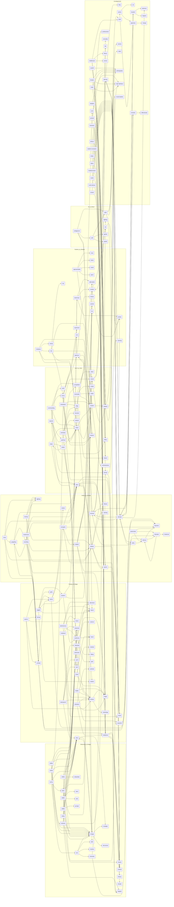

# Tag Network Map

Visualizing how specific tags map to broader categories.

```mermaid
graph LR
    classDef source fill:#e1f5fe,stroke:#01579b,stroke-width:1px;
    classDef target fill:#fff9c4,stroke:#fbc02d,stroke-width:2px;

    subgraph Fantasy_&_Magic
    t_adventurous(adventurous) --> t_active(active)
    t_adventurous(adventurous) --> t_adventure(adventure)
    t_adventurous(adventurous) --> t_nature(nature)
    t_adventurous(adventurous) --> t_outdoorsy(outdoorsy)
    t_alchemist(alchemist) --> t_fantasy(fantasy)
    t_alchemist(alchemist) --> t_magic(magic)
    t_alchemist(alchemist) --> t_science(science)
    t_druid(druid) --> t_fantasy(fantasy)
    t_druid(druid) --> t_forest(forest)
    t_druid(druid) --> t_magic(magic)
    t_druid(druid) --> t_nature(nature)
    t_fantasy(fantasy) --> t_magic(magic)
    t_fantasy(fantasy) --> t_mythology(mythology)
    t_healer(healer) --> t_fantasy(fantasy)
    t_healer(healer) --> t_magic(magic)
    t_healer(healer) --> t_medical(medical)
    t_healer(healer) --> t_peaceful(peaceful)
    t_medieval(medieval) --> t_armor(armor)
    t_medieval(medieval) --> t_fantasy(fantasy)
    t_medieval(medieval) --> t_historical(historical)
    t_medieval(medieval) --> t_traditional(traditional)
    t_outdoorsy(outdoorsy) --> t_adventure(adventure)
    t_outdoorsy(outdoorsy) --> t_forest(forest)
    t_outdoorsy(outdoorsy) --> t_hiking(hiking)
    t_outdoorsy(outdoorsy) --> t_nature(nature)
    t_outdoorsy(outdoorsy) --> t_park(park)
    t_priestess(priestess) --> t_fantasy(fantasy)
    t_priestess(priestess) --> t_magic(magic)
    t_priestess(priestess) --> t_spiritual(spiritual)
    t_priestess(priestess) --> t_traditional(traditional)
    t_rugged(rugged) --> t_action(action)
    t_rugged(rugged) --> t_gritty(gritty)
    t_rugged(rugged) --> t_nature(nature)
    t_rugged(rugged) --> t_outdoor(outdoor)
    t_rugged(rugged) --> t_western(western)
    t_steampunk(steampunk) --> t_fantasy(fantasy)
    t_steampunk(steampunk) --> t_industrial(industrial)
    t_steampunk(steampunk) --> t_retro(retro)
    t_steampunk(steampunk) --> t_sci_fi(sci-fi)
    t_steampunk(steampunk) --> t_tech(tech)
    t_warrior(warrior) --> t_action(action)
    t_warrior(warrior) --> t_armor(armor)
    t_warrior(warrior) --> t_combat(combat)
    t_warrior(warrior) --> t_fantasy(fantasy)
    t_warrior(warrior) --> t_strong(strong)
    end

    subgraph Sci-Fi_&_Tech
    t_commanding(commanding) --> t_formal(formal)
    t_commanding(commanding) --> t_luxury(luxury)
    t_commanding(commanding) --> t_office(office)
    t_commanding(commanding) --> t_urban(urban)
    t_commanding(commanding) --> t_work(work)
    t_esports(esports) --> t_competition(competition)
    t_esports(esports) --> t_gaming(gaming)
    t_esports(esports) --> t_tech(tech)
    t_gaming(gaming) --> t_competition(competition)
    t_gaming(gaming) --> t_esports(esports)
    t_gaming(gaming) --> t_tech(tech)
    t_minimalist(minimalist) --> t_clean(clean)
    t_minimalist(minimalist) --> t_indoor(indoor)
    t_minimalist(minimalist) --> t_modern(modern)
    t_minimalist(minimalist) --> t_simple(simple)
    t_minimalist(minimalist) --> t_studio(studio)
    t_modern(modern) --> t_contemporary(contemporary)
    t_modern(modern) --> t_realistic(realistic)
    t_modern(modern) --> t_urban(urban)
    t_skate(skate) --> t_skater(skater)
    t_skate(skate) --> t_sport(sport)
    t_skate(skate) --> t_urban(urban)
    t_skater(skater) --> t_skate(skate)
    t_skater(skater) --> t_sport(sport)
    t_skater(skater) --> t_urban(urban)
    t_streetwear(streetwear) --> t_casual(casual)
    t_streetwear(streetwear) --> t_edgy(edgy)
    t_streetwear(streetwear) --> t_fashion(fashion)
    t_streetwear(streetwear) --> t_modern(modern)
    t_streetwear(streetwear) --> t_urban(urban)
    t_techwear(techwear) --> t_edgy(edgy)
    t_techwear(techwear) --> t_futuristic(futuristic)
    t_techwear(techwear) --> t_tactical(tactical)
    t_techwear(techwear) --> t_tech(tech)
    t_techwear(techwear) --> t_urban(urban)
    t_urban(urban) --> t_modern(modern)
    end

    subgraph Historical_&_Vintage
    t_1890s(1890s) --> t_historical(historical)
    t_1890s(1890s) --> t_retro(retro)
    t_1890s(1890s) --> t_victorian(victorian)
    t_1890s(1890s) --> t_vintage(vintage)
    t_1900s(1900s) --> t_edwardian(edwardian)
    t_1900s(1900s) --> t_historical(historical)
    t_1900s(1900s) --> t_retro(retro)
    t_1900s(1900s) --> t_vintage(vintage)
    t_1920s(1920s) --> t_historical(historical)
    t_1920s(1920s) --> t_luxury(luxury)
    t_1920s(1920s) --> t_noir(noir)
    t_1920s(1920s) --> t_retro(retro)
    t_1920s(1920s) --> t_vintage(vintage)
    t_1950s(1950s) --> t_classic(classic)
    t_1950s(1950s) --> t_historical(historical)
    t_1950s(1950s) --> t_retro(retro)
    t_1950s(1950s) --> t_vintage(vintage)
    t_1970s(1970s) --> t_boho(boho)
    t_1970s(1970s) --> t_historical(historical)
    t_1970s(1970s) --> t_retro(retro)
    t_1970s(1970s) --> t_vintage(vintage)
    t_1980s(1980s) --> t_historical(historical)
    t_1980s(1980s) --> t_neon(neon)
    t_1980s(1980s) --> t_pop(pop)
    t_1980s(1980s) --> t_retro(retro)
    t_1980s(1980s) --> t_vintage(vintage)
    t_1990s(1990s) --> t_grunge(grunge)
    t_1990s(1990s) --> t_historical(historical)
    t_1990s(1990s) --> t_retro(retro)
    t_1990s(1990s) --> t_vintage(vintage)
    t_noir(noir) --> t_cinematic(cinematic)
    t_noir(noir) --> t_dark(dark)
    t_noir(noir) --> t_mystery(mystery)
    t_noir(noir) --> t_vintage(vintage)
    t_retro(retro) --> t_nostalgic(nostalgic)
    t_retro(retro) --> t_vintage(vintage)
    t_traditional(traditional) --> t_classic(classic)
    t_traditional(traditional) --> t_cultural(cultural)
    t_traditional(traditional) --> t_history(history)
    t_traditional(traditional) --> t_temple(temple)
    t_victorian(victorian) --> t_elegant(elegant)
    t_victorian(victorian) --> t_formal(formal)
    t_victorian(victorian) --> t_historical(historical)
    t_victorian(victorian) --> t_retro(retro)
    t_victorian(victorian) --> t_vintage(vintage)
    t_vintage(vintage) --> t_nostalgic(nostalgic)
    t_vintage(vintage) --> t_old_school(old-school)
    t_vintage(vintage) --> t_retro(retro)
    end

    subgraph Action_&_Combat
    t_action(action) --> t_dynamic(dynamic)
    t_action(action) --> t_energetic(energetic)
    t_action(action) --> t_motion(motion)
    t_athletic(athletic) --> t_active(active)
    t_athletic(athletic) --> t_fitness(fitness)
    t_athletic(athletic) --> t_sport(sport)
    t_athletic(athletic) --> t_sports(sports)
    t_athletic(athletic) --> t_training(training)
    t_boxing(boxing) --> t_athletic(athletic)
    t_boxing(boxing) --> t_combat(combat)
    t_boxing(boxing) --> t_fighting(fighting)
    t_boxing(boxing) --> t_sport(sport)
    t_combat(combat) --> t_action(action)
    t_combat(combat) --> t_dynamic(dynamic)
    t_combat(combat) --> t_intense(intense)
    t_dramatic(dramatic) --> t_intense(intense)
    t_dramatic(dramatic) --> t_theatrical(theatrical)
    t_energetic(energetic) --> t_active(active)
    t_energetic(energetic) --> t_dynamic(dynamic)
    t_energetic(energetic) --> t_playful(playful)
    t_energetic(energetic) --> t_sport(sport)
    t_grappling(grappling) --> t_combat(combat)
    t_grappling(grappling) --> t_sport(sport)
    t_grappling(grappling) --> t_wrestling(wrestling)
    t_martial_arts(martial arts) --> t_athletic(athletic)
    t_martial_arts(martial arts) --> t_combat(combat)
    t_martial_arts(martial arts) --> t_fighting(fighting)
    t_martial_arts(martial arts) --> t_sport(sport)
    t_martial_arts(martial arts) --> t_traditional(traditional)
    t_mma(mma) --> t_athletic(athletic)
    t_mma(mma) --> t_combat(combat)
    t_mma(mma) --> t_fighting(fighting)
    t_mma(mma) --> t_grappling(grappling)
    t_mma(mma) --> t_sport(sport)
    t_passionate(passionate) --> t_dramatic(dramatic)
    t_passionate(passionate) --> t_dynamic(dynamic)
    t_passionate(passionate) --> t_intense(intense)
    t_sport(sport) --> t_active(active)
    t_sport(sport) --> t_athletic(athletic)
    t_sport(sport) --> t_sports(sports)
    t_sports(sports) --> t_active(active)
    t_sports(sports) --> t_athletic(athletic)
    t_sports(sports) --> t_sport(sport)
    t_sultry(sultry) --> t_intense(intense)
    t_sultry(sultry) --> t_intimate(intimate)
    t_sultry(sultry) --> t_sensual(sensual)
    t_wrestling(wrestling) --> t_athletic(athletic)
    t_wrestling(wrestling) --> t_combat(combat)
    t_wrestling(wrestling) --> t_fighting(fighting)
    t_wrestling(wrestling) --> t_grappling(grappling)
    t_wrestling(wrestling) --> t_sport(sport)
    end

    subgraph Fashion_&_Lifestyle
    t_approachable(approachable) --> t_casual(casual)
    t_approachable(approachable) --> t_cozy(cozy)
    t_approachable(approachable) --> t_home(home)
    t_approachable(approachable) --> t_social(social)
    t_approachable(approachable) --> t_warm(warm)
    t_bohemian(bohemian) --> t_alternative(alternative)
    t_bohemian(bohemian) --> t_artistic(artistic)
    t_bohemian(bohemian) --> t_boho(boho)
    t_bohemian(bohemian) --> t_creative(creative)
    t_chic(chic) --> t_city(city)
    t_chic(chic) --> t_fashion(fashion)
    t_chic(chic) --> t_luxury(luxury)
    t_chic(chic) --> t_modern(modern)
    t_chic(chic) --> t_urban(urban)
    t_formal(formal) --> t_elegant(elegant)
    t_formal(formal) --> t_evening(evening)
    t_glamour(glamour) --> t_beauty(beauty)
    t_glamour(glamour) --> t_fashion(fashion)
    t_glamour(glamour) --> t_sensual(sensual)
    t_k_fashion(k-fashion) --> t_chic(chic)
    t_k_fashion(k-fashion) --> t_fashion(fashion)
    t_k_fashion(k-fashion) --> t_modern(modern)
    t_k_fashion(k-fashion) --> t_trendy(trendy)
    t_k_fashion(k-fashion) --> t_urban(urban)
    t_luxury(luxury) --> t_elegant(elegant)
    t_luxury(luxury) --> t_expensive(expensive)
    t_luxury(luxury) --> t_fashion(fashion)
    t_luxury(luxury) --> t_glamour(glamour)
    t_luxury(luxury) --> t_rich(rich)
    t_playful(playful) --> t_active(active)
    t_playful(playful) --> t_casual(casual)
    t_playful(playful) --> t_colorful(colorful)
    t_playful(playful) --> t_fun(fun)
    t_playful(playful) --> t_outdoor(outdoor)
    t_western(western) --> t_casual(casual)
    t_western(western) --> t_edgy(edgy)
    t_western(western) --> t_outdoorsy(outdoorsy)
    t_western(western) --> t_rugged(rugged)
    end

    subgraph Art_&_Mood
    t_art(art) --> t_artistic(artistic)
    t_art(art) --> t_creative(creative)
    t_boho(boho) --> t_alternative(alternative)
    t_boho(boho) --> t_artistic(artistic)
    t_boho(boho) --> t_bohemian(bohemian)
    t_boho(boho) --> t_creative(creative)
    t_cinematic(cinematic) --> t_dramatic(dramatic)
    t_cinematic(cinematic) --> t_lighting(lighting)
    t_cottagecore(cottagecore) --> t_calm(calm)
    t_cottagecore(cottagecore) --> t_nature(nature)
    t_cottagecore(cottagecore) --> t_soft(soft)
    t_cottagecore(cottagecore) --> t_vintage(vintage)
    t_creative(creative) --> t_art(art)
    t_creative(creative) --> t_artistic(artistic)
    t_intense(intense) --> t_dramatic(dramatic)
    t_intense(intense) --> t_dynamic(dynamic)
    t_soft(soft) --> t_calm(calm)
    t_soft(soft) --> t_gentle(gentle)
    t_soft(soft) --> t_pastel(pastel)
    end

    subgraph Uncategorized
    t_african(african) --> t_cultural(cultural)
    t_african(african) --> t_traditional(traditional)
    t_alluring(alluring) --> t_flirty(flirty)
    t_alluring(alluring) --> t_intimate(intimate)
    t_alluring(alluring) --> t_sensual(sensual)
    t_anime(anime) --> t_2d(2d)
    t_anime(anime) --> t_japanese(japanese)
    t_boudoir(boudoir) --> t_bedroom(bedroom)
    t_boudoir(boudoir) --> t_intimate(intimate)
    t_boudoir(boudoir) --> t_lingerie(lingerie)
    t_boudoir(boudoir) --> t_sensual(sensual)
    t_business(business) --> t_formal(formal)
    t_business(business) --> t_office(office)
    t_business(business) --> t_professional(professional)
    t_calm(calm) --> t_peaceful(peaceful)
    t_calm(calm) --> t_quiet(quiet)
    t_calm(calm) --> t_serene(serene)
    t_calm(calm) --> t_static(static)
    t_candid(candid) --> t_photography(photography)
    t_candid(candid) --> t_realistic(realistic)
    t_casual(casual) --> t_everyday(everyday)
    t_casual(casual) --> t_life(life)
    t_casual(casual) --> t_realistic(realistic)
    t_detailed(detailed) --> t_high_definition(high definition)
    t_detailed(detailed) --> t_realistic(realistic)
    t_eastern_european(eastern-european) --> t_cultural(cultural)
    t_eastern_european(eastern-european) --> t_traditional(traditional)
    t_edgy(edgy) --> t_alternative(alternative)
    t_edgy(edgy) --> t_cool(cool)
    t_edgy(edgy) --> t_dark(dark)
    t_female(female) --> t_high_definition(high definition)
    t_female(female) --> t_photography(photography)
    t_female(female) --> t_realistic(realistic)
    t_indian(indian) --> t_cultural(cultural)
    t_indian(indian) --> t_traditional(traditional)
    t_intellectual(intellectual) --> t_indoor(indoor)
    t_intellectual(intellectual) --> t_library(library)
    t_intellectual(intellectual) --> t_office(office)
    t_intellectual(intellectual) --> t_quiet(quiet)
    t_intellectual(intellectual) --> t_school(school)
    t_intimate(intimate) --> t_alluring(alluring)
    t_intimate(intimate) --> t_bedroom(bedroom)
    t_intimate(intimate) --> t_boudoir(boudoir)
    t_intimate(intimate) --> t_romantic(romantic)
    t_intimate(intimate) --> t_sensual(sensual)
    t_intimate(intimate) --> t_sultry(sultry)
    t_japanese(japanese) --> t_anime(anime)
    t_japanese(japanese) --> t_manga(manga)
    t_latina(latina) --> t_cultural(cultural)
    t_latina(latina) --> t_traditional(traditional)
    t_male(male) --> t_high_definition(high definition)
    t_male(male) --> t_photography(photography)
    t_male(male) --> t_realistic(realistic)
    t_mediterranean(mediterranean) --> t_cultural(cultural)
    t_mediterranean(mediterranean) --> t_traditional(traditional)
    t_nordic(nordic) --> t_cultural(cultural)
    t_nordic(nordic) --> t_traditional(traditional)
    t_north_african(north-african) --> t_cultural(cultural)
    t_north_african(north-african) --> t_traditional(traditional)
    t_portrait(portrait) --> t_photography(photography)
    t_portrait(portrait) --> t_realistic(realistic)
    t_realistic(realistic) --> t_high_definition(high definition)
    t_realistic(realistic) --> t_mood_realistic(mood:realistic)
    t_realistic(realistic) --> t_photography(photography)
    t_romani(romani) --> t_cultural(cultural)
    t_romani(romani) --> t_traditional(traditional)
    t_romantic(romantic) --> t_affectionate(affectionate)
    t_romantic(romantic) --> t_intimate(intimate)
    t_sensual(sensual) --> t_alluring(alluring)
    t_sensual(sensual) --> t_glamour(glamour)
    t_sensual(sensual) --> t_intimate(intimate)
    end
```
